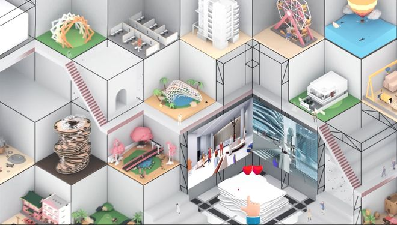

# “创意生态”的再定义：元宇宙技术打造国内首个设计领域共享社区

当今，越来越多样化的灵感需求正驱动着一场设计领域的变革。近日，国内首个设计领域共享社区拓扑正式宣布进入内测阶段，平台借助元宇宙技术打造沉浸式体验空间，为设计领域共享社区带来颠覆性创新。据悉，拓扑粒方重新定义了创意生态，即用户可以在三维空间内进行灵感创作并与社区其他用户分享创意与作品，通过元宇宙空间获得身临其境的生动体验。这无疑打破了传统行业的边界，使得创意和灵感更为立体化、可视化，进一步降低了创作体验、交流与分享的门槛。

（创意社区界面）

**孵化创意三维空间内的沉浸式创作体验**

在拓扑粒方平台，用户可以打造自己的虚拟形象以及个人元宇宙空间。进入该空间内，设计师可以借住元宇宙技术从而不被二维图面所束缚，在三维空间内任意移动，多角度、全方位感受作品细节，获得更接近于现实的沉浸式创作体验。

（三维空间内全方位感受作品细节）

用户还能够在元宇宙世界里自由发挥，摆脱现实钢筋混凝土的限制并重新定义物理规律，创作出别具一格的艺术作品。作为创意灵感的高效孵化平台，设计师可以在拓扑粒方的元宇宙环境中充分释放想象力，并在沉浸式体验中与作品产生更紧密的连结。

**共享社区虚拟场景中身临其境的社交互动**

作为对创意生态重新定义的一部分，拓扑粒方也同步发力对共享社区的打造。用户可以通过平台举办元宇宙个人展览，并定制化作品展示方式，为分享灵感和获取灵感提供了绝佳的途径。此外，平台还已经构建了相当丰富的社区内交互功能，例如粉丝互动、空间弹幕、创作讨论以及语音交流等，使得创作者和需求用户之间能够更高效的互动，缩短沟通的路径和成本。通过元宇宙技术，用户将获得一种不同于视频或文字的空间体验，在身临其境的社交互动过程中，体验超越现实的丰富感受。

（空间弹幕交流）

（实时语音交流）

除了为个人用户提供分享平台，拓扑粒方也为企业用户提供了能够举办云讲座、云展览、云秀场的虚拟互动场地。近日，拓扑粒方与同济大学、一造科技共同承办的“DigitalFUTURES 2022”元宇宙展览即将正式上线，届时来自全球的上千名知名学者、建筑师、设计师及相关企、事业单位和学术媒体将通过元宇宙技术，在拓扑粒方的三维空间内展示、交流作品。

（DigitalFUTURES 2022工作营宣传海报）

（DigitalFUTURES 2022元宇宙展示舞台）

**创意赋能探索元宇宙的无限可能性**

拓扑粒方在未来将持续拥抱数字科技，带来更多作品格式的支持，更自由的动态作品分享渠道，并通过VR（虚拟现实），AR（增强现实）等技术创造出更为沉浸式的社区体验，旨在为用户提供更佳的共享创意生态和创作环境，为所有想分享创意与获取灵感的人们提供平台，让每一个IDEA都能发光。