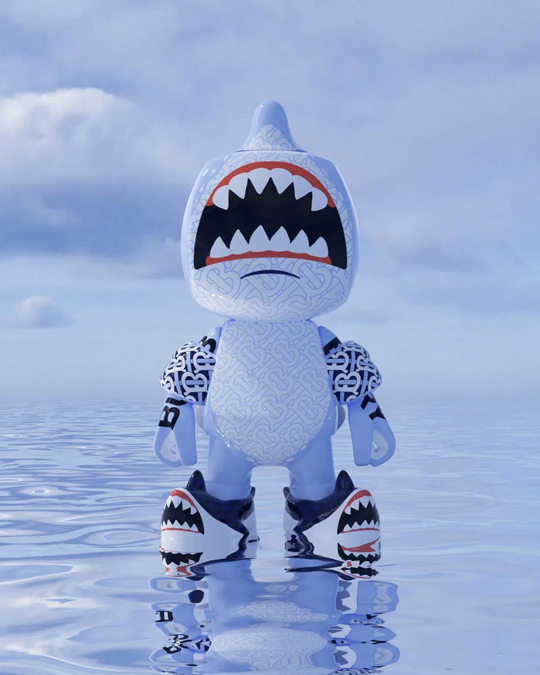
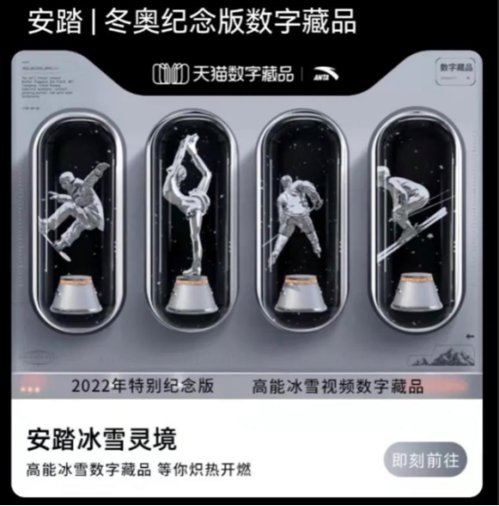

# “元宇宙”很玄幻？50+头部品牌&商场正在把它做实！

> 摸准调性做运营，才能“常旺常新”。《运营新知》系列把商场与品牌们的创意idea扒开给你看。此篇为，**品牌、商场的“元宇宙”之战**。

元宇宙，一个虚拟与现实相生的虚拟现实空间。

在“元宇宙第一股”Roblox、Facebook、腾讯等互联网巨头推动下，叠加着疫情下兴起的“宅经济”、“二次元文化”盛行带来的虚拟消费，“元宇宙”走上爆红之路。

据艾媒咨询调查报告显示，2021年八成网民为虚拟偶像花费在1000元/月以内，且消费热度还在不断上升。

吸客又吸金的“元宇宙”，让不少观望的品牌和商场心动不已，且纷纷开始下场抢滩“元宇宙”，上演着一出魔幻大戏。

元宇宙（Metaverse）是利用科技手段进行链接与创造的，与现实世界映射与交互的虚拟世界，具备新型社会体系的数字生活空间。（内容来自北京大学学者发布的《元宇宙特征与属性START图谱》）

**一、奢侈品、运动品牌最积极，服饰集合店、简快餐不甘落后**

被认为是“元宇宙”基础设施之一的NFT（Non-Fungible Token，非同质化代币），因其独一无二的特性正成为愿意为“精神消费”买单的年轻人追逐的新物种。

据腾讯NFT平台数据显示，每个NFT系列作品都能吸引超10万人争抢。

具有收藏价值的NFT已经成为一种新的社交货币，一个圈子身份的象征。而只要是年轻人聚集的地方，追逐新鲜血液的品牌都不会放过。

另外，出圈的NFT作品和虚拟偶像，可以形成如米老鼠、钢铁侠、多啦A梦一般的大IP，品牌可以围绕其吸引的人群，创造出强大的IP经济。

纵观品牌关于“元宇宙”的动作，主要有以下两种做法：

**■ 推出虚拟形象人，增强品牌传播**：在消费者对“虚拟偶像”日益高涨的热情之下，相比传统偶像、明星代言人，具有弹性创造空间的虚拟人，更能贴合品牌自身产品、服务定位以及市场策略，满足各种商业场景传播需求。

**■ 借助游戏平台，推出虚拟主题空间或数字产品**：游戏平台在数字世界的流量优势，使其成为品牌首选的施展“元宇宙”相关动作的场合。独特的带有品牌印记的数字产品，能让品牌获得强曝光量、用户黏性。

**1、奢侈品**

2021年至今，在“元宇宙”领域动作最多的品类，当属奢侈品。

**Gucci**：从提供虚拟主题空间体验，到发布品牌自身的NFT（数字藏品）系列产品，进军“元宇宙”领域的轨迹清晰可见。

**Coach**：在品牌成立80周年，发布了首个名为“Snow City”的NFT系列。系列产品涵盖80件数字艺术作品，包括 Coach吉祥物Rexy、北极熊Fuzz、Spike刺猬等，每个Coach NFT的首个持有者将在2022年收到一个免费定制的Rogue手袋。

**Louis Vuitton**：为庆祝创始人Louis Vuitton 200 岁诞辰，推出首款 NFT 手机游戏LOUIS THE GAME，玩家可以在游戏中解锁30个NFT。游戏发布仅7 天下载量就达到了50万次，中国地区贡献了下载量的大头。

**Balenciaga**：与《堡垒之夜》游戏合作，为游戏中最受欢迎的4个角色定制服装道具，并发售以该游戏为灵感的卫衣、帽子、T恤等实体服饰。之后，宣布将成立一个专门研究“元宇宙”的独立团队。

**Karl Lagerfeld**：以数字小雕像的形式推出品牌首个限量版动漫NFT系列，第一版售价为77欧元，限量777个，在发布后49分钟内售罄。

**Burberry**：与多人互动游戏Blankos Block Party合作，推出游戏内NFT系列作品——Burberry x Blankos系列，包含NFT限量版玩具角色Sharky B及喷气背包、臂章等一系列配件。玩家可在游戏内获取NFT配件、升级游戏角色（确保Sharky B的独特性和稀有性）。

**DKNY**：推出以纽约市“不夜城”为灵感设计的新Logo NFT，并在官网拍卖该Logo的NFT产权。

**RIMOWA**：与NUOVA设计工作室合作，设计了包括餐车、灯、音响系统及桌子在内的4件 NFT 艺术品，并命名为“元宇宙的蓝图（Blueprints from the Metaverse）”。

**Balmain**：同游戏公司Altava合作，推出Vogue新加坡独家NFT服装“火焰连衣裙”。购买这件NFT服装的消费者将获得一份数字版的Balmain真品证书、裙子草图，同时可将NFT裙子植入到游戏应用Altava中。

**2、运动品牌**

与奢侈品同样积极布局“元宇宙”的，还有一众运动品牌。

**NIKE**：在Roblox上发布了以耐克总部为模型的虚拟世界“NIKELAND”，玩家可用虚拟形象体验各类NIKE产品，体验「Tag」、「The Floor Is Lava」、「Dodgeball」等虚拟游戏，同时支持开发者基于互动体育材料设计专属迷你游戏。在此举之后，NIKE 花费2亿美元收购了虚拟球鞋公司RTFKT，标志着NIKE开始亲自上场做NFT球鞋。

**Adidas Originals**：发布首款NFT项目“Into the Metaverse”，每个NFT定价为800美金，一共发售3万个，销售额超过2000万美金。NFT拥有者可在基于区块链的游戏《The Sandbox》穿戴相关虚拟设备，还将获得由adidas联名BoredApeYachtClub、PunksComics以及GMoney推出的独家实体服饰。

**Vans**：与游戏平台Roblox合作，推出以滑板为主题的虚拟世界“Vans World”。用户可从中选择滑板与服饰鞋款，打造独特穿搭风格、与朋友一起练习滑板技巧，并在游玩过程中获得独家Vans装备。**Under Armour**：与篮球明星斯蒂芬·库里合作推出可穿戴的、跨平台的运动鞋NFT——Genesis Curry Flow NFT系列。一天内，总销售额突破1200 ETH。

**PUMA**：将推特名改为“PUMA.eth”，同时收集猫科动物的NFT，以此吸引NFT和Web3爱好者，进一步加深用户对品牌“元宇宙”身份的认知。

**安踏**：联合天猫超级品牌日，打造“安踏冰雪灵境”沉浸式互动数字空间，首发“2022 限量高能冰雪NFT数字藏品”，其中包含助力中国冰雪国家队12支队伍的队服以及2个神秘纪念款数字藏品。

**Under Armour**：与篮球明星斯蒂芬·库里合作推出可穿戴的、跨平台的运动鞋NFT——Genesis Curry Flow NFT系列。一天内，总销售额突破1200 ETH。

**PUMA**：将推特名改为“PUMA.eth”，同时收集猫科动物的NFT，以此吸引NFT和Web3爱好者，进一步加深用户对品牌“元宇宙”身份的认知。

**安踏**：联合天猫超级品牌日，打造“安踏冰雪灵境”沉浸式互动数字空间，首发“2022 限量高能冰雪NFT数字藏品”，其中包含助力中国冰雪国家队12支队伍的队服以及2个神秘纪念款数字藏品。

**李宁**：首幅NFT艺术品“Wizard Shop in ESSENCE”（带有美国NBA球员德维恩·韦德的电子签名），以约113万元的价格在保利拍卖行展拍出。

**特步**：在发布最新款160X跑鞋的同时，推出了全球首款跑鞋数字藏品160X-Metaverse。用户可以同时拥有专业160X实物跑鞋以及独一无二的虚拟数字资产。

**3、时尚鞋服**

紧跟奢侈品、运动头部品牌的步伐，时尚鞋服品牌也踏进了“元宇宙”领域。

**Tommy Hilfiger**：在本周举行的全球首届元宇宙时装周（Metaverse Fashion Week）展示品牌2022春季系列，并将所有商品以NFT资产的形式出售，购买者可将NFT兑换为配送上门的实物产品。

**Ralph Lauren**：与虚拟应用程序ZEPETO达成新合作，推出一个数字服装系列和一个主题虚拟世界。数字服装用12个造型、50多个主题展现品牌复古风格和新品，Ralph Lauren咖啡店、Ralph Lauren麦迪逊大道旗舰店、纽约中央公园等组成了主题虚拟世界；ZEPETO用户的3D虚拟化身可穿着Ralph Lauren x ZEPETO系列作品，进行社交。

**GAP**：在去年收购3D虚拟试穿方案商Drapr后，在今年与Frank Ape艺术家Brandon Sines合作发布其首期限量版NFT系列。这个项目涵盖了数字和实体产品，以及游戏化体验。用户可通过游戏收集Gap帽衫数字艺术，解锁购买限量版数字艺术和实体帽衫的机会。

**Forever 21**：通过Roblox推出了虚拟店铺“Forever 21 Shop City”，用户能够模拟拥有和管理自己的线上Forever 21店铺，并且购买和销售Forever 21商品。Forever 21在线下推出新系列时，Roblox平台会同步发布数字系列供虚拟人物穿戴。

**ASICS**：在拍卖会上推出首个ASICS Sunrise Red NFT系列，9款鞋款分为20个限量版、1个黄金版。所有NFT所有者会获得鞋子的数字和 3D 渲染文件，黄金版NFT鞋履拥有者还将收到一位艺术家未来的NFT。

**4、简快餐/茶饮**

时尚行业“豪赌”元宇宙，餐饮品牌也不甘示弱，赶上风潮尝试各种“NFT+美食”玩法。

**麦当劳**：麦当劳中国继推出品牌虚拟形象“开心姐姐”之后，发布了以麦当劳品牌精神和新总部大楼外形为灵感的首个NFT作品“巨无霸魔方”，并将188份NFT作品送给员工及消费者；麦当劳法国则在推特发布了其食品系列NFT“McDoNFT”，包含薯条、巨无霸和圣代等共20个美食NFT创意作品。

今年2月，麦当劳为基于元宇宙的虚拟餐厅提交了商标申请，成为最新一家为元宇宙世界中的虚拟商品和服务申请商标注册的公司。

**必胜客**：发布了像素风披萨片NFT作品“1 Byte Favourites”，公司将每周发布不同的像素风披萨片NFT，展示不同的披萨配方。必胜客的NFT营销得到了大量披萨爱好者的关注，新NFT的售价已经达到了5ETH（约9000美元）。

**棒!约翰**：在Tezos区块链上铸造了其首款NFT，包括19,840个NFT热保温袋（hot bag）。

**汉堡王**：与NFT市场交易平台Sweet联动开发了NFT收藏品游戏。用户扫描汉堡王“Keep it real meal”（真材实料）活动产品包装盒上的二维码，集齐三款收藏品游戏，可随机获得3D数字收藏品、一年免费的Whopper三明治品牌明星大使亲笔签名。此次活动极大刺激了用户的收集欲，间接引导用户购买了更多品牌产品。

**王老吉**：携手阿里推出首款数字艺术作品“百家合”，并在线上进行了公开拍卖。随后在成立十周年创新发展大会上进行了王老吉元宇宙“吉空间”启动仪式。

**蜜雪冰城**：注册一系列与元宇宙相关的商标内容：包括“蜜雪元宇宙”、“雪王元宇宙”、“MIXUEMEAT”等，国际分类涉及视频、广告销售、餐饮住宿、科学仪器等。

**奈雪的茶**：官宣品牌大使“NAYUKI”，并在线上推出围绕该IP的300份NFT数字艺术品，促进生日季活动72小时斩获GMV近2个亿。

**5、美妆护理/潮流数码/汽车**

除了服饰与餐饮两大热门品类，美妆护理、潮流数码、汽车等品类中的头部品牌，亦不约而同地跟进了“元宇宙”热潮。

**欧莱雅**：去年宣布“欧爷”成为品牌虚拟代言人后，联合五位女性艺术家推出了数字收藏艺术品口红——Reds of Worth，并在OpenSea上进行拍卖，起拍价为1500美元；今年欧莱雅集团申请了17个关于NFT 和元宇宙类别的商标，涉及旗下科颜氏、美宝莲、Pureology、Urban Decay、Redken等品牌，或将推出虚拟香水和化妆品。

**自然堂**：去年双十一，携手天猫推出“超强元宇宙”玩法，上线了唐卡冰肌水+NFT版冰肌水藏品，并由国内首位超现实虚拟人物AYAYI作为天猫超级品牌数字助力人，自然堂也成为了首个与天猫共创线上虚拟数字产品的国货美妆品牌。

不少美妆品牌通过推出虚拟代言人，表示自己涉足“元宇宙”领域。如**花西子**推出虚拟形象“花西子”、“**100年润发”**邀请跨次元国风女孩——翎LING成为品牌代言人、**兰芝**特邀虚拟人气偶像川CHUAN担任潮流体验官等。   

**小米**：发布NFT数字藏品“xiaomi 12 系列芯纪元龙蛋”，芯纪元龙蛋里有小米 12 系列的晶格风未来城市以及由全新一代骁龙 8 移动平台构成的浮空岛屿。

**OPPO**：携手艺术家Roubit肉比特，推出了Find N元宇宙奇旅数字藏品限定礼盒。礼盒除了数字藏品还有实体手机套装，全球限量100份。产品秒售罄后，曾在闲鱼上有用户加价收购。

去年拓展势头迅猛的新能源汽车，也想通过“车企+元宇宙”变得更火。哪吒汽车、比亚迪、小鹏汽车、蔚来汽车、上汽、理想汽车纷纷抢注“元宇宙”商标，智己汽车、宝马已经开始“试水”。

**宝马**：推出了元宇宙虚拟世界JOYTOPIA，用户在里面不但可以欣赏英国知名摇滚乐队的演唱会，还可以通过跳舞和人群冲浪。

**智己汽车**：品牌CSOP用户数据权益计划“原石谷”正式在“IM智己”App上线。用户在这里可以拓荒原石、交流心得、升级装备、进化车辆。其中包含与智己汽车4.9%股份挂钩的3亿枚原石，用户可通过“里程式开采”获得其中70%，“原石”可被用于兑换各类硬件或OTA服务。

**二、从营销活动到“元宇宙”商业体，购物中心“元宇宙”大戏迭起**

目前，国内商业地产正处于差异化发展阶段，2022年商业地产投资规模预计将突破3000亿元。市场竞争激烈且客群消费发生变化，商场们需要不断制造新鲜感。

能带来高质量沉浸式体验的“元宇宙”，成为商场们新的“掘金敲门砖”。新鲜的虚拟偶像、由VR/AR/3D等新技术组成的神奇空间，一经出现总能吸引大众的目光。

商场的“元宇宙”探索正处在初步阶段，主要有三种做法：

**■ 通过VR/AR/3D等技术，提供更具科技感的购物体验；**

**■ 以虚拟人、数字藏品创新营销玩法**，通过将年轻人追捧的虚拟偶像引做商场代言人、率先以商场身份发布数字藏品，引流；

**■ 用元宇宙概念赋能商场主题**，由此主题引入特定的品类品牌、制定独有的购物规则，打破现有商场运营模式。

**上海AI PLAZA 西岸凤巢**：大量利用数字新媒体技术，如室内中庭的巨幕会依据真实天气环境，展现气象、昼夜、草木、动物等奇幻场景效果，此外还有“魔镜”互动智能场景、模拟换装的设备等，最新奇的玩法则隐藏在地图导航墙——上面展示了整片西岸的重要建筑，当人伸手触摸，被触摸的建筑会“活过来”。

**广州悦汇城**：上线广州商圈首个大型AR实景应用AR Show，现实与虚拟交融的“元宇宙”购物体验，让商场一跃为广州新晋打卡地。据悉，悦汇城周年庆活动期间，AR Show助力商场销售额同比增长196%，客流超过开业同期。

**凯德虹口商业中心**：携手彩虹笔公益机构，将50幅孤独症儿童的画作转化为NFT数字藏品，每个作品衍生20个副本，总量达到1000个之多。藏品在发售伊始便得到大众的热烈反响，不到1小时便已售罄。

**龙湖北京长楹天街、首创龙湖北京丽泽天街、成都IFS**：均将传统2D导航升维至室内实景AR 3D导航，通过全息标识指引顾客实现从地下停车场到商场内所有品牌门店、服务设施等的全场景AR导航导览。

**北京朝阳大悦城、上海第一八佰伴、上海七宝万科广场**：均推出或联手虚拟人物IP，以增强与年轻人之间的互动。如北京朝阳大悦城的超写实数字人Vila、上海第一八佰伴的虚拟偶像Gina、以及上海七宝万科广场的虚拟偶像GINA。

**北京BOM嘻番里**：号称“首个线下‘元宇宙’主题商场”，针对周边高校年轻人，将二次元周边、三坑服饰、卡牌游戏、剧本杀、猫咖等新消费、“小众”品牌作主业态。整个商场被打造成为大型实景解谜“游戏场”，顾客身处其中既可以享受传统的购物、消费，也能够在专业NPC演员的引导下沉浸式体验解谜游戏。今年元旦期间，商家销售额呈倍数增长，BOM嘻番里荣登五道口商圈热门榜第一。

除了已开业项目，深圳前海·T-ONE、郑州金META商业综合体等筹开项目纷纷定位为“元宇宙”商业体。

**深圳前海·T-ONE**：被称为深圳首家智慧生活体验中心，将通过VR、AR、3D等前沿技术的运用，创造独特的“逃离地球”体验式商业空间。

**深圳后海汇**：打造商业地产全国首个虚拟代言人——Hilda（想想），并在哔哩哔哩、小红书等社交平台与粉丝形成互动。

**郑州金META商业综合体**：作为金科首个商业元宇宙项目，将与元宇宙游戏IP深度合作，以金小宝的元宇宙之旅为故事线，从建筑、景观、装饰、运营企划，构建一个全新的元宇宙空间场景体系。

**三、冷思考**

不可否认，虚实融合是未来的发展方向，“元宇宙”概念的出现，给在同质化中苦苦挣扎的商场和品牌，注入了一丝新鲜感。

但All in做“元宇宙”的Meta创下美股市场历史最大市值跌幅、“元宇宙第一股”Roblox市值缩水约500亿美元、《关于防范以“元宇宙”名义进行非法集资的风险提示》的出台……给这一热潮浇冷水，“元宇宙”概念与现实之间的差距被显现。

这提示实体商业在发力“元宇宙”时，应实事求是，避免噱头大过实际，回归消费者本质需求。