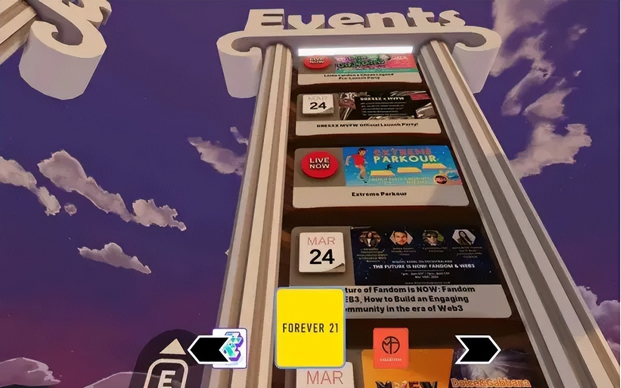

# 元宇宙下的时尚品牌该怎么选择？

> 元宇宙无疑是今年最火爆的互联网概念之一。就在上周，扎克伯格宣布Facebook正式改名为Meta，并表示将会把业务重心转向元宇宙，成功把「元宇宙」这个词再次推上了热搜。
>
> 除了改名之外，更有趣的一幕是，Meta直接在Twitter和Balenciaga互动了起来，让人猜想接下来会不会有新的跨界合作。

元宇宙（Metaverse）一词，来自Neal Stephenson的科幻小说《雪崩（Snow Crash）》。“Meta”表示超越，“Verse”代表宇宙，“超越宇宙”即指平行于现实世界运行的人造虚拟空间。

元宇宙被大众媒体描绘成了一个完全沉浸式的网络空间，它看起来与现实世界相似，但却是由计算机生成的，人们能够借助VR头盔在物质世界和虚拟世界之间自由切换。

虽然目前还并没有公认的定义，但是元宇宙的核心可以概括为：**人人都可参与创造的虚拟世界，所有人都能随时随地进入这个世界，甚至可以在这个虚拟世界里做大多数以前在现实世界做的事情，比如跟朋友聊天、玩游戏、看演唱会，甚至是在虚拟世界里工作，**就像电影《失控玩家》里那样。

元宇宙的概念范围可以扩展到虚拟时尚、社交媒体、AR技术、虚拟商店、视频游戏和非同质化代币（NFTs）等。怎样才能将现实与ACG相联系、并引起足够的话题？作为当下Z世代最为关心的时尚与潮流，**对于品牌来说，了解元宇宙的时尚潜力并抢占先机至关重要。**

Meta单独“点名”Balenciaga可以看作是一个契机，虽然目前尚无证据证实Meta和 Balenciaga在未来会发生合作，但是两者的互动已经足够赚足眼球。

不过也有观点表示，对于Balenciaga和Meta的互动完全不会感到惊讶。毕竟作为当下时尚产业中最能适应元宇宙生态的时尚品牌，Balenciaga早在今年9月就已经和Epic Games旗下的游戏「堡垒之夜（Fortnite）」进行合作。

在这次合作中，设计师为了能够设计出更生动更精细的服装，对该系列角色进行了 3D 扫描，从面料到质地，还有数字服装在角色上的表现，一切都被考虑在内。联名分为虚拟游戏服饰和限时服饰两种，在堡垒之夜游戏中玩家可以前往游戏商城购买。

这次合作不仅仅存在于Fortnite平台的范围，甚至在线下也做了推广，纽约、伦敦、东京和首尔的3D动画广告牌上都曾出现过Fortnite的广告投放。

两个不同行业品牌的碰撞将物理世界和数字世界相结合，把时尚产品带到《堡垒之夜》的元宇宙中，给玩家们带来了完全身临其境的体验。

除了Balenciaga之外，其他品牌也默默参与到了「元宇宙」的发展之中。

Louis Vuitton今年八月发布了一款手机游戏「LOUIS THE GAME」，游戏角色名叫 Vivienne，是一朵花卉，象征着路易威登精神，成为勇敢无畏的探索者和时尚爱好者的化身。

游戏以 Vivienne 的视角展开路易森林、闪光之城、冒险国度、Monogram 之岛、阳光都会与生日盛会的探索，深入走进品牌世界。在这里玩家可以收集 200 支生日蜡烛，了解品牌故事集齐相应时尚配饰。

通过游戏的形式，Louis Vuitton用更有趣的方式向消费者呈现了品牌历史。

同时，Burberry通过与Blankos Block Party游戏的合作推出了第一批NFT，销售属于NFT的角色和配件。

恰逢品牌100周年之际，Gucci也于今年五月在Roblox平台开放了Gucci Garden空间，启动了为期两周的“The Gucci Garden Experience”艺术花园体验虚拟活动。

这一全新的数字空间环境利用了Roblox背后的游戏引擎的最新进展，为Roblox的用户提供了一套高度动态的环境，他们可以像透明空白的人体模型一样穿越这些环境，随着用户在不同空间中移动，这些环境在视觉上也会发生变化。

在活动期间，Gucci推出了几款限时购买的单品，平台的用户可以在一小时内自行选购，价格为475Robux。随着转售的进行，单品的价值不断上涨，其中Dionysus手袋以4321欧元成功出售，远远超过了原价2000欧元。

Ralph Lauren与ZEPETO今年八月合作包括了一个数字服装系列和一个主题虚拟世界。Ralph Lauren为ZEPETO的数字世界重新设计了服装，允许用户用其产品为他们的3D化身穿衣。Ralph Lauren的世界通过设立在纽约的三个独特的数字互动空间来实现。

不能不承认，**「元宇宙」的出现打破了物理世界的局限，进一步融合现实和虚拟，带来了全新的互动体验和生活方式，也为时尚产业带来了新的发展方向。**时尚界的高奢品牌也开始向元宇宙迈出步伐，主动和NFT等虚拟时尚品牌合作进行虚拟商品的生产。足以说明虚拟时尚的流行，以及市场对虚拟商品的认可和热情。

元宇宙的不断发展，也势必将对时尚和奢侈品行业的各个环节产生颠覆性的影响。数字化与年轻化转型是时尚品牌在「元宇宙」时代的思考与探索。随着Z世代逐渐成为主导消费市场的中坚力量，只有不断尝试新的营销玩法，增强与消费者的直接互动，与Z世代产生情感连接，完成品牌新世代革新，才能为品牌下一步发展增加新动力。