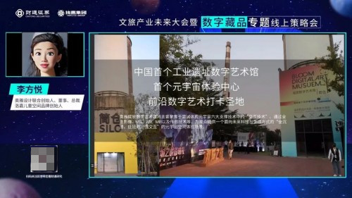
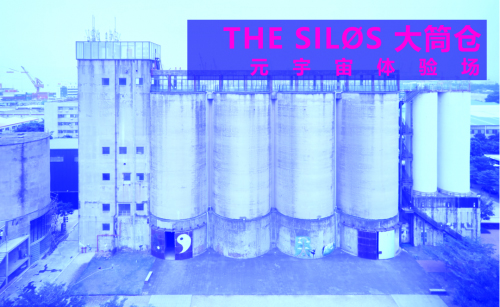
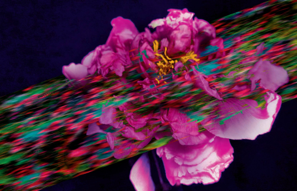

# 打造中国首个元宇宙体验馆，李方悦谈元宇宙下的创意驱动和创意驱动

> 在元宇宙的新时代下，如何重新定义IP、如何使IP发挥新生，这是一个非常符合当下需求和关注的话题。

3月27日，奥雅设计（股票代码：300949）董事总裁李方悦女士受邀参加2022文旅产业未来大会暨数字藏品专题线上策略会，本次会议以“重塑IP运营、重估IP价值”为主题，由财通证券研究所主办、执惠集团承办。李方悦女士进行了“元宇宙时代下奥雅的穿心实践”为题的分享，以下是她的精彩演讲。

以下文字根据演讲整理，经过李方悦女士本人审定

我们都知道，文旅项目包括景区、主题乐园，核心都是IP的经营，IP是项目的灵魂。如何在IP上进行创作、赋予它生命，同时赋予文旅项目价值——生命价值与投资价值，这是大家都高度关注的问题。我觉得，元宇宙时代给IP经营与文旅项目都带来了全新的机会和可能性。

我演讲的题目是“IP赋能与创意驱动”，驱动文旅项目发展的引擎就是IP和创意；并跟大家分享元宇宙时代下奥雅设计的创新实践。第一个是非遗活化，以非物质文化遗产活化之后推动唐山工业城市转型为例，第二个是创意激活一线城市工业遗址、孵化新型产业的案例；以及在元宇宙时代奥雅设计的发展思路、创新实践以及未来发展趋势。

**1、唐山皮影主题乐园**

首先分享的是唐山皮影主题乐园，这里原来是世园会的闲置土地，通过IP打造、活化非遗推动了唐山的城市转型与升级。当时，唐山政府给了我们一个“命题作文”：第一希望做一个亲子项目，第二要求必须做唐山文化。

经过研究之后，我们选择了唐山皮影这个主题。我们用对艺术的理解来解读唐山皮影，提出了“最古老的动漫、最时尚的皮影”，“舞动的皮影、行进的唐山”，要把皮影从博物馆中请出来，让它在大地舞动起来、推动唐山往前走，走出历史的创伤。

从设计到落地只有两个月的时间，这对于我们的挑战非常大，2018年8月到10月完成一期，19年3月动工、当年五一盛大开园，历时10个月、耗费2亿打造了这样的产品。2019年开园首年就获得了近30万人次客流，2020年达到近50万人次，成为了唐山的新打卡点；乐园人气爆棚，就推出了年卡、并涨了三次价。唐山皮影主题乐园成为唐山文旅盈利水平最高、运营最可持续的项目。

我要特别讲一下皮影兔的IP打造，皮影兔现在成为了唐山的文旅大使，让唐山这个北方工业城市脱离了灰蒙蒙的旧形象，唐山皮影主题乐园也成为了一个鲜活的典范。我们的团队在树林里看到一只兔子，并以此为灵感、用皮影元素打造出一套IP形象，包括爸爸妈妈和两个兔宝宝，又经典、又民俗、又时尚，有创意、也不会过于传统。2018年10月，皮影兔一家人的形象一亮相就收到了唐山市民的极大欢迎；在二期中，不仅出现在宣传海报、园区门票上，还成为了园区的打卡点以及周边文创产品；看到孩子们抱着皮影兔、非常非常有生命力。

唐山皮影主题乐园是EPC+O的项目，我们做了一部分的运营，包括筹划运营手册、运营培训，再交给他们进行在地运营。这个项目已经走出唐山，河北省各地都欢迎唐山文旅去整体操盘，奥雅也和唐山文旅形成了战略合作伙伴关系。

**二、大筒仓THE SIL?S 潮酷玩乐新地标**

第二个案例是如何把工业遗产变废为宝、实现新生。这个项目是大筒仓THE SIL?S——奥雅绽放数字艺术馆，位于大湾区深圳蛇口价值工厂。大筒仓有很优秀的历史，但是闲置了十多年，现在被我们打造成为中国首个工业遗址数字艺术馆、首个元宇宙体验中心、前沿数字艺术打卡圣地。这里有着辉煌的历史，是原广东浮法玻璃厂，是我国改革开放标志性的合资企业，投资一亿美元落成，是当时国内最大的现代化浮法玻璃厂；并获得了1988年中国建筑工程鲁班奖。现在去看这个建筑，我们说它本身就是一件艺术品，它内部的声学、光影都非常美，吸引了很多文艺青年。

大筒仓整体面积2400㎡，底层有两个纵深大空间、上面是4个大筒仓以及7个分层小空间；其中业态包括数字美术馆SIL?S Art、数字潮牌商店SIL?S Shop、云顶咖啡SIL?S Café以及潮流夜店SIL?S Club. 这个项目整合了全球资源，我本人是总制片人、总导演，好莱坞制片团队Stephen Gibler担任联合制作人，他是知名的导演和制片人。我们希望打造The Next Generation Experience，面对未来人群的、全新的数字化体验馆、中国第一个元宇宙体验馆。

现在大家都在讨论元宇宙、讲了很多定义，但是都很抽象；所以我们做了一个策划，让这个筒仓空间来回答“元宇宙到底是怎么回事”、“体验是什么样的”。我们模拟了一场元宇宙之旅，提供一个直观的感受。首先是一个序幕，然后启航进入元宇宙，再到现实世界之外的数字花园·NFT美术馆，这是一个创世幻境，接着进入平行宇宙、在筒仓中“造梦”，再到第四个筒仓，就是云端上传、升华到了顶端——光跃平台，回归物理世界，就是SIL?S Café以及SIL?S Club. 整个旅程是虚拟与现实不断转换的过程，是一座数字艺术花园、充满了琳琅满目的艺术品。

大筒仓项目将集中中国乃至世界最潮流的艺术家，与二十余位活跃在世界艺术领域的年轻艺术家签约合作，届时将展出近40件他们的优秀作品。在这里，我要特别强调的是中国新生力量，这些年轻艺术家大多是90后，他们在这方面的成就非常瞩目、令人骄傲。

宋婷，数字艺术界的中国代表人物、AI和区块链艺术家、the poster girl，她毕业于清华大学，是2020年中国AI艺术品、区块链艺术品拍卖纪录保持者，FAT榜单2020年度最具潜力加密艺术家、2021年入选福布斯under 30艺术榜单。她善于利用区块链技术、结合对抗生成神经网络进行大量训练实践。创作主题从当代科技哲学思辨、科幻未来历史到中国传统民族艺术。我们计划选用一副敦煌佛像与现代艺术对撞的作品。

宋婷作品：牡丹亭 Rêve 之标目蝶恋花——信息科技穿透了“我”

大悲宇宙，他是第一位登上世界顶尖拍卖行的数字艺术家，他的作品《有诗的海滩》成交价格创造了中国数字艺术领域的历史。大悲宇宙用两年的时间，创造出了100万只数字虚拟蝴蝶，这次会有2万只独一无二的蝴蝶在筒仓供参观者认领。

在筒仓尽端，将引进胡帅的作品《Islands》。胡帅是一位活跃在纽约的年轻艺术家，这个作品体现了他对元宇宙的理解：“元宇宙中，我们的生命像是有机的共生组织，数据线形成岛链，一切直指‘后人类世’。”

西班牙艺术工作室LedPulse成立于2012年，他们重新设计LED技术的应用，把东西方最好的文化融合在一起。这次，LedPulse为大筒仓量身打造了作品《Shenzhen I See You》，将成为从深圳看向世界的新窗口。

除此以外，还有很多关于赛博朋克、人工智能、电子机械花等作品。我们还邀请到新锐数字艺术家高阳、罗比以及西班牙艺术家Cristal Reza，打造了一座线下植物花园和线上植物花园相互连接的数字花园。

我们非常欣喜地看到，在数字艺术领域，中国力量在崛起，涌现出一大批九零后的年轻艺术家，并且在世界上有了自己的话语权和影响力。我们非常高兴在大筒仓见证中国力量。

现在，我们进入了最核心的部分——4个筒仓的创作。我们觉得元宇宙最核心的不是技术，技术是支持人类创作的，是赋予人类超越以往的想象力和创造力的，在这里每个人都是“造梦者”。

第一个作品由奥雅设计打造，名为《十面埋伏》。从春江花月夜到十面埋伏、从音效到视觉的展现，后边LOGO是从黑洞延展而来、代表未来世界。

第二个作品《镜域》由Y&Z——当代艺术界的新锐艺术家设计，是从现实的物理场通往精神的心理场的通道，通过凝视、浸入、互动实现融合。

第三个筒仓由南加大Jordan Halsey教授联合7位艺术家（组合）共同创作筒内沉浸式数字艺术作品及大筒仓外立面投影作品。他们的作品Projection Mapping在由世界著名建筑师理查德·迈耶设计的洛杉矶GETTY Museum 盖蒂美术博物馆展出，非常现代唯美。

7位艺术家（组合）包括苏少禹Su Shaoyu，他是新媒体艺术家、创意人和策展人，也是极具创造力的技术专家。他的艺术实践和研究采用了数学、物理学和科幻小说的跨学科方法，研究了关于深空-时间挖掘的概念：从古代历史到遥远未来的替代投射；HiBanana苗晶，国内年轻一代的新媒体艺术家，创作多种类型的多媒体艺术作品，声音影像装置，舞美设计，MV及影像艺术,并获得艺术到商业转化的成绩；刘一纬Liu Yi-wei，电子音乐制作人，在其多年的艺术生涯和不同的音乐项目中，一直探索形式和理念的边界与可能；王玺Jake Wang，动画数字艺术家，多年从事独立艺术创作并参与于过多个艺术项目，动画作品被盖蒂美术馆和其他美术馆展出；辛叶桐RERANER，3D艺术家，作品涉及动态图形、实验影像、游戏概念设计等；田咖喱Curry Sicong Tian，视觉艺术家，独立导演，作品跨越摄影、3D 数码影像、 电影、平面影像、话剧、语言权利、中西对话、符号结构、女性身份等多维度领域；马晓博Daniel Ma，动画&数字艺术家， 多年从事创意内容的企划与创作，客户包括苹果，谷歌，网飞等多家国际知名互联网企业。

**三、总结：IP赋能与创意驱动**

最后，我再做一下总结——IP赋能与创意驱动。

第一，一定要挖掘在地文化。在地文化是灵魂，是激活文旅的核心内容。

第二，文化不是老古董，不只是形式的传承，而是要活化创新、要坚持创意。

第三，场地特征，场地的生态、地形地貌、植被等都是项目独特性的根基。

第四，要坚持国际化的审美和现代人的需求，用设计引领创意驱动。

第五，IP不是一个动漫形象，而是系统化、主题化的，包括策划、产品、设施、活动、平面、运营，是贯穿始终的。

第六，要打通现实世界和虚拟世界，线上线下联动，创造无限可能。