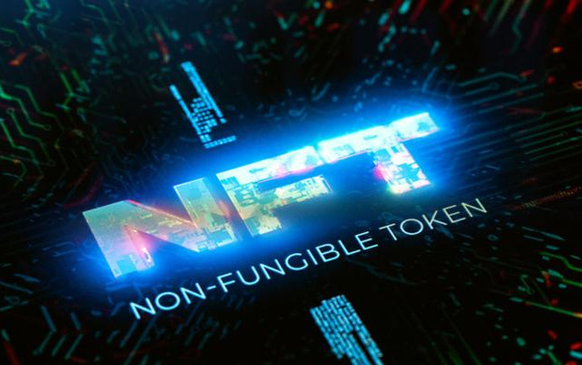

# 品牌需要采用NFT和元宇宙

如今，NFT和元宇宙技术正在迅速变化，吸引了越来越多的品牌参与独特的项目，这些项目有可能永远改变未来。

我们已经看到许多来自完全不同领域的品牌加入了这场竞赛，其中最着名的例子是Meta，还有Applei，Louis Vuitton，Coca Cola和许多其他品牌。

脸书元，例如，决定投资100亿美元在元宇宙技术上，再次试图成为其发展的先行者和领导者。然而，微软以220亿美元的混合现实技术合同超越了它。

世界正在快速发展，但不幸的是，并非所有企业和人们都在追随它的脚步，这可能对他们不利。如果忽视这些趋势，他们可能会被抛在后面，因为他们根本不了解它是如何运作的，对他们和他们的客户有什么好处，或者这种新趋势有多强大。

### 为什么品牌需要采用NFT和元宇宙？

有一些好处对每个人都是普遍的，无论是麦当劳还是苹果断续器，早期采用者将获得优于竞争对手的优势，并引起人们对自己品牌的关注。例如，他们可以找到吸引用户的新方法，或者使用元宇宙来展示和销售他们的产品。他们可以举办虚拟活动，并在虚拟现实中引入新的广告形式。

Tommy Hilfiger，Louis Vuitton，PepsiCo等公司

同样，可以通过提供数字商品从元宇宙中受益。麦当劳已经提供了一个NFT，在40周年纪念日庆祝其三明治McRib。这样的事情让品牌有机会展示和销售他们的产品，提供独家商品，为NFT所有者提供特别折扣，以及参加私人活动。例如，TripShock为基于鱼类黑手党的NFT持有者提供加密钱包连接和折扣。或者，公司可以将其元宇宙中的商业空间出租给较小的品牌，销售虚拟服装和配饰，例如耐克的NFT运动鞋。

与此同时，其中一些东西也可以被谷歌、苹果、微软或Meta等科技巨头使用，特别是在广告、数字会议和聚会方面。他们可以创建更具互动性和身临其境的社交媒体，以及通常的社交体验。他们还可以在区块链上推出自己的游戏，就像史克威尔艾尼克斯计划的那样;开发超级计算机，存储大量数据，为沉浸式虚拟世界提供支持等等。

### 品牌在进入NFT和元宇宙行业时面临哪些问题？

当然，尽管他们付出了努力和希望，但品牌在进入元宇宙时仍然面临问题。品牌需要调整，有时甚至完全重新学习营销策略。

他们有时对用户和员工的期望太高，他们也需要学习如何使用这项新技术。一些员工已经花费了数年甚至数十年的时间将同一软件用于特定目的，现在，由于区块链技术，他们必须学习如何动态地使用这项新技术。在这方面，激励措施也有助于缓解过渡。新技术的有用性和优势将解决其余的问题。一旦人们开始给它一个机会，这项技术就很容易被采用。

另一个问题是，解释NFT的可信度或解释NFT产品的价值具有挑战性。毕竟，大多数人将它们视为可以轻松复制和下载的数字图像，如果是这样的话，那么为它们付费又有什么意义呢？
事实是，复制可以很容易地制作，这是事实。但是，拥有副本的用户不能对它们执行任何操作，因为他们不复制NFT - 仅复制NFT所代表的图稿。原始艺术品的所有权仍然属于NFT持有人，他们是唯一可以用NFT证明这一点的人。想想莱昂纳多达芬奇的名画《蒙娜丽莎》。这幅画在世界各地都有无数的副本，由各种艺术家重新创作。但是，只有原始版本的真实价值为8.7亿美元。

以NFT为代表的艺术品具有原始艺术品的真正价值，只有NFT持有者才能证明他们拥有它，而人们可以制作的所有数字副本实际上都毫无价值。再一次，解决方案在于教育大众，让他们了解NFT提供了所有权和价值的证据，而这些证据是无法从他们身上获得的。

### 结论

随着这些技术的快速发展，元宇宙和NFT的采用正在上升。他们可以为正在开发和使用这种新技术的品牌带来巨大的变化，对于早期推动者来说尤其如此。当然，也有很多问题需要解决，比如学习如何驾驭新的数字世界，如何最好地应用新的数字商品和资产，以及如何教育用户做同样的事情。

然而，凭借如此巨大的潜力，这项技术吸引了普通人以及品牌，并且非常渴望获得元宇宙和NFT必须提供的好处。进入NFT和元宇宙市场的公司预计利润或潜在客户数量的增加，以及投资资金和所花费的时间的积极结果。这项新技术肯定会对所有相关人员都有回报，我们预计，如果发展和兴趣仍然像现在一样高，或者更高，这将在未来几年内导致大规模采用。