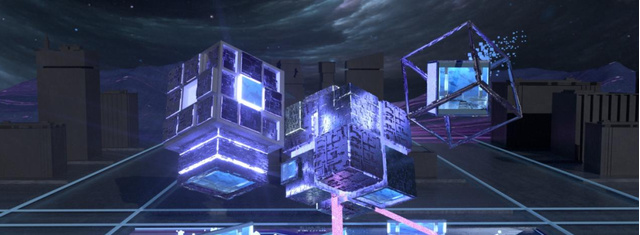

# 建筑设计师进军元宇宙，虚拟建筑将成为自由展示创意设计的空间

“元宇宙”这一热词自去年延续到当下，很多时候可能你都想提出一个疑问：谁在构建元宇宙？但你可能还未意识到，这个看似与科技圈更相近的新概念，其实与空间设计息息相关。

在虚拟空间中构建一个新世界，当下许多嗅觉灵敏的建筑师与空间设计师已然加入了建设元宇宙的行列之中。摆脱了传统钢筋混凝土的束缚，空间设计师们可以在元宇宙世界里自由发挥，创作出独具一格的艺术建筑。

### 知名元宇宙建筑盘点

### 龙城

由Metaverse Labs团队打造的龙城，是建立在区块链上的虚拟中国文化主题城市，总面积约166万平方米，中国风建筑为主，是Decentraland上的著名建筑。作为去中心化的大型文化社区，龙城致力于展示世界传统文化，探索人类社会未来发展的更多可能性。

Decentraland在3月24日至27日举办第一届元宇宙时装周(MVFW)，龙城成为首届元宇宙时装周亚洲品牌的独家场地。

龙城的建筑团队Metaverse Labs 成立于2018年，其使命是持续为社区带来乐趣、能量，建立一个超越虚拟和现实的集体共享空间，使其成为每个人的第二家园。

### 三星

三星电子美国公司（Samsung）于1月6日正式宣布进军元宇宙平台Decentraland，为2022年国际消费电子展（CES）开设了第一家虚拟旗舰概念店。三星官方表示：“837X内部空间是一个不断发展的体验中心，旨在提供最前沿的虚拟世界互动，将流行文化与三星的创新融合在一起。”

三星837X商店将通过Connectivity Theater和Sustainability Forest为用户提供虚拟体验，当中Connectivity Theater在CES 2022期间循环播放三星电子的宣传片。

三星电子高级副总裁Michelle Crossan-Matos表示，元宇宙使我们能够超越物理和空间界限，创造独特的虚拟体验，没有元宇宙我们不可能做到，创新是我们的DNA，三星迫不及待地想让人们发现这个蓬勃发展的虚拟世界。三星表示，虽然三星837X商店只会在Decentraland限时开放，但三星打算今后带来更长时间的体验。

### Snoop Dogg元宇宙演唱会

著名说唱歌手Snoop Dogg在The sandbox 平台购买了自己的地产，他将在那里举办私人虚拟音乐会、派对、艺术展览等活动，丰富了元宇宙形态业态。

根据The sandbox母公司Animoca Brands的新闻稿，Snoop Dogg的最新专辑b.o.d.r中的“House I Built”是“沙盒元宇宙制作的第一个音乐视频”。在视频中，Snoop Dogg是一个像素化的3D化身à la Minecraft。该视频由该平台的免费内容制作工具VoxEdit和Game Maker制作。

### 林俊杰的元宇宙房产

知名歌手林俊杰在社交平台宣布买下Decentraland平台上的三块虚拟土地。他购买这三块“土地”花费了12.3万美元，约合人民币78.4万元，正式涉足元宇宙世界。

### 其它元宇宙建筑

The sandbox继与Adidas、Gucci等众多品牌方合作后，包括香港富豪酒店集团、迪拜虚拟资产监管局（VARA）等相继入驻其中。

除此之外，上海新世界发展集团CEO也宣布购入The sandbox中最大的一块虚拟土地，大约花费500万美元，约合人民币3200万美元。

### 元宇宙虚拟世界的"施工队"

元宇宙土地受到追捧的同时，元宇宙建筑自然也会一同出现在聚光灯下。

元宇宙中的建筑想要真正的让人有沉浸式体验可能并不是一件简单的事，缺失了触觉，嗅觉乃至味觉的体验，就需要在视觉和听觉找补回来，所以元宇宙建筑更会尤为强调人与场景之间的联系。

同时没有了现实生活中种种条件的限制，元宇宙建筑也能在最大程度上发挥设计师的全部想象力，将建筑的艺术感完美的展现出来。

龙城的建筑团队Metaverse Labs 是全球最早致力于建设元宇宙的区块链创新企业之一，其成果大家有目共睹，知名度高，也深受大家喜爱。这里将介绍另一支非常优秀的元宇宙建筑团队——Lantern DAO，其实力也不容小觑。

Lantern DAO自称是元宇宙美好生活服务商，其成员wfeng.eth接受NFT中文社区采访时说：“Lantern DAO原Conflux DAO，是一个以建设元宇宙为主导的分布式自治共创组织，致力于打造人们喜爱的元宇宙环境。团队拥有丰富的元宇宙建筑设计经验，熟悉各个元宇宙平台的场景搭建。2021年12月成立至今，Lantern DAO在元宇宙建筑领域稳扎稳打，逐步发展成熟。”

如果你去Decentraland上林俊杰的家参观的话，一定也会被旁边别有设计感的BBS魔方广告牌吸引，该广告牌由Lantern DAO设计，坐落于Decentraland（20，-125）。建筑造型灵感来源于变幻莫测却又规则有序的魔方，极具视觉冲击力。

Decentraland：BBS广告牌正在施工中...

Legend of City Oasis是Lantern DAO在The sandbox里的项目，由Season Studio与Metaoasis合作建设。整个故事背景设置在古Oasis王国被灭亡的数百年后，玩家需要通过九重关卡，最后复苏神树，让古王国复生。而且除了游戏之外，该建筑亦为Metaoasis DAO的大本营，DAO成员可以在其中进行会议、教学、展览、交易等多种社交活动。

在国内首个元宇宙平台百度希壤中，Lantern DAO作品在风语筑的全球招标中荣获TOP20。Lantern DAO设计的“星雨”（元宇宙数字艺术馆）致力通过建筑空间设计为元宇宙艺术展览形式提供更多的可能。整个场地以开放的入口和下沉式处理再加上悬浮于空中的主场馆，使得整体空间错落有致，呈现出宇宙行星的美感。

除此之外，Lantern DAO其旗下的Meta emo工作室和MetaVesta工作室在元宇宙的各个场景中也尤为活跃。

Meta Emo工作室作为新锐品牌参与Decentraland时装周，共有5款作品参与展出，在时装周展示现场，引来了很多游客的围观与合照。

MetaVesta则是为冷兔设计The sand box 时装周人物角色，不仅在动作设计上完美贴合角色的人物设定，而且人物与人物之间又互相联系，打造出一个完整的“冷兔江湖，风云再起”系列。

宇宙的建设与空间设计团队息息相有前瞻性的团队。元宇宙就像现实宇宙一样，需要由人来搭建，随着行业的发展，未来将有更多的建筑设计师进军Web3.0领域，在元宇宙中自由地展示自己的创意设计。

### 小结

到目前为止，没有人可以给元宇宙下一个明确的定义，但是“元宇宙”概念却以肉眼可见的速度蹿红了。买地，建房，装修，出租，抛售，简直和现实世界里如出一辙，“炒房热”在线下受挫的同时，却在元宇宙中重新焕发活力。

甚至是Z世代或千禧一代中，也不乏有购买虚拟地块的身影出现，这一代人对于“元宇宙”的概念接受程度更高，对于“元宇宙”的未来也更有信心。

元宇宙建筑设计给了传统建筑师们可以大胆发挥个人想象的空间，不仅解决了当前环境下的就业压力，也给建筑行业带来了新的探索方向。

未来元宇宙将得到更广泛的应用，像Lantern DAO这样的元宇宙建筑团队，也会随着行业的发展而得到更大的发展机遇。声明：iNFTnews原创作品，内容仅代表作者立场，且不构成投资建议，请谨慎对待。