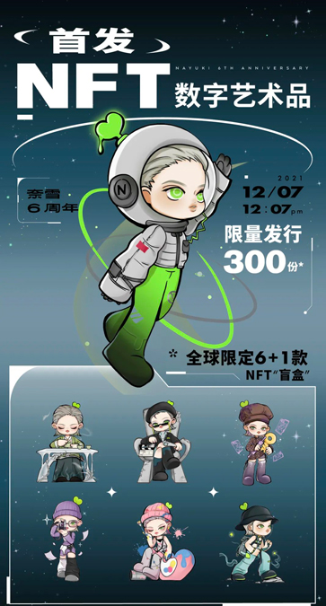
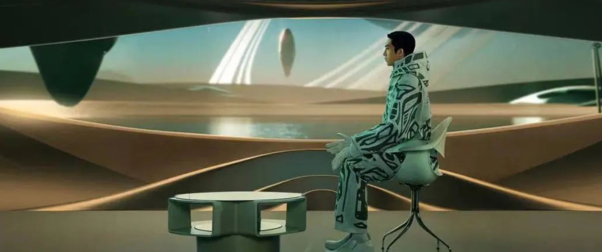

# 品牌元宇宙如何最大化触达消费者！

> 最近几年全世界都刮起了元宇宙风暴。元宇宙可能颠覆现有一切。让我们看到彻底释放想象力的无限可能。在这些时间，品牌也借着元宇宙进行着各种尝试。从游戏场景中的品牌道具到品牌虚拟时装秀等。品牌在寻找如何在元宇宙世界中，传达品牌信息给消费者。我们看看元宇宙如何触达并最大范围影响消费者的？

**真正的人格化**

以前企业经常说要打造自己品牌人格化，最多就是绘制一些卡通图案。这些图案，更多的是一种简单的图像。这种品牌卡通图案缺点就是比较呆板，互动性不是很强。品牌在元宇宙时代，完全可以打造属于品牌的虚拟代言人。他有着立体的身体，五官，和时尚的穿着。可以和消费者进行近距离的交流，消费者甚至可以看到虚拟代言人表情的变化。

虚拟代言人在品牌元宇宙世界生活着，拥有自己的人设，甚至自己的车子，自己的身份。虚拟代言人可以在线上帮品牌举行虚拟发布会、演唱会、品牌秀等。让消费者身临其境，并进行交互。企业能够通过线上激活品牌体验，驱动品牌增长。品牌线上、线下一体化的元宇宙，也为虚拟代言人进入消费者社交圈、娱乐圈打开了可能。

奈雪的茶在自己6周年之际，推出了美好元宇宙宣传主题。还推出了元宇宙IP＆品牌大使NAYUKI。NAYUKI偶像全球限量1000个，奈雪还以盲盒形式，限量发售美好多元宇宙NFT数字艺术品300个。通过这一系列的宣传活动，很好的把NAYUKI无拘无束特征真正的人格化了。万圣节时，柳夜熙一个会捉妖的虚拟美妆达人出圈了。视频通过美妆和后期特效呈现，达到了以假乱真的地步，很好的打造了首位元宇宙虚拟达人。

**新广告体验**

元宇宙广告不能还是品牌灌输给消费者广告信息。而是消费者从一个全新的角度去体验品牌。简单来说，元宇宙广告要带给消费者仿真的经历。就是消费者跟品牌接触以后，回忆跟品牌的过往，就像回忆过去真实的经历一样的感觉。从这个角度，元宇宙广告更类似于体验营销。

更重要的是，消费者不再是被动的品牌信息接受者。而且品牌所创造元宇宙的一部分。可以主动的去探索品牌世界。品牌和消费者的关系会进一步密切起来。新的广告体验，让之前品牌是希望消费者了解什么和知道品牌信息到现在品牌给消费者创造什么样的生活体验或愿景。百度在AI开发者大会上推出了自己的百度智能云曦灵平台，是数字人生产、内容创作等为一体的平台级产品。为了很好的宣传自己的产品，它们也进行了一系列营销活动，通过虚拟主持人、虚拟偶像、品牌代言人等各种数字人的展示，希望助力品牌打造定制化数字人等。

**开放的品牌场景**   

消费者其实大部分时间都处在一定的场景之下。只要消费者在线下活动，就不可避免的接触到场景。场景是一个不可替代的东西。元宇宙通过技术可以把消费者的各种场景仿真的体现出来。特别是跟消费者相关的品牌使用场景。这样场景就能和品牌广告自然的融合起来，更好的打动消费者。

品牌元宇宙中消费者可以看到虚拟世界与真实世界的边界越来越模糊，一些曾经一定要在线下操作或者必须真人出境的场景已经可以搬到品牌虚拟世界中。由此可见，品牌元宇宙未来发展的主要方向是通过匹配线上、线下不同的营销场景，找到适合品牌发力的核心产品来生动呈现。安慕希为了打造新生一代喜欢的新一代健康酸奶。推出了自己的元宇宙IP形象Amoo。它是一位次元探索家，自由探索不同次元场景，钻研酸奶元宇宙无限可能。品牌还在地铁和超市搭建相关场景，给消费者带来了沉浸式体验。

**广告创意更加灵活**

随着AI、XR、5G、人工智能、大数据等跟元宇宙相关的技术获得快速发展。元宇宙已开启萌芽生长期。它作为虚拟世界和真实世界融合的载体，目前已在社交、营销、内容、娱乐等场景落地。这些区块链、数字商品、非同质化代币（NFT）和个人数字替身等核心元素，也已投入到商业和品牌广告营销应用中。

在品牌元宇宙世界中，品牌可以为消费者自由地提供私人订制的体验、娱乐、灵感和消费机会。可以不受现实条件和时间空间因素的限制，具备更大的广告营销创造性与灵活性。在强大的虚实融合环境中，品牌还能够实时响应不断变化的市场和消费者需求，实现个性化的消费者互动。近期，阿里妈妈首推“元宇宙”杂志《MO Magazine》。它以“曼塔沃斯”为创刊号主题，通过井柏然与数字人AYAYI邀请消费者进入元宇宙的世界。创意的给消费者带来了沉浸式的互动体验。

虽然元宇宙真正的技术实现需要一个时间的过程，但是这种过程品牌也要积极的参与。虽然偶尔会有挫折，但是相对于元宇宙未来的品牌广告营销新机会来说是值得冒险的。未来元宇宙还有更多的创意机会等待品牌去发掘。

