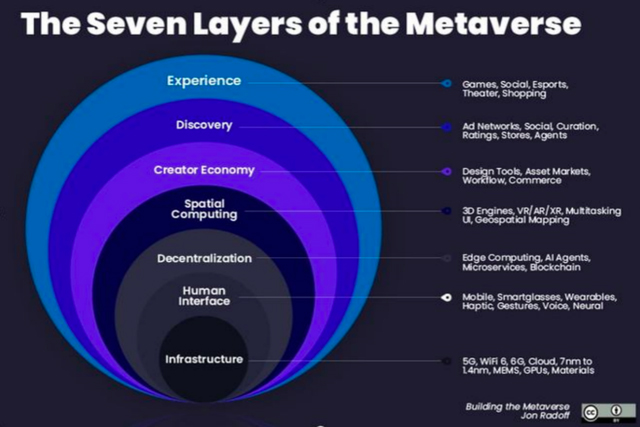

# 全面解读元宇宙，品牌如何获得新的消费增长？

**导语：**

自比特币等数字货币大火几年后，互联网圈在这两年似乎进入了静默期，人们并没有感受到数字货币带来的实际应用与生活的改善，所谓的数字货币也变成了圈子内的狂欢。

突然从去年开始，在互联网圈、科技圈另一些概念开始崛起，“元宇宙”、“WEB3”、“NFT”“区块链” 令人眼花的名词层出不穷。互联网巨头facebook在2021年10月宣布正式改名为Meta，宣告正式进入元宇宙赛道，宣称将在未来5年时间，将公司打造成元宇宙公司。随后，国外公司可口可乐、Bruberry、Gucci，国内公司奈雪的茶、茅台等纷纷宣布进入元宇宙市场，推出自身的NFT数字藏品，元宇宙概念一时风光无限。有人称这是未来互联网科技的发展趋势，也有人说这是互联网继数字货币概念后的另一波炒作。

**那么元宇宙究竟是什么？“元宇宙”又是否可以作为品牌继电子商务、短视频、直播后的下一个增长赛道呢？**

**一、元宇宙是什么？**

初次接触到元宇宙，很多人都有个疑问，元宇宙不就是VR游戏么？我的回答是“是”也“不是”。元宇宙在VR的技术上发展，但拥有了一项在以前的网络中无法实现的事情，“真实的经济系统”。要想深入了解元宇宙，要先从一个概念讲起：**“WEB1.0、2.0、3.0”**。上世纪60年代末，世界互联网在美国诞生，由4台计算机通过局域网链接起来，从此互联网开始进入“WEB”时代。

1、WEB1.0：用户开始“读”互联网

到90年代，互联网在全世界开始普及，其中个人门户网站的建立标志着WEB1.0时代的到来。以个人、公司为主的网站主将信息及内容发布到网站上，用户则可以在互联网上主动浏览这些信息，**WEB1.0，用户进入了“读”互联网时代。**

2、WEB2.0：用户从“读”互联网变成“读写”互联网

04年开始，博客、社区等社交媒体网站开始蓬勃升起，这使得用户可以在网络上主动发出并创造内容，互联网开始进一步发展，而WEB2.0时代则是用户从被动的“读”到主动的“读写”的转变。

但是在WEB2.0时代一直有一些问题，那些提供给用户生产内容的平台如“微信、微博、抖音”等等，用户平台上生产的内容并不属于用户，而是平台方拿着用户生产的内容作为自身的资产进行融资、扩张。另一方面由于互联网中的内容仅需“复制、粘贴”就可以进行传播，所产生内容及数据容易被贩卖，而真正产生数据的用户却无法得到贩卖的收益。

**这导致了WEB2.0时代两个问题：**

**1、用户自身的数据并不归用户所有，归属网络平台，也就是中心化。**

**2、自身数据极其容易流失，用户作为创作者没有得到真正的收益。**

**3、WEB3.0与元宇宙：在“读写”基础上增加了“体验”和“拥有”**

基于上述两个问题，WEB3.0时代的到来是必然的。WEB3.0的特征就是“去中心化”，使用户产生的内容、数据真正的归用户所有，用户是数据的合法拥有人，并可以进行专卖自身数据进行受益。

而区块链技术的发展也加速了WEB3.0时代的到来，这是一种加密数据技术，使数据不再保存在单一的“中心化平台”上，而是保存在每一个传输的节点上，每一次传输都通过对比所有节点上的数据来保持其准确性，如果数据被修改、盗用则被视为无效，**这一技术真正实现了用户数据的“去中心化”及“资产化”，基于此生成了元宇宙中最重要的一环“NFT”数字资产。**

NFT（Non-Fungible Tokens）译为“非同质化代币”，是区块链中注册的一种独特数字证书，可锚定现实物品的数字凭证，唯一的编码代表了其具有独一无二、稀缺、不可分割或复制的特点，可以用来记录虚拟收藏品、游戏内资产、虚拟资产、数字艺术品、房地产等各种资产的所有权，也使之成为公认的特定资产可交易性实体。打个比方，在现实世界中，你可以购买一幅画家的画，出具票据等一系列证明就可以证明这幅画的归属权，所有其他的画都是仿冒的。现在在WEB3时代中，同样你买一幅虚拟的画，其背后的NFT数据同样可以给你证明其购买的虚拟物品的唯一性，而你的画也可以放到任何平台进行交易、转卖。

**正是WEB3.0时代的到来，打开了真正元宇宙的大门，元宇宙通过虚拟现实的技术创造出一个虚拟世界，人们可以在这个虚拟世界中体验各种事情，而且这个虚拟世界和现实世界一样，其产生的资产归属于个人，但更难以被盗用。元宇宙不仅仅是一个虚拟游戏，而是现实世界在网络中的真实分支，它超越现实中的社交、工作等多种体验，并且拥有更安全、可追溯的经济系统。**

**二、元宇宙时代给企业的五大增长机会**

如同电子商务时代的崛起，元宇宙时代在发展中成长。研发工具商 Beamable 公司创始人Jon Radoff把元宇宙划分成七层价值链。其中对应着企业未来的增长机会，让我们一一解读。

1.基础设施、人机交互、空间计算：巨头之间的技术竞争

元宇宙的发展必然离不开基础设备的支持，就像互联网带动了电子设备及网络通信赛道的发展一样，云计算、5G、芯片、图形处理器、对应着最底层建设，如同高速公路和房屋。VR、智能眼镜等交互设备将成为用户进入元宇宙的入口。这些围绕元宇宙产生基础建设必将迎来井喷式增长。在这些赛道中，技术将成为最主要的核心竞争力，如微软、苹果、华为等巨头已经在此加速布局。空间计算则主要为用户创造更好的虚拟体验，为了让用户在虚拟空间中感受到更真实甚至超越真实的场景体验，目前主要以3D技术厂商为主，如英伟达、字节跳动等开始布局。

3.创作者经济：品牌价值增长的切入点

正如上述所说，元宇宙时代中，用户创造的所有数据内容将归用户所有，且由用户进行自由处置（转卖、保存等），这将会迎来数字内容创作的井喷，正如风靡全球的“无聊猿”数字画像，自2021发售起，涨幅高达1873倍，价值40多万美元。品牌要想抓住此波热潮，一方面要着重打造自身内容创作能力，以自身为基础创造数字内容，形成品牌自身的数字IP。另一方面可以邀请用户共创，实现用户的高度参与感。

要注意的是，这些虚拟资产价值的核心在于内容背后的赋能，在众多数字作品中“无聊猿”因其全球名人的推荐、用户对其形象的不断创作，形成的IP化，这才是“无聊猿”被称为最有价值的数字头像的原因。因此，创造内容并赋能内容将成为品牌下一个用户增长点。

4.发现：广告及口碑，在新时代依然不可缺少

发现，指在元宇宙的发展阶段，主要将用户引入元宇宙的途径，人们通过传统的信息收集渠道如搜索引擎、应用商店、线上线下广告等及社交化媒体的口碑传播。这意味着品牌要想进一步将更多用户引入自身的创造的元宇宙店铺进行体验，有效的广告及口碑营销依然是必不可少的。

亚马逊宣布推出Amaozn View新功能，该功能融合了VR技术，允许消费者查看商品展示在居住环境中的样子。

**结语：**

以上是元宇宙的全面解读，网络及科学技术将随着时代不断发展，元宇宙或许现在在有些企业看来只是个哗众取宠的小丑，如同当年电子商务的出世，一些传统巨头对此不屑一顾，却在不知不觉间迷失在时代的风口，一些企业积极拥抱，现在转型成功。正如刘慈欣在《三体》中所说过得“弱小和无知不是生存的障碍，傲慢才是。”保持敏锐，拥抱时代，企业的价值才不会随时代而消逝。