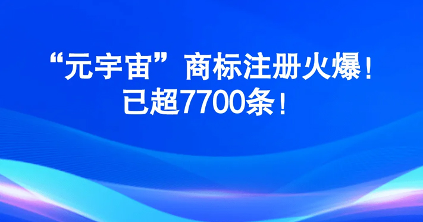

# 商标界欲掀起元宇宙风暴，多品牌争先注册元宇宙商标

> 自从世界科技互联网巨头脸书Facebook更名Meta以来，元宇宙短短数月火出天际，无论零售企业还是快消企业，都纷纷宣布要搞“元宇宙”。

怕上火，就做元宇宙，这是王老吉的新动作。

近日，财富世界500强巨头，白云山申请注册“王老吉元宇宙”商标的消息再次引起行业轰动。

***01***

**王老吉元宇宙商标申请**

**元宇宙首款活动来了**

据天眼查显示，王老吉品牌持有方广州白云山医药集团股份有限公司近日确实在申请注册“王老吉元宇宙”商标，国际分类为“32类 啤酒饮料”，当前商标状态为“注册申请中”。

就在王老吉商标申请前几天，王老吉在淘宝公开拍卖一款首次推出的数字艺术作品“百家合”。

据悉，王老吉以姓氏文化为主体，以传统文化为创作元素，以数字技术为载体，推出了100款“百家合”数字藏品，也是王老吉进军元宇宙的第一步。据悉，“百家合”数字藏品在区块链上拥有唯一的标识和权属信息，不能被盗用，因此用户一旦获得就相当于拥有了一份独一无二且无法同质化的数字资产。

此次针对“百家合”数字艺术品的发布，是从web2.0跃迁至3.0的元宇宙世界的探索，也是为了更好的撬动年轻用户市场，最大限度的实现与消费者的深度互动做出大胆尝试。

***02***

**你要了解的元宇宙**

什么是元宇宙？

自从扎克伯格（facebook脸书创始人）将公司改名为Meta以彰显转型元宇宙决心之后，国内外均有不少科技公司和互联网公司纷纷跟进，如今传统零售和快消品行业企业也纷纷加入，确实让这个充满神秘的名词再次引起大家的注意。

元宇宙（Metaverse）是利用科技手段进行链接与创造的，与现实世界映射与交互的虚拟世界，具备新型社会体系的数字生活空间。

元宇宙一词诞生于1992年的科幻小说《雪崩》，小说描绘了一个庞大的虚拟现实世界，在这里，人们用数字化身来控制，并相互竞争以提高自己的地位，到现在看来，描述的还是超前的未来世界。

准确地说，元宇宙不是一个新的概念，它更像是一个经典概念的重生，是在扩展现实（XR）、区块链、云计算、数字孪生等新技术下的概念具化。

应用在零售和快消品的营销中，我们可以简单理解为新零售“人、货、场”中的场，就是一种全新的沉浸式，科技化，虚拟现实结合的场景体验。

***03***

**沃尔玛、宝洁、可口可乐、奈雪等**

**纷纷瞄准元宇宙**

在看这些零售与快消品品牌入局元宇宙前，我们需要了解一个叫“NFT”的东西。NFT的全称是Non-Fungible Tokens，中文常翻译为“不可同质化代币/不可替代代币”。简单地说，NFT是区块链的一个条目，而区块链是类似于比特币等加密货币的去中心化数字账本技术。

 

因为NFT不可替代的特性，这意味着它可以用来代表独一无二的东西，比如博物馆里的蒙娜丽莎原画，或者一块土地的所有权。

上文提及的王老吉进军元宇宙，其实就是这个玩法，除此之外，沃尔玛、宝洁、可口可乐、耐克、蜜雪冰城等企业也纷纷加入元宇宙“开发”计划。

可口可乐和数字可穿戴设备设计平台Tafi，联合推出了NFT数字藏品，Coca-Cola Friendship Box的作品，进军元宇宙。

宝洁旗下品牌P&G Beauty在美国消费电子展上推出线上虚拟世界“BeautySphere”，主题为“Responsible Beauty”，消费者可以通过虚拟现实技术与品牌进行互动，参观英国皇家植物园邱园，探索宝洁旗下品牌“Herbal Essences植感哲学”中使用的植物成分。

2021年12月7日，新消费品牌奈雪的茶宣布进军“元宇宙”，其发行的NFT盲盒已经上线就被秒空。同时，奈雪推出“充100得150”的储值卡福利，72小时内销售额达到1.9045亿元，相当于全国门店近一周的销售成绩。

2021年年底，主打下沉市场低价饮品的蜜雪冰城也注册了元宇宙商标，根据天眼查显示，蜜雪冰城注册的商标有“蜜雪元宇宙”“雪王元宇宙”“MIXUEMETA”“SNOWKINGMETA”等。

据CNBC当地时间2022年1月16日报道，沃尔玛正低调进军“元宇宙”领域，表示其有意制造和销售虚拟商品，包括电子产品、家居装饰、玩具、体育用品和个人护理产品，同时将向用户提供虚拟货币和NFT。

据公开信息显示，传统品牌冷酸灵、五粮液、自然堂、小鹏汽车等都陆续搭建了各自的数字收藏品，即NFT，开始元宇宙相关领域的探索与尝试。

总的来说，元宇宙是个大蛋糕，各企业都争先想要通过注册元宇宙商标来分割这块大蛋糕，一旦分食到，那将是无穷的财富。但蛋糕虽大，却不是容易吃到的，据悉，目前还未有企业注册成功元宇宙商标，几乎无一例外，元宇宙商标都被一一驳回。

那么究竟哪个企业能先一步注册成功元宇宙商标呢？这真是一个令人十分好奇的问题，你觉得呢？欢迎留言，说出您的想法。

