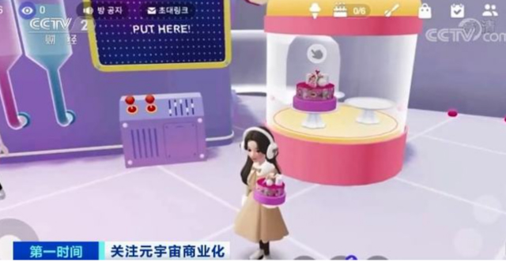
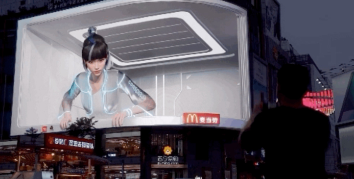
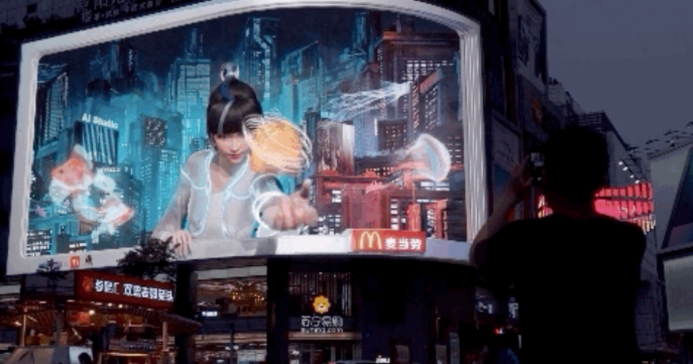
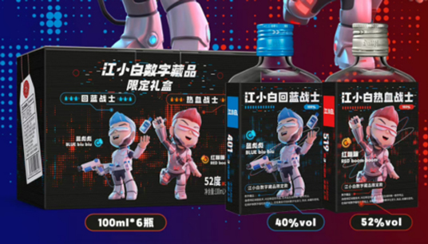
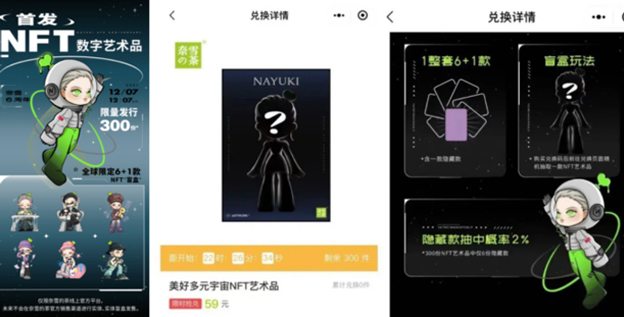

# 食品饮料行业如何玩转元宇宙品牌营销

> 品牌该如何入局，占据元宇宙先机？

继社交和数字化时代之后，我们现如今已经进入了营销的另一个时代，即元宇宙时代。2021年掀起了元宇宙的浪潮，元宇宙带来了“视觉、听觉、嗅觉、味觉、情感、情绪、心理、生理”等全方位喜怒哀乐的沉浸式体验升级；元宇宙的广告营销策略也从当下单项输出的一维平面变为消费者可感受、可参与、可创造、可穿越的四维空间，我们从视觉媒介进入全感知媒介的新时代！

随着越来越多生活场景同步到虚拟空间，元宇宙已经成为一个新锐、前沿的营销阵地！奢侈品、时尚服装、美妆、食品饮料、直播电商以及金融和文旅物理空间等品牌及场景商在加快布局元宇宙，陆续推出虚拟数字人、NFT数字藏品、沉浸式及游戏化交互体验的服务及产品。新的市场空间、新的商业体系、Z时代新消费人群涌现，新的营销技术和营销理念也应运而生。品牌应该如何玩转元宇宙营销，如何获取Z时代年轻消费者的青睐成为众品牌共同力争的突破点。

品牌该如何入局，占据元宇宙先机？我们接下来，从食品饮料行业领域入手聊聊食品饮料行业在营销机遇和实践案例上做分析。

虽然元宇宙相对来说仍然是个新兴概念，实现其全部可能性所需的技术也仍未发展完全，但这并不阻碍企业和品牌制定能够充分利用元宇宙时代下的品牌机遇：
1)争取新受众， 重振品牌感知
2)与消费者建立长久关系 并构建社区
3)创造叙事方式， 建立特色

米塔之家根据市场上的元宇宙营销实战，总结了元宇宙时代的品牌三大营销手段：
1）虚拟数字人-连接元宇宙与现实的使者（新品上市推荐官）
2）NFT数字藏品-先锋品牌营销新密码（经典品牌破圈必选）

3）沉浸式与游戏交互设计带来营销新范式（电商促销必备）

食品饮料的实践案例分析

## 1：（韩国冰淇淋工厂）虚拟空间沉浸式体验+游戏互动营销

虚拟冰激凌工厂

首尔市的上班族郑珉晶，近日偶然登录一个3D虚拟社交平台时，发现常去的冰淇淋店在平台上新开了虚拟工厂， 号称是含有元宇宙元素的第一号冰淇淋工厂 ，她不禁产生了兴趣。郑珉晶通过平台创建3D虚拟化身进入工厂，在3分钟的限制时间内，集齐所需材料制作出了冰淇淋蛋糕。任务完成后，虚拟工厂赠送郑珉晶电子优惠券，这些优惠券可以在现实世界的冰淇淋店里直接使用。据这家冰淇淋店负责人介绍，虚拟工厂是去年12月底开张的， 仅一周时间玩家的访问量就超过100万人次 ，这带动冰淇淋 实体店的销售额走高 ，较此前一周增长两成左右。

##  2：（麦当劳）裸眼3D+数字人带你突破次元壁，开启“真香之旅” 

“吃汉堡的数字人”

最近，百度旗下的AI数字人「希加加」就与麦当劳联手，在成都、大连的裸眼3D大屏上演了「吃汉堡的数字人」。

只见「希加加」从未来感的简约空间中，走向大屏幕。她倾身看向楼下的麦当劳店铺（这互动绝了），牛堡散发香味....似乎被美味吸引，这是要咬上一口的节奏？

“吃汉堡的数字人”

此刻，站在广告牌下的观众才恍然大悟，原来这是麦当劳的广告？！这款连「希加加」都忍不住要尝上一口的“安格斯MAX厚牛堡”竟然是麦当劳推出的新品，而希加加也顺理成章地成为这款单品的AI推荐官。

## **3:（江小白）3分钟售罄！江小白数字藏品引爆消费狂欢**

江小白数字藏品

在2月28日0点正式上线的江小白数字藏品，在3分钟就宣布售罄，销售转化率创历史新高，超过日常的10%，单日销售额超日常16倍，支付用户数也暴涨超日常34倍，成为天猫当日酒类成交额的TOP4。

江小白此次在天猫《有点东西》上推出的“蓝彪彪”和“红蹦蹦”，“告别emo”的主题其实也是江小白“创享愉悦”价值理念的一贯延续，同时，也让更多的品牌看到了数字藏品在消费端的热度。品牌可以通过数字藏品第一时间与这些未来新生世代年轻人，建立良性的互动沟通机制，进而推动实现更多品牌心智层面的沟通，并同步完成内容种草，促成品销合一。

## 4：（奥利奥）结合NFT数字藏品打造最会玩的“水墨风小饼干”

奥利奥推出了全球首款白色奥利奥饼干，与经典的黑色奥利奥一起，打造“水墨国风”概念组成全球限定版黑白饼干。同时，延续“玩在一起”的品牌精神，奥利奥联合周杰伦发布水墨国风大片。

不仅如此，这块“最会玩的小饼干”开创性运用区块链技术，基于线下水墨艺术展同步发行链上数字水墨长卷，让国风奥利奥在元宇宙生长出生命力。

## 5：（可口可乐阳光柠檬味茶）虚拟数字人-Z时代文化下，品牌升级

据了解，中国的Z世代人数多达2.64亿（出生于1995~2009年间的人），在漫画与动漫之中成长起来，对虚拟偶像的接受度也比较高。同时，Z世代消费人群已成为当前中国最具消费实力和潜力的群体，也更愿意为自己的热爱买单，也给虚拟人带来了火热的市场，为了迎合Z世代的消费习惯，品牌营销模式也随着发生一系列变革。Z时代文化下，品牌升级离不开IP化，塑造与品牌相匹配的虚拟IP，或者将品牌传统的平面形象“复活”已成为促进品牌转型升级发展，在激烈市场竞争中脱颖而出的重要因素。而对于品牌商们来说，虚拟偶像的商业价值是非常巨大的。

以洛天依为例，曾为很多美食饮品例如可口可乐、康师傅、雀巢咖啡代言，她还与汰渍进行了环球街拍，与太平鸟服饰进行了联名，去年还进入了直播间为欧舒丹等品牌带货。

## 6：（奈雪的茶）虚拟数字人+数字藏品,全面赋能品牌营销

奈雪的茶推出全新的虚拟人NAYUKI，以及相应的NFT数字藏品，从悬念预热到隆重登场，奈雪将储存卡福利和虚拟代言人捆绑在一起推出，充分释放出了IP人物的能量。

奈雪的茶虚拟人NAYUKI

在IP设定中，这三点与品牌调性契合得很好：

IP人物造型 —— 提取品牌标志性标签，匹配人物造型与调性；

IP角色设定 —— 美好的多元宇宙，美好的NAYUKI，品牌与用户共同展望美好未来；

IP社交属性—— 线上NFT，线下盲盒收藏，以品牌IP内容与用户互动，强化用户心智；

通过IP「元宇宙」营销，使得品牌资产不再只是空谈，实实在在的品牌数字资产会在一次又一次的品牌营销中，越积累、越厚实，最终建筑起一个深厚的品牌形象护城河 。

看到这里，如果你还有以下疑惑：
「元宇宙」很热门，但仍然不知道如何切入品牌营销？·

「元宇宙」听起来很贵，预算不高怎么做？·
「元宇宙」听说监管不足，该怎么规避潜在风险？

在虚拟世界中，品牌有数以百计的机会。 如果你想知道元宇宙是什么，它如何推动新的参与，创造 O2O 体验，以及你如何开发元宇宙世界内的广告，欢迎与我们联系；我们将为品牌提供1对1咨询包含从元宇宙营销咨询策划、虚拟数字人制作、孵化与联名、沉浸式虚拟空间搭建、数字藏品创意制作、设计、发行等一站式元宇宙营销解决方案；我们可以帮助你在元宇宙中导航，提升价值，并建立新的体验。
