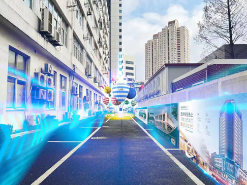
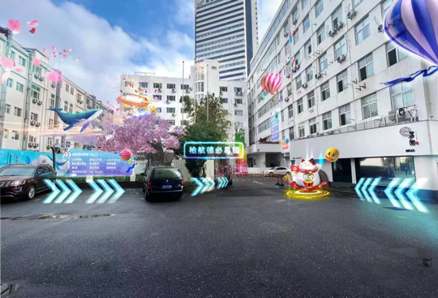

# 突破“次元壁”！首个元宇宙创意园区办公场景正式在虹口上线

> 担心在园区迷路？“召唤”元宇宙世界的AR导航，只要跟着眼前的镜头，即可抵达现场；

觉得工作场景太单调？走进元宇宙世界，便可一路探寻园区里的暗藏“彩蛋”；

看腻了画报与电子屏？AR广告借助实体空间加持，创造广告新形式……

如今，这样的元宇宙语境正突破“次元壁”，出现在日常工作中。记者今天从虹口区了解到，近日，由德必集团打造的全国首个元宇宙创意园区办公场景正式在虹口柏航德必易园上线。

柏航德必易园，位于上海市虹口区中山北一路1200号，前身为研发导弹遥控及通讯设备的航天工业老厂。2013年经德必集团更新改造后，成为文化创意办公园区。如今这座更新10年之久的创意园区，正借助数字化技术和元宇宙生态，迎来二次更新。

元宇宙需要实时交互、传感技术和区块链等技术的基础支撑，德必集团创新研发了智慧园区管理系统wehome。在这里，戴上AR眼镜或是打开手机，便能感受到为园区白领提供的沉浸式体验。无处不在的AR大屏幕，让企业的最新产品、最新广告等不再限于实体，让创意灵感在虚实交融的三维世界中进一步迸发。

通过计算机网络，园区可为每家公司量身定制个性化展示空间，并随时更新，让颜值与功能在线。没有漫长的施工周期，也没有扰人的“装修”，这样非静态且虚拟与物理空间交融的办公场景，将大大提升园区能效、生产力及交互力。

一方面，德必元宇宙园区将完善基础办公服务，让线上办公、日常的跨区域会议等不再受限于技术与设备，通过数据进行空间复刻和场景模拟，让参会人员产生更加高效的良性互动。

另一方面，德必元宇宙园区还将叠加虚拟向导、养成宠物模型、设计游戏规则，丰富园区虚拟互动场景。例如，虚拟向导将介绍每栋建筑的详细内容，包括但不限于楼内已承租企业、办公面积、合作渠道等，还可提供周边餐饮。再如，结合园区特色设计主题游戏，包括可提供福利的寻宝游戏、虚拟养宠等，通过游戏内激励机制的设计，促进园区内白领的社交互动。

未来，除了将进一步打造元宇宙园区办公生态体系之外，德必将联动更多的园区企业，共同探索元宇宙产业技术的发展、孵化高效益未来型产业。在区块链技术和分布式网络的支持下，用丰富想象力延展元宇宙技术和产业的更多可能，让更多资源互通、业态共生的创新产业场景在德必园区落地。

