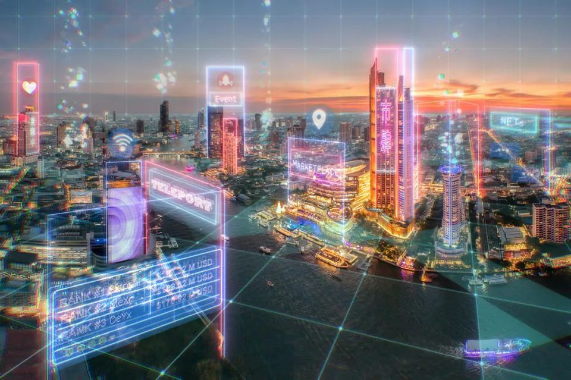

# 未来的元宇宙热潮中，企业该如何建立品牌？

> 企业品牌的部署，将随着组织规划通往互联网未来状态的路径而发展和调整。

当前的元宇宙正在构建中，有人乐观地说五年内可以出来。也有专家预测更像是10到15年，这取决于一些硬件和连接问题。但快速发展的今天，我们正在铺设它的基础轨道，奠定它的未来发展基础。

如何定义一个成熟的元宇宙？对于人类来说，这是一种持续的、不断发展的体验。现在元宇宙还处于早期阶段。它会随着相关技术的发展而成熟。目前已经开始了，而且会越来越好。

在开放的元宇宙里，前端的可用性体验让大多数人都可以有愉快的体验，在元宇宙中用户作为一切的中心，用户拥有可追溯性和可移植性。这样的开放交互式体验大概率只是时间问题，迟早都会发生。所以在开放的元宇宙里探索好玩有趣的交互，以用户体验为中心的元宇宙、开放的元宇宙可能最大程度上吸引Z世代的用户。

随着大量的资金和人才都进入了这个领域，大概率会有一些新方向的项目出来。人们总是有创造新事物探索未知的渴望，元宇宙给人类能够带来更多的创造力。目前海内外如火如荼探索不同方式的元宇宙，这正是推动那些进行大规模投资的公司的动力，但也将会在较小规模上的项目进行投资。这将涌现出大量具有创造力想象力的项目——我们可能会在未来两到三年内看到这一点。希望在不久的未来，能够有项目探索出能让人们在不同的元宇宙之间可以流畅切换的体验，以及支持开放的方法。

在过去的几年里，人们一直在要求透明度和在数字行业中拥有发言权。在区块链技术进步之前，这是不可能的，区块链带来了加密货币、NFT、元宇宙和DeFi。这一切现在齐头并进。人类正朝着这个方向不断成熟和进化。

当谈到 NFT 时，很多人可能会有不同情绪。但当我们把NFT与区块链技术相结合时，区块链的概念为NFT带来积极的方面。也许是因为有时我们陷入了NFT疯狂的炒作，它的疯狂的炒作让人对它又是欢喜又是担忧。

区块链作为一种底层技术，它背后的计算机代码，它背后的智能合约。区块链作为一种技术是目前大多数人加入并认为有价值的重要原因。即使目前围绕 NFT 和游戏赚钱方面存在很多炒作现象，但这项技术的确对改变世界产生了某种作用，多数人将区块链技术视为一种积极的技术。

元宇宙是类似于互联网和社交媒体的下一个技术拐点。元宇宙为那些愿意开拓的人创造了新的商业机会。元宇宙经济的独特之处在于去中心化应用 (dApp) 运营商、用户和企业聚集在一起形成对所有人都有利的经济学系统。作为用户的消费者将参与社区和品牌建设，这将使他们更像是用户生成内容的合作伙伴和创造者。

元宇宙的一个特点是可以吸引很多有想法创意的人。元宇宙的根本之处在于它是一片充满机遇的新土地，在这里，创业将获得全新的转折，因为任何人都可以成为元宇宙中的企业家。他们来自哪里并不重要。很多时候，在元宇宙中，人们会假设不同的身份。这一切都被混淆了。也许将来你会与非洲或亚洲的人做生意，但最终如果他们提供好的产品或好的想法，无论你在元宇宙中看到什么——这才是真正的开放元宇宙世界，而不仅仅是关于技术和区块链，而是世界上任何地方的人都可以参与进来共同创造的新世界。

元宇宙将各个品牌、艺术家和观众之间的体验升级了一个维度。元宇宙将有可能改变品牌与其受众之间的体验与交流方式。元宇宙可以激发更多的创造力、一些项目和来自企业、创造者的创新，共同推动着元宇宙不断向前发展。

品牌在与客户、合作伙伴或者是整个行业进行交流时，讲故事的方式都是品牌与其受众之间的主要共鸣的联系方式。在与 Metaverse 中的价值创造框架类似，元宇宙可以帮助品牌直接收集用户的实时反馈数据，以便在开发这个令人兴奋的新空间中提供最符合用户期待的切实想法与创意。

对于企业的品牌来说，最困难的部分可能是试图对整个社区实时构建的东西预设采取某种立场，而创作者和技术专家则想办法将它们都连接在一起。建立一个灵活、跨学科的内部团队是探索其潜力重要的一步。对其团队人员的一项要求是能够超越既定结构进行思考，同时能够将其业务与元宇宙场景项目建设联系起来。

虽然目前对 Metaverse 有多种解释，但最重要的是企业品牌团队对元宇宙有个全面的认识。目前大多数的元宇宙定义可以作为企业品牌寻找方向的灵感，但它可能不向传统技术那么简单。需要结合自身的业务所形成的元宇宙才可能对于企业来说是最正确的。

一些企业品牌从企业定位中加入元宇宙概念。企业在开发探索的元宇宙时，其关键要素取决于该品牌的受众参与其中的可能性。大企业，通常具有高度发达的营销部门，他们对其受众都有很好的了解，这有助于品牌如何最大程度利用开发元宇宙。

在元宇宙中存在的期望方向是什么？要想把元宇宙做好，需要花很多心思。对于大多数企业来说，这是利润驱动的。企业品牌看到了扩大受众的机会，可以进一步加深与现有受众的联系，甚至是与全新受众互动的方式。无论哪种方式，品牌都应该在元宇宙中密切结合自身特点，把自身最具魅力的部分让用户切身体会到企业真正的品牌价值和企业文化内涵。

在元宇宙中由于所有权产生了动态变化，元宇宙打破了这种平衡，将优先级的钟摆严重转向客户价值 。现在，企业业务的成功与为最终用户创造的影响程度更加密切相关。品牌的最佳情况是最终用户甚至没有意识到他们正在与元宇宙进行交互，是一种渐进的潜移默化的影响方式。

企业品牌需要进行技术讨论并将品牌资产映射到元宇宙，以帮助品牌快速执行与业务一致的想法。元宇宙是一种新兴现象，由集体社区实时构建的 Web3 技术在许多方面提供支持。

企业品牌的部署，将随着组织规划通往互联网未来状态的路径而发展和调整。现在是有志于发展元宇宙相关的企业，制定整体战略、明确试点探索方向并为未来几年将出现的新挑战和机遇做好准备的时候了。