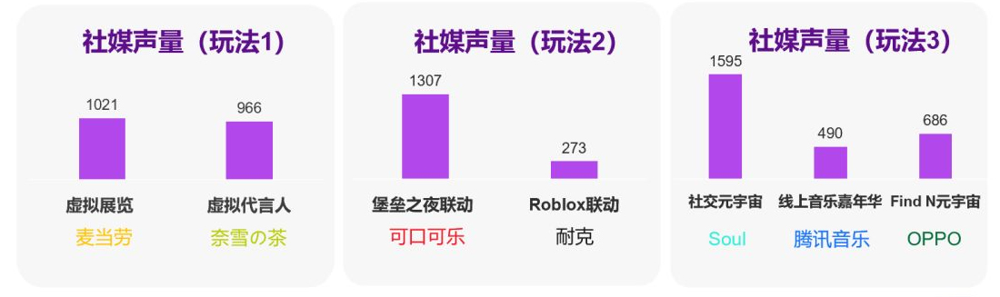
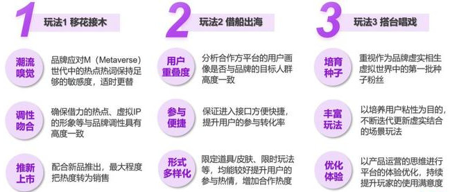

# 元宇宙如何赋能品牌营销

2021 年无疑是 “元宇宙元年”。这个似近似远且高度依赖互联网技术的新概念在 2021 年火爆市场，并且引爆一大串 “元宇宙概念股”，备受资本追捧。

在 “元宇宙历 2 年” 的 2022，越来越多的品牌开始尝试**利用元宇宙概念及相关技术进行品牌传播和用户运营。**益普索元宇宙研究院选取了 7 个来自不同品类的品牌，通过社媒聆听和益普索微信 panel 用户调研，分析了他们在**第一季度国内元宇宙事件的营销效果。**

01、**元宇宙营销的三种玩法**

基于 “**元宇宙技术卷入度**” 和“**品牌体验的沉浸度**” 两个维度（元宇宙技术卷入度：AI/VR/AR/XR / 区块链等相关技术在整个营销事件策划中的卷入程度；品牌体验沉浸度：在营销事件过程中用户与用户、用户与品牌互动的深度。），益普索把这次分析的 7 个营销事件划分为三种 “玩法”：**移花接木、借船出海、搭台唱戏。**

**玩法一移花接木**

**元宇宙技术卷入程度低：**运用浅层元宇宙相关技术，进行宣传内容的制作

**用户体验沉浸度低：**仅利用一些热点概念（如发行数字藏品）进行品牌宣传

受众跨度广

品牌文化内涵有待挖掘和沉淀

用户体验单一，通常被认为有 “蹭热度” 之嫌，在事件的热度持续性保持上较为困难

**玩法二借船出海**

**元宇宙技术卷入程度中等：**联动类元宇宙游戏平台，打造线上局部空间

**用户体验沉浸度中等：**用户在虚拟平台中一定程度地与品牌产生交集

联动平台玩家需与品牌受众一致

品牌已有的文化沉淀，借力平台体验获得强化

**玩法三搭台唱戏**

**元宇宙技术卷入程度高：**打造自有线上空间，供用户以虚拟身份进行活动

**用户体验沉浸度高**：用户有机会在虚拟空间中进行全方位体验

受众圈层为年轻一代的前沿用户

品牌 / 产品有强科技或强社交特性

令用户沉浸式地体验到品牌前沿技术的应用、内容创作等方面的优势

02、**如何评估元宇宙营销的效果**

有效的品牌营销活动，应该满足两个必要条件：**获得目标受众的关注，及品牌能从中受益**（产生对品牌购买意向的短期影响，或者对长期品牌资产的沉淀有正面作用）。

三种玩法的营销活动，在社交媒体上产生的**声量水平均不算突出**；单个活动事件不到 2000 甚至低于 1000 的声量，只占这些品牌同期在社媒中的讨论声量的 1%；由此可见，品牌方对元宇宙仍只是 “试水” 中，且后续也缺少相关话题和活动的更新。

虽然网络声量不大，但看过相关内容消费者的品牌**购买意向或者使用意向得到明显提升。**话题缺乏持续讨论热点，营销事件对品牌资产的长期沉淀作用则有待观望。

无论使用哪种技术手段，品牌传播要达到既定目标，对目标受众的有效曝光并引起他们的关注永远都是必要的前提。在这一点上，这 7 个营销事件显然在目标人群中未获得普遍的关注（也许与品牌方都仅抱着试水态度，传播投入力度不高有关）。

在目标受众关注了事件、体验了活动后，是否触发了他们对品牌的购买欲或者对品牌的好感则是关键，也是营销的本意。数据结果显示，与传统营销手法相比，元宇宙跨界营销对品牌偏好的潜在作用力是巨大的。

03、**如何优化元宇宙营销**

基于品牌元宇宙营销效果的市场调研和数据洞察，对三种不同营销玩法，提出以下建议：

