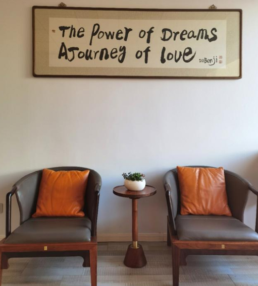

# 让全世界在“体验中国文化”的元宇宙创意中更爱我们的文化

2022年7月5日，在中国国际文化交流基金会体验中国文化专项基金管理委员会办公室，与王星娴主任进行了近三小时交谈，从中清晰地了解到王主任是一个非常乐于公益事业，喜欢独立思考，采访过程中也给我们带来了有趣的分享。

以下为部分采访记录：

Q：一进门就看到这幅独特的用英文中国书法的字——The power of dreams A journey of love，您一直乐于公益事业，当时是什么使您创立“梦想的力量 和爱同行”这个项目平台？

王星娴：其实，如果从思想的层面来说，在我内心深处一直就存在公益之志，也一直坚持公益善行，运营一些与慈善相关的项目。只不过2013年可以作为一个相当有意义的转捩点。

2013年底，我们受到米兰世博会组委会的邀请，希望我们能组织具有中国特色的一些活动到世博会，到一个更为广阔的国际舞台上，去交流，去展示。

我当时内心第一个反映就是“要去世博会做公益向的活动”。当然，这需要我们进一步思考：中国人的公益是什么，能在世博会舞台上做什么，表达什么，如何通过有层次的公益活动勾勒出当代中国人的精神轮廓？如果说2013年之前，我们团队的“公益行动”相对来说聚焦国内，尚未站在一个“国际化”的思考层面上。那么2013年之后，我们几乎用了大半年的时间重新思考，直到2014年年中，我们逐步确定下“梦想的力量 和爱同行”（The power of dreams A journey of love ）的米兰世博会系列公益活动的大主题。

可以说这“九个字”提炼了我们团队上下以及求证过程中各位专家顾问的思想精华。“梦想”是人类不断进取开拓的支撑力，这种力量因为“和爱同行”，才有了更高普世价值，能在全球得到更广泛的呼应。放之全球，“dream ”和“love”又有谁可以失去？

“梦想的力量，和爱同行”系列活动当时也得到了中国对外文化交流协会和中国文化艺术发展促进会的支持，成为米兰世博会期间中国对外进行文化交流的重要平台。

具体说来，活动以“中国梦”为主题，以“弘扬中国文化”为目标，设“家庭梦想”、“企业梦想”、“城市梦想”、“国家梦想”以及“人类梦想”五个板块。

我们在2014年到2015年间，举办了各板块的多项活动，包括：“全球新人玫瑰盛典”、“分享笑脸，和爱同行”映像展、国际摄影文化交流使者团、梦想学旅、绅士生活国际大赏、中欧友好城市缔结暨主题城市推介、“茶香四海”—中国茶文化走进米兰世博会、国际和平日主题活动、“梦想的力量，和爱同行”艺术展等等。

Q：您觉得这么多活动里面最有意义或者说最难忘的是什么？

王星娴：对我来说，9月21日“国际和平日”的活动至今记忆犹新。活动得到了米兰世博会组委会大力支持，长期致力于全球和平发展事务的全球各界人士共一百多人受邀参加了主题活动。这是当年在米兰世博园内举办的最高规格、高级别的国际活动之一。

把9月21日定为国际和平日原本就出自于中国人在1997年的倡议。而米兰世博会的举办周期恰涵盖了这个特殊的日子。中国人的传统精神讲“以和为贵”，追求的目标是“世界大同”。“和而不同”是我们外交政策制定的重要思想基础。在不同之上追求“和平共处”，这无疑是中国人精神智慧对于全球格局稳定的重大贡献。

我们在国际和平日活动前后筹备组织跨了半年多。过程中，我们组织了包括中国企业家、中小学生在内的和平鸽折纸祈福活动，还举办了围绕主题的公益助学等活动。把和平精神通过仪式化的设计传递到不同的人群，同时把人群回传的公益力量凝聚转化为通向边远地区的援助。正如，我们公益片中一位资深公益人士所言：爱停留在口中，那只是一个字，爱要通过行动。和，爱，同，行。最后一个字是注脚，是所有力量的输出目的地。

我至今记得在国际和平日当天，意大利众议院前议长艾琳皮维蒂、罗马尼亚前总统埃米尔康斯坦丁内斯库，联合国教科文等全球相关机构组织、国家政要的参与，与他们充满激情的主题发言。活动结束后，我还得到了组委会颁发的和平交流贡献奖。这个奖，其实是人们对于中国人和平公益梦想以及公益执行力的肯定，所以也是特别感恩的。

Q：据说2016年里约奥运会，梦想的力量和爱同行组委会用《分享运动精神》致敬献礼奥运健儿，当时是怎么想的呢？

王星娴：其实，《梦想的力量 和爱同行》不是一朵乍现的昙花，而是我以及团队多年的坚持。米兰世博会结束之后，我们把这一主题继续融入各项国际大事件，在这一个个接踵构建的大舞台上，不断深化和演绎我们的主题。

2016年，我们对接里约奥运会，技术输出了副主题为“分享运动精神”的系列活动。2017年威尼斯双年展，我们欧洲中心助力故宫博物院，设立独立的平行馆。2018年我们积极的参与了中欧旅游年系列活动。2019年我们在原来9个字主题之上，更加突出“体验中国文化”六个字，并在第58届威尼斯双年展中设立了首次中国文化体验馆。2019年也正逢新中国70周年国庆大喜。在威尼斯双年展这个充满艺术气质的平台上，中意两国艺术家激荡出充满灵感和创意的艺术火花，包括茶叶装置艺术，咖啡地毯等跨越“生活”与“艺术”，跨越“历史”与“当代”，跨越“东方”与“西方”的创意作品及文化体验活动让人印象深刻，耳目一新。当年也很意外组委会为我个人颁发了国际文化交流奖。

Q：梦想的力量和爱同行是公益项目平台，那么您刚才提到的体验中国文化又是什么呢？

王星娴：这个问题问得特别好。如果说前面梦想的力量和爱同行这9个字体现的是我们举办系列活动精神根基与源动力，表达的是“为什么”；那么“体验中国文化”则更清晰说明了组委会的使命“做什么”。从这将近十年的国际文化交流活动项目来说，两个主题各自独立，但又如同江河奔流，水系的奔突，两者彼此一以贯之，且不断递进、各有侧重，一路滋养灌溉，最终归向海洋。

就活动的重心来说，“梦想的力量 和爱同行”是一个“公益活动的平台”。

体验中国文化则作为一个开放的文化平台来打造，用数字化、多元化技术让全球想了解中国文化的友人们更好的“体验”中华文化。

去年，2021年9月21日，又逢国际和平日，当日也正好是我们中国的中秋节。我们邀请了多国国际青年参加了友谊厨房的和平日活动，大家各自动手做着月饼在传统美食文化中，消弭隔阂，增进了解。

2022年伊始，我们通过再次梳理几千位国际友人的调研表，了解大家对中国文化体验的需求，开始正式筹建体验中国文化全球运营中心（场馆）。可以说，从公益始发，以国际大事件为契机我们走向海外，如今我们又从文化始发，通过落地于海内外的自建中心，把中国文化的种子精耕细作，在全球土壤中培育孵化。我们相信通过元宇宙技术的发展，能更好的在世界各地去体验中华文化，同时助力中华文化在世界范围的正确表达。

Q：请问您怎么看待元宇宙与中国文化的结合?

王星娴：元宇宙是数字与文化的融合创新，开创了人与世界全新的交互形态，让文化通过数字化以全息全真的方式呈现，实现了文化形态从以内容化传播到互动化的体验的升级，在元宇宙中构建的虚实联动的场景，让文化展现更丰富，让体验更便捷，全球的人都可以随时穿越时空，进入更加立体感性的数字世界，这是人类文化形态的巨大变革，对拥有五千年文明的中国影响深远。

5月22日中共中央办公厅、国务院办公厅印发了《关于推进实施国家文化数字化战略的意见》，明确了“发展数字化文化消费新场景，大力发展线上线下一体化、在线在场相结合的数字化文化新体验。” 这是国家文化领域的战略目标和战略重点，也对战略路径和步骤作出的重点部署，国家文化数字化战略的发布对中国文化如何走出去给出了明确的创新方向和思路，需要我们在未来的工作中进行积极行动、针对落实和重点部署。

Q：体验中国文化的元宇宙创新到底是什么？如何打造体验中国文化元宇宙？

王星娴：体验中国文化这个项目平台作为中国国际文化交流基金会的核心项目，在创始之初，就希望把文化聚焦在“体验”上，我们过去做了很多创新获得了国内外的一直好评，现在元宇宙的数字文化新体验，将成为我们在“体验”创新上最核心的抓手，我们将组建专家团队开展顶层设计，联合政府、专家和相关产业伙伴，用数字引擎创新文化体验场景，设计各种文化元宇宙落地项目在国内外落地，把中国文化以喜闻乐见、沉浸其中的方式进行虚实融合的体验创造，在惊喜和愉悦中让全世界感受中华文化魅力，这是体验中国文化发展基金未来的重要的工作。

体验中国文化的元宇宙打造，会以数实融合、内外兼修、社会协同的思路开展。数实融合就是数字、文化IP和属地城市要三位一体，实现融合创新；内外兼修就是体验中国文化元宇宙要国内外同时兼顾，并在全球层面实现虚实联动，在国内要与最具中国文化代表的城市开展合作，打造落地的文化元宇宙项目，同时对接到国外落地的体验中国文化元宇宙馆中，以数字交互促进全球文化在体验中共识，在分享中传播。社会协同就是我们要与国内外有志于推动中国文化发展的各方联合，共同打造体验中国文化元宇宙产业链，包括文旅、文博、文娱、数字藏品、数字艺术品以及代表中国文化的各类实体产业，一起创造文化的数字价值，赋能产业让实体在数字文化中增值，让世界在对中国文化的消费中加深对中国文化的共识。

Q：那么请问，关于推动文化元宇宙创新的相关工作计划是否已经开始？

王星娴：我们正在积极的开展相关工作，已经有多个文化元宇宙项目启动，比如仓颉造字元宇宙、文化元宇宙城市馆等项目，目前在中国上海和意大利米兰已经基本完成落地。同时我们积极响应国家文化数字化战略，正在着手成立文化元宇宙创新中心，以文化元宇宙为载体与世界各国开展合作，搭建全球文化元宇宙项目交流互鉴体系，目标是在国外百个以上的城市落地中国文化元宇宙体验项目，同时在国内筛选出一百个最具中国文化代表的城市开展合作，打造体验中国文化元宇宙城市馆，创造文化数字化内容资源，以一馆可见一城，同时，国内城市馆与国外百个城市元宇宙体验馆联动虚实同步，把国内的城市文化和产业用新的方式同步推广到全球。目前，体验中国文化元宇宙创新中心的筹备组已经成立，聚集了国内外顶级专家智库，计划7月中旬正式启动，欢迎大家开展合作，共同推动文化产业的发展。

最后结束时王主任还表示，我们要建立的“体验中国文化中心”也不仅仅存在于某国某地一个实体，它可以建设在一个你随时到访的虚拟空间里。只要任意门一开，你将与“爱”，与“梦想”拥抱。无论是徜徉于故宫，还是成为清明上河图里的一枚路人，亦或是邂逅李白杜甫，对话飞天的宇航员，甚至在我们中国文字中，我们都有这份信心，通过整体规划落实让全世界在“体验中国文化”的过程中爱上我们的文化。