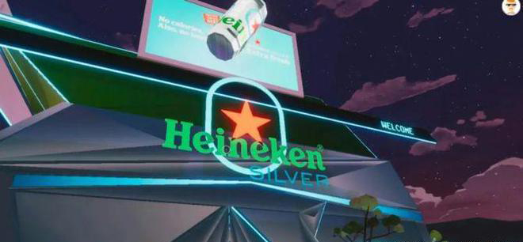
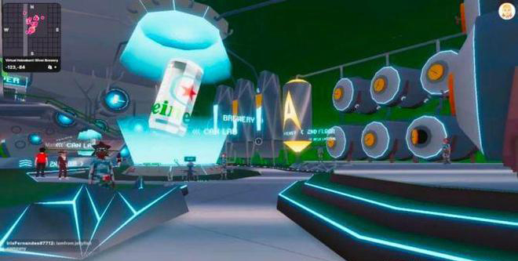

# 复盘喜力的元宇宙品牌战略，以及第一款虚拟啤酒是如何推出的

想喝啤酒吗？虚拟的怎么样？随着全球首款虚拟啤酒喜力星银（Heineken Silver）的推出，喜力已成为最新的、在虚拟世界中快速扩张以占有一席之地的品牌之一。

将啤酒花换成像素，喜力于 3 月中旬在元宇宙平台 Decentraland 的虚拟啤酒厂推出了他们的新产品。可以理解那些参加虚拟发布会的人回到现实世界后会有点口渴——然而，他们不需要等待很长时间，喜力就推出了「世界上第一个『现实生活』的元宇宙酒吧」。

喜力对虚拟世界的态度就像他们最新的啤酒一样令人耳目一新，喜力在虚拟世界推出这款啤酒也采取了一种具有讽刺意味和自我意识的方法，产生了近 20 亿次曝光。然后，他们以令人难忘的真实世界体验来支持这一点。我们拉出一张吧台凳，与喜力全球数字总监 Rob van Griensven 讨论如何充分利用元宇宙并为他们的观众提供无缝的数字和物理体验。当你了解他们是如何做到的时，请坐下来，放松一下，为自己喝杯（虚拟）啤酒！

**世界上第一支「虚拟啤酒」**

作为元宇宙的早期采用者，喜力采取了出人意料的一步。从表面上看，饮料品牌推出虚拟酒吧没有任何意义。至少据我们所知，你不能「喝」像素。事实上，在 Decentraland 的喜力星银区域，什么都买不到。然而，喜力星银——苦味更少，口感更清爽——针对的是 Z 世代，而其目标受众越来越多地在 Decentraland、Roblox 和 Sandbox 等虚拟世界中共度时光。

「知道啤酒更适合 Z 世代，我们的营销策略是利用元宇宙。在我们的研究中，以及通过与喜力的工作人员和合作伙伴的对话中，我们发现这一代人将元宇宙视为可以获得有趣和更多社交体验的地方。在实物产品推出之前，他们能够以前所未有的身临其境的方式体验喜力星银。」 喜力全球数字总监 Rob van Griensven 这样解释道。

**可信、相关、独特：三位一体**

喜力啤酒还认为，许多此前加入元宇宙潮流的品牌，只是将其视为一种进步的象征，而这并不一定与他们的品牌相符。

「每个优秀的品牌都应该将可信、相关和独特之间的三位一体联系起来。而且我认为在元宇宙的初始阶段，许多品牌都专注于与众不同以与竞争对手区分开来，但在这个领域并不总是非常可信或相关。他们只是想给自己贴上前瞻性思维的标签，而不是为客户的体验添加任何特定的东西。」

**选择一个元宇宙，任何元宇宙都可以**

第一步是让喜力选择正确的平台，并以一种让他们忠于自己品牌的方式利用它。首先，作为啤酒供应商，他们非常清楚与适合年龄的社群互动，并需要一个可以实施年龄限制的平台。他们想以谨慎的方式拥抱元宇宙营销趋势。

「作为一个酒类品牌，我们总是需要小心，不要与我们不应该交流或接触的消费者接触。例如，像 Roblox 这样的元宇宙世界是完全不受限制的，因为平台上有孩子。这不是一个合适的空间。还有一些其他的虚拟世界，比如 Sandbox，它们的视觉形象有点幼稚。我们希望在一个视觉成熟的平台上反映我们的用户对虚拟酒吧的期望。」

喜力的最终选择是在 3D 虚拟平台 Decentraland 上托管他们的虚拟酒吧。Decentraland 对某些内容设置了年龄限制，并提供了一个更成熟的平台，该平台自 2015 年以来一直在开发中，并且已经托管了三星和阿迪达斯等品牌。通过精心策划，喜力能够选择完美的平台，在虚拟环境中与目标受众见面。他们还需要自己构建虚拟酒吧。为了避免被误认为是另一个品牌，不添加任何可信或与客户相关的东西，喜力求助于代理商和公关人员学习专业知识，他们可以引导他们找到正确的平台并帮助他们建立它。

「在值得信赖的合作伙伴中，有阳狮、安索帕和 Boomerang 等创意机构，它们积极参与元宇宙和 Web3 计划。除了我们自己的定性研究外，它们还帮助我们了解正确的风格以使某些东西变得很酷。仅仅在虚拟世界中添加一些品牌贴纸并不足以激活我们的品牌；我们需要创造一个能够增加客户体验的环境。」

**独特的元宇宙营销策略**

因此，喜力必须仔细考虑他们的战略。他们建立了一个美妙的环境，让他们的观众可以见面。伴随着 DJ、舞蹈，当然还有虚拟啤酒，它融入了虚拟世界，反映了喜力长期以来的进步和创新精神；但几乎元宇宙上的任何其他品牌都可以提出类似的主张。这并不代表独特性。因此，喜力拥抱了他们品牌的调皮的部分。

「对于喜力来说，一切都是为了不要把自己太当回事。元宇宙是一种趋势，具有更严肃的一面。因此，喜力采取了拥抱讽刺的方式。尤其是在元宇宙中，幽默和讽刺扮演着重要的角色。我们从一开始的计划就是一个自我意识的玩笑，说我们正在推出一款虚拟啤酒，但喝虚拟啤酒是不可能的。」

「这使我们能够将我们的目标转向为我们的客户提供独特的体验并就此展开对话。作为元宇宙的先行者，评估我们应该利用哪些成功指标将是一件棘手的事情，尤其是像 Decentraland 这样的平台本身并没有大量的集中式虚拟化技术或访问者或用户信息。相反，我们选择将喜力星银的主要目标集中于将人们聚集在一起。」

**制造一些噪音**

自嘲并采取这种新颖的方法使喜力也受益于巨大的媒体和公关影响，这是该活动的另一个核心 KPI，通过媒体关系、社交媒体和 KOL 达到了近 20 亿次印象。随着这场活动的更新迭代，喜力可以利用他们在元宇宙的发布尽可能引起媒体和 KOL 的兴趣，这一点至关重要。这样做的关键是与本地的创作者和 KOL 合作。

「我们的许多独立市场都能够在 Decentraland 内创作新事物。例如，我们在西班牙的同事与当地一位著名的音乐家进行了接触，她制作了一段视频，记录了她的舞蹈。」

**融合客户的现实和数字体验**

喜力的计划绝不是让喜力星银成为虚拟啤酒。基于元宇宙发布的背后是计划提供与虚拟无缝融合的实体活动。他们努力创造一种尽可能让人联想到虚拟世界发布的现实生活中的体验。

「我们与以涂鸦闻名的艺术家 J Demsky 合作，与我们的目标受众建立联系。他致力于风格视觉效果，并帮助我们开发了我们在 Decentraland 的银色区域的某些部分。然后，他继续帮助我们创建 The FRT（For Real Tokens），这是我们对 NFT 的有趣看法，但针对现实世界——这是我们挑战『虚假』以拥抱真实时刻的另一个例子。我们还有数字时尚单品。它就像一个数字博物馆，将元宇宙美学带入了物理世界。从最初的挑逗到实际发布，我们分几个阶段部署了该活动，因此虚拟啤酒可以进入现实生活。」

「每个当地市场的做法都有所不同。在伦敦，实体活动的初始入口让你觉得你身处在虚拟世界酒吧中，人们可以使用 VR 耳机进行游戏；在米兰，通过在手机上显示特定的二维码，就会出现一个实体啤酒罐，这将是你进入派对的标志。在活动早期阶段，我们内容创作者合作。我们邀请他们与我们客户群中的重要人物一起参加活动。」

这为喜力星银的消费者创造了跨虚拟和现实世界的无缝体验。通过在这两种情况下提供自我意识的方法，喜力继续表现出俏皮感，并可以为他们的观众提供真实、有意义的体验。至关重要的是，他们继续为欧洲各地创建个性化体验，复制他们在元宇宙中的定制体验。它使他们能够以一种真实的方式与他们的观众互动，这反映了他们的品牌价值，并在此过程中为该观众创造了独特的体验。

「我们重新连接了已经在虚拟世界中与我们互动的消费者。我们还利用了我们在元宇宙中使用的相同的内容创建器，将我们在元宇宙中创建的视觉标识带入现实对于可识别、意识和转化至关重要。在购买时看看他们在元宇宙遇到了什么，或者在社交媒体上听到了什么，这是推动消费者购买的一个合理步骤。」

**喜力元宇宙营销策略下一步是什么？**

这是喜力进入虚拟世界的第一步。由于没有太认真地对待这个平台，对于喜力这样的公司里的许多高管来说，这场活动是一个极其有用的压力测试，因为他们并不熟悉这个虚拟世界。

「我们已经看到了不把自己太当回事的好处。对于像喜力这样的大公司的高管来说，这是一个教训，要放松一点，把信任委托给那些在企业品牌世界中经验较少但在元宇宙更有经验的人。」

在成功地为虚拟世界和物理世界中的客户提供了真实的体验之后，喜力星银的任务现在是为未来的活动复制这一点。

「如前所述，我们必须评估我们进入元宇宙的第一步是否可信、相关和独特。作为一个品牌，向前迈进，我们每次都需要重做这项工作。我们通过在虚拟和现实之间创造有趣的互动来实现这一点，这肯定是向前发展的关键因素。在这里，我们自嘲，从虚拟啤酒发布开始，然后将其转移到现实世界；未来，何不反其道而行之，以一种独特的方式将现实世界的一些东西，比如一场大型音乐盛会，带到元宇宙中呢？」

喜力将继续将他们的数字化和元宇宙战略与他们的品牌个性保持一致，从不把自己看得太重。至关重要的是，他们还将致力于将其广告的数字元素与实体元素相结合，继续为客户创造真正的机会来分享啤酒，无论是在现实生活中的玻璃杯中，还是在数字瓶中。