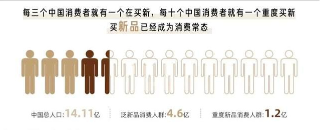

# 谁是元宇宙品牌C位？

今年以来，乘着元宇宙的东风，平台与品牌“试水”元宇宙的玩法五花八门，有的签约虚拟偶像，有的推出数字藏品，还有搭建元宇宙艺术展等等，谁都唯恐落于人后。

虽然到底什么是元宇宙，估计大多数人都似懂非懂。但不可否认，每一次对于元宇宙的探索，都会让我们对元宇宙的认识，更进一步。

当购物节遇上元宇宙，又会激发怎样的想象力呢？今年，迈向元宇宙的618，一众带着新奇触达与互动方式的品牌，给出了答案。

**一、以“新”破局元宇宙**

对品牌来说，元宇宙到底意味着什么呢？

这是一个仁者见山、智者见水的问题。**在这个证明“江湖地位”的618，显然如何抢占用户关注，是大家共同面临的问题。**之所以大家都迫不及待地“占领”元宇宙，是因为新消费人群所到之地，品牌自然不能错过。

去年，一款纯数字版Gucci包包在Roblox上卖出了超过了实体包的价格；耐克一双虚拟球鞋高达17万，却在7分钟内售出了600多双……可见年轻一代消费者，正在虚拟领域复刻他们的日常消费习惯。在虚拟世界和在现实世界中买东西，都是自我表达，并无不同。

**那什么样的产品能够符合元宇宙的定位呢？答案非“新品”莫属。**

古今中外，人们对“未来”这个概念总是充满好奇。而“新品”恰恰可以承载商家关于未来的描述。特别是代际跃迁下，年轻一代不再唯大牌是论，更乐于尝鲜，去追求潮流先锋和身份认同，这就意味着新品已经成为了引导消费的重要因素。《2021线上新品消费趋势报告》显示，中国的重度新品消费人群高达1.2亿。

**于是，今年618商家们都不约而同从促销，转为“上新”来获取增长。**比如三得利在618大促前，早早上线了无糖茉莉乌龙和无糖橘皮乌龙两款新品；联想则表示，在整个618期间新品成交是最大的亮点之一；博世家电也计划今年会在天猫上线多款重磅新品。

**但对于探索元宇宙营销的品牌来说，一个更为现实的问题是，当“不确定性”成为市场新常态时，如何在618获得稳健增长呢？**ubras、小米等商家都坦言，今年受疫情影响，用户消费欲望较低，流量转化效率不如以往。所以不论是试水元宇宙，还是发布相关新品，粗浅的玩法是不具备持续吸引力的。就像此前大家竞相推出虚拟代言人时，往往出道即巅峰，如果缺少后续的高质量内容与互动的持续输出，影响力也免不了下滑。

所以，品牌要想真正在元宇宙领域支棱起来，除了需要主动参与到变革浪潮中来，还得多花功夫去经营。这次，致力于为品牌推动经营创新的阿里妈妈，从消费者洞察、新品场景升级以及全生命周期经营等多方面，给出了元宇宙营销的全新解决方案。

**二、由虚入实的创新路径**

为了让元宇宙营销告别博眼球的短期流量玩法，618期间**阿里妈妈平台营销策划中心**通过整合新品经营能力、创意内容能力、广告产品等资源，打造了阿里妈妈首个618王牌新品计划，或将让元宇宙由虚入实的创新路径逐步清晰。

元宇宙时代，品牌首先要做的是围绕元宇宙，不断创新迭代自己的内容形态和营销场景，来和消费者进行与时俱进地沟通。品牌想唱元宇宙的戏，需要有经验的平台来搭场。恰巧阿里妈妈在元宇宙概念刚热时，就不止步于概念之争，而是迅速联动蚂蚁链、达摩院来完善元宇宙的“周边产品配套”，率先开启了元宇宙商业化落地的实验。

此次618期间，阿里妈妈联合14大品牌，带来了一场元宇宙经营范式。**具体来看，阿里妈妈第一步，为品牌创造了一个元宇宙的新品经营场景。**

在我们以往的认知里，关于元宇宙的入口，可能是游戏、是VR眼镜，而阿里妈妈却告诉我们也可能是一本杂志。作为背靠阿里的数字内容杂志，《MO Magazine》成为了这次618元宇宙经营的内容载体。它打破了当下移动端的静态阅读模式，创造性地联动品牌将整个杂志构建成一个新奇的可探索的世界，为读者带来沉浸式体验。

在最新一期「NewTopia-新品多元宇宙」主题里，多个不同的空间代表了新奇、能量和温暖的空间。观众可以化身“执行者”去探索不同的元宇宙，寻找不同的文明。而不同空间呈现的品牌新品，如联想小新Pad 2022、西门子欧式烟灶套装、喜临门乳胶床垫等等14件现实物品，都在这个乌托邦新世界里被赋予了全新的理念，从而打开了与消费者沟通的新场景。

第二步，阿里妈妈在元宇宙语境下，给互动营销注入了新活力。近年来，随着各类social平台的兴起，品牌聘请明星KOL为活动造势，已是“老生常谈”。而元宇宙时代想要一鸣惊人，还需要以更科技人文的营销互动玩出新意。借助数字化技术，国际超模何穗被复刻为一名元宇宙空间的数字领航员，在网上掀起了一番热潮。除了发布一支简单的概念先导片，一个更大的亮点在于何穗打破了次元壁，带领消费者在新的空间探索新品世界，互动中产生了更加奇趣的新体验。这样一来，品牌不仅能与消费者创新交互与共鸣，还能在元宇宙文化体系中沉淀品牌价值。

第三步，阿里妈妈也构建起了一套基于数字藏品的全链路平台级能力，来拓宽新品的边界。此次618活动期间，OPPO、Redmi等品牌都在阿里妈妈的帮助下参与到了数字藏品的打造中。而数字藏品所具备的稀缺性和新鲜感，又是对年轻、高净值用户的全新抓手，可以极大提升品牌的溢价能力，并在行业里形成差异化竞争优势。

总结来说，通过在《MO Magazine》上的活动内容输出，阿里妈妈帮助品牌率先在元宇宙赛道进行占位，提升品牌影响力，进一步帮助实现618货品的销售转化。**比如围绕消费者在元宇宙场景中的互动行为，可以帮助品牌找到最适合的“上新”产品。**如果直接问消费者，想买什么元宇宙产品？那他们必然答不出个所以然。但在元宇宙场景下，消费者浏览过什么、点赞过什么，又在哪个产品上停留了许久，这些行为中就藏着他们对未来世界的期许。

因此，在立体、互动的创新方式中，阿里妈妈联手CBNData发布了2022天猫王牌新品榜单，从科技、美感、体验、性能四个维度，洞察年轻人喜欢的“新品宇宙”。

比如上榜“科技爆发星系”的启赋蓝钻3段，刷新了我们对科技力的认知。因为除了消费电子产品掌握核心科技，“科学养娃”理念当下，奶粉也开始用新技术助力成长；“美感光谱星系”里的莱珀妮幻亮精粹露就用新设计，为女性消费者带来审美体验上的升级；而“体验超感星系”里的杜蕾斯，为消费者带来全新的感官体验；最后是“核芯动力星系”榜单上的产品，都代表着过硬的口碑和性能，往往最容易影响消费者的购买决策。纵观“四大星系”的新品，我们发现阿里妈妈既捕捉到了品牌新品趋势，又成为了消费者拥抱新生活的捷径，无疑为新品增长开了加速器。

**最后，数智化全域经营能力的升级，可以让商家在元宇宙场景下，获得更高效、更确定的经营和增长。**这次618诞生的诸多现象级新品背后，是阿里妈妈数智化全域经营能力升级的结果，而这次的王牌新品计划承接了这套升级打法，包括商业化经营策略的提升、阿里妈妈数智能力深度应用、商业化产品工具优化与提效以及降本增效、创意保效等等特色玩法，全方位赋能商家上新。

比如今年618期间，ubras通过摩盘白金版、新品洞察、品牌全域资产分析等能力，开门红期间新品小凉风单品销售额突破300W；莱珀妮则在万相台「百万新品计划」中实现618预售首战告捷，截止6月中店铺销量同比去年增长200%+；荣耀新品荣耀70通过淘积木定制创意互动玩法，斩获天猫2500-3000元价位段单品销量TOP1。值得一提的是，还有许多受疫情影响的商家，都在多项阿里妈妈营销工具免费使用的政策下，获得了降本增效的经营成果。

**三、追风口背后的长期主义**

可以说，元宇宙的出现让久久未变的电商大促，出现了一些新气象。**对品牌来说，对待这个新风口仅仅去蹭个热点远远不够，还需要完成全生命周期的承接。**

虽然元宇宙看似才刚刚开始，但未来已来，对元宇宙的探索只会更为深入和广泛。不管是元宇宙、虚拟人等概念，还是数字藏品玩法，全新的具有新鲜活力的商业模式，正在逐渐改变着年轻人的生活方式和消费习惯。未来，当线上线下边界逐步模糊，由虚入实进一步融合，元宇宙必然会全面进入我们的日常生活。

因此，坚守长期价值共建的阿里妈妈从平台视角出发，帮助探索元宇宙的品牌实现从拉新互动到沉淀召回的用户全面运营。在开拓新的消费者体验和新的互动玩法后，阿里妈妈平台也将用包括大客户、行业品类、跨行业跨品类经营等丰富的经营场景，满足了品牌的长效经营，去解决日常增长问题，而非蹭一时热度。

可以明显感受到，当商业竞争从“流量”变为“留量”之争，留住用户注意力和留住用户时长，也是品牌寄希望于元宇宙的创新解困之道。

因为在元宇宙场域，人货场核心要素或许再次革新，但经营的本质不会变化。无论市场如何变化，消费者对美好生活的向往不会变，因此阿里妈妈“平蓄促收”所代表的精细化日常经营和注重消费的体验运营，仍具有长期生命力。

尽管元宇宙概念如日中天，但必须承认的事实是，元宇宙仍处于起步阶段，所有参与者也都在探路。而那些已经尝到甜头的品牌，成功之处除了杰出的产品，还有对于前沿概念积极拥抱的创新力。

可以确定的是，随着阿里妈妈在数字世界里更多的超前布局，相信它将会带给品牌更多玩法上的惊喜和全新的增长空间。也期待更多创新产品，可以出现在元宇宙时代的货架上。