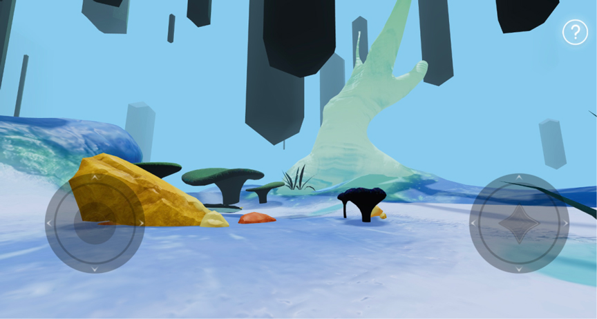
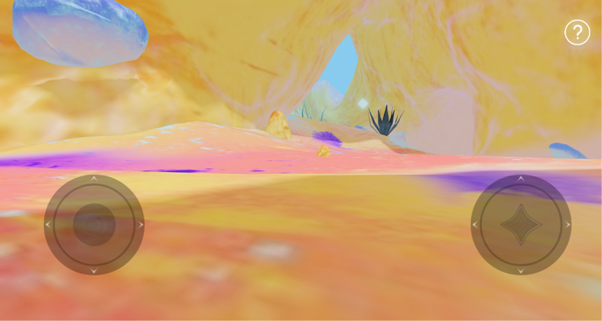
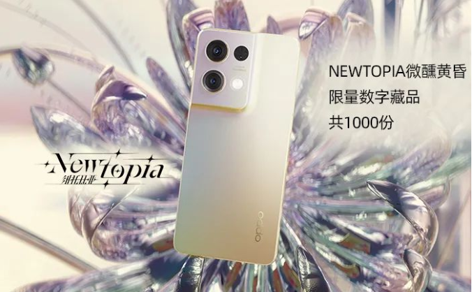

# 用元宇宙连接新用户，这些品牌把新品营销的格局打开

> 元宇宙大潮已至，各大商业力量闻声而起。

一种新技术与新场景的出现，为今天的品牌表达带来哪些改变？社会学家刘易斯•芒福德在其著作《技术与文明》的末尾，曾作出过这样的展望：“如果说在古生代技术时代人们强调的是机器的蛮力，**在新生代技术时代，如果我们明智地使用技术，它将帮助我们找回器官的精细和敏感。”**

技术将器官的感知延伸到自然界之外的领域，前所未有地革新了人类的感官体验。洞察到「元宇宙」的场景潜力，阿里妈妈•平台营销策划中心联合栩栩华生与品牌共同探索品牌表达的新可能。这一次，携手14个品牌新品，阿里妈妈以「Newtopia」为题打造一个乌托邦新世界。

用户进入浩瀚宇宙中无界探索，以强交互感的第一视角与新品互动，逐步建立起对各个品牌的多维感知。而Newtopia用一次元宇宙的集中呈现，探索出当代品牌价值呈现的又一新潮玩法。

 **造理想世界Newtopia 
 探索元宇宙IP新玩法** 

作为阿里妈妈•平台营销策划中心联合栩栩华生推出的《MO Magazine》的第三期，「Newtopia」借用Utopia乌托邦的寓意为之命名，以期**在元宇宙建立一个与当代品牌紧密相关的理想世界。**

**1、明星真人演绎+沉浸式游戏互动，全民共建品牌元宇宙新领地**

**● 何穗领航开启探索，埋下问题悬念**

「Newtopia」的开篇，超模何穗以乌托邦新世界领航员的身份，向用户揭开一个关于未来星际探索的故事。

故事设定在公元25世纪，人类为了延续文明的繁荣发展，派遣领航员何穗前往探索虫洞另一端的文明。在飞船逐渐接近目的地时，能量磁场的干扰突然袭来，驾驶舱陷入混乱。为了不被磁场干扰，飞船前往芯机世界，找到寻找进入纽托比亚的钥匙。

用何穗领航员这一创意角色设定，短片为观众身居现实世界、想象乌托邦新世界，找到了一个具体的连接点。轻赛博风的调性、跌宕的情节设计，增强了观看代入感。

可以说，1分钟的短片展示，打开探索的视野与格局，引人深思——**当人类文明发展走向瓶颈，新世界到底身在何方？人类作为一种有创造性的动物，如何延续「求新」的探索？**

带着对未来人类文明的思索，用户正式开启一场前往Newtopia的冒险。

**● 寻找记忆碎片，在互动中增加品牌体验感知**

**为登录「Newtopia」，在领航视频之后，用户穿越虫洞抵达芯机世**界，6根悬浮的石柱出现在眼前。只要点击石柱、阅读其中的宇宙记忆，每位用户就能获得前往Newtopia必需的量子能量。而6大品牌新品的展示视频，以宇宙记忆的形式融合到这一原生场景中，实现惊艳感亮相。

根据不同品牌的新品特质与调性，6支品牌视频设定了不同风格的主题——天空气泡的轻盈通透，展现出杜蕾斯003的薄透柔韧；旖旎森林的绚丽多彩，衬托出ubras小凉风的轻盈凉爽；用金属花鸟的锋利璀璨，体现着OPPO新品的轻薄流畅……

**在风格各异的美学呈现中，短片将用户的感知深度进一步延伸，在超常规的视听场景中，激发对品牌产品的新奇感知。**

而不同短片末尾形而上的哲语呈现，既有文明智慧的反思，也有幻想未知世界的憧憬，各大品牌也借此传递出人类文明与未来的深刻憧憬，进一步激发大众对于未来生活的向往与思考。

**交互化探险，用新品锚定消费者心智：**

随着用户抵达乌托邦岛屿，三得利、雷士照明、喜临门等8个新品卡片，分别在「晨森之刻」「懵懂之境」2个不同主题的岛上，渐次浮现。不设定人物定位、没有固定路线玩法，用户以第一视角参与其中、可在岛屿中随心行走。新品卡片则化身悬浮的菱形光点，分布在探索路线周围，吸引互动与观看。

在乌托邦岛屿，用户充分掌握探索的主动权，自行决定参与深度和探索程度，体验探索平行异世界的新奇感觉。

不同品牌借各形各色的地貌环境，完成新品的创意亮相，在反差感的场景呈现中，刷新消费感知、建立起全新的品牌体验。

**共建多元世界，拉动社交传播**

结束岛屿探险，Newtopia将自动为用户随机生成元宇宙DNA。以创意海报形式，宇宙DNA个性化呈现每一位用户的新品探索足迹，为其打造专属的Newtopia多元世界，实现深度的心理认同。

**每一份「元宇宙DNA」也随之成为社交货币，在社交链条上形成扩散传播，拉动更多人群参与，为Newtopia带来更大传播势能。**

经过一系列游戏感互动，用户对品牌新品的理解进一步加深，品牌黏性进一步增加。同时，多线互动、多元世界的故事设定也给Newtopia增加了更多话题面向。

**2、用多元宇宙风格夺目、做社会议题输出升华，找到品牌价值新支点**

在整个Newtopia的故事中，每一个故事环节都设定了不同的视觉风格——领航员日志是金属冷硬的太空感，六大能量柱是古朴厚重的神秘感，三大岛屿则是轻松扁平的游戏感。

借用不同风格的视听呈现，《Mo Newtopia》为不同阶段的用户探索，建立起一个异质化的底层场景，并在多元宇宙的风格化呈现中，调动更多的情绪共鸣与用户参与度。

而在故事之外，对Newtopia的价值讨论延展到「元宇宙对社会文明的影响」这一具体社会议题中。用「拥抱多元选择，抵达美好生活」，回应Newtopia探索开篇、人类文明未来的困惑与迷思，**在进一步升华Newtopia价值的同时，也彰显出未来主义、长期主义的价值取向——在元宇宙的故事框架中，践行社会责任的承担和传达。**

正如《MO Magazine》卷首语所言：“它肩负这样的使命：将当下对元宇宙的抽象感知，具象成一本属于明日的‘百科全书’，**并输出一种忠于文明、忠于自我、忠于道德的人文关怀。”**

以《MO Magazine》、以Newtopia为支点，阿里妈妈**找到未来品牌价值探索的新角度，也向用户传递出其作为时代大品牌的能量与担当。**同时，各大品牌在Newtopia中完成价值共同体的构建，实现品牌价值的升维。

 **重建元宇宙人货场 
「王牌新品计划」助品牌讲新故事** 

**1、人：互动感更强的新消费者关系**

将消费者对品牌的黏性进一步加强，元宇宙为品牌到消费者的关系链接，提供了一条体验向的创新路径。借助《MO Magazine》这一全新营销介质，阿里妈妈帮助各个品牌建立起互动感更强的消费者关系。

Newtopia开拓出新的消费体验与互动玩法，成为普通用户走向元宇宙的第一步，也为人与货的联动找到一个具象化的触达场景。在这一审美升级的场景中，品牌向外延伸出更多精细化的视听细节，从更多维度唤醒了消费者对品牌的感知敏感。

阿里妈妈，**以体验的新鲜感与情绪的深度调动，帮助品牌达成消费侧的共鸣升级，**在618这一关键节点，直接俘获消费者的停留参与。

**2、货：用新品展开品牌营销新版图**

在当下，新品是激活用户消费力的关键武器、也是展开品牌营销新版图的关键一环。

而Newtopia不仅开辟出一个全新的体验场景与品牌沟通场，帮助品牌探索出新品展现形式——减少卖点堆叠，增加深度价值的呈现，而且，也为品牌找到全域触达的关键联结点。

在这过程中，消费者可以在元宇宙的世界中打开感官敏感性，用更情绪体验、更新颖的方式感受到新品价值特性。品牌也进一步将消费者对新品的感知、与对未来美好生活的向往联系起来。

同时，阿里妈妈还为OPPO、Redmi等品牌新品推出对应的数字藏品，加赠给购买实体产品的用户。

数字藏品作为传递品牌DNA的创新虚拟权益，一方面为品牌开辟关于新品的全新玩法，成为品牌对话消费者的又一渠道；另一方面，也将用户对新品的感知延伸到虚拟场景。借助数字藏品完成爱好展示、身份标识，用户打开了又一维度的新奇消费体验。

**3、场：在虚拟场景中探索新品经营方式**

具体到Newtopia这一虚拟场景，阿里妈妈•平台营销策划中心联合栩栩华生为品牌打造6个石柱碎片、2个不同岛屿，将品牌新品展示以互动形式融入其中。

延伸到《MO Magazine》所建构起来的元宇宙体系中，平台与品牌探索、共创了一个更有创意、更能体现品牌文化内容的场景解决方案。

这一场景也正好契合了新品的传播需要。新品破圈需要新人群的支持，而新的内容场景在人群扩充上的作用效果，无疑是更加显著的。

**在「元宇宙」场景中完成品牌创意内容与商业营销形式的完美衔接，阿里妈妈通过不同主题的选择、呈现，将品牌与消费者的认知沟壑抹平。**与此同时，阿里妈妈与品牌共创数智联动场景的全新解决方案，搭建出一个以内容持续对话的商业文化空间。

 **用新品引爆品牌可持续经营 
 在长期视角中增强品牌价值转化** 

在人货场的全新交互之中，阿里妈妈对品牌的打造不止步于一次营销活动的交付，而是带来更多长期主义的营销视角参考。

**● 丰富品牌叙事性思考，创新营销场景形式**

如营销大师菲利普科特勒所预测的，当今的品牌要从过去的传播性品牌转变为叙事性品牌。不同于过往洗脑式、强植入的传播，**如今的品牌需要通过创造内容和顾客价值，帮助消费者更好了解产品、实现品牌传播，才能称之为叙事性品牌。**

从「Metaverse」到「Mobius」再到「Newtopia」，《MO Magazine》不断升级视觉呈现形式，阿里妈妈借助这一全新介质与世界观，与品牌共创，也思考着品牌传播的多维叙事可能。

在元宇宙场域与未来感场景化的表达中，阿里妈妈为品牌开拓出消费、经济、商业之外，关乎社会、文化、科技等更加丰富的人文维度。与之相应的，**不同品牌也由此打造出一套全新的语言沟通体系，完成情感调性与价值感知的双向提升。**

**● 以新品撬动消费决策，带来品牌价值转化**

新品是品牌创新力、产品力的集中展示，也是拉动消费兴趣决策、产生互动的直接介质。以新品作为价值锚点，阿里妈妈在新品新故事、新互动中，为品牌找到全新的价值增量空间。

一方面，从元宇宙场景为新品销售引流，阿里妈妈将元宇宙开辟为新品触达消费者的又一渠道。另一方面，在618大促节点当下，阿里妈妈用新品的全新形式，撬动消费者决策，为品牌新品带来直接而可见的商业转化。

**在面向未来的品牌发展中，元宇宙的故事呈现，将为品牌的长期存续积蓄起更广阔的文化与商业价值。**有关阿里妈妈•平台营销策划中心的元宇宙故事与全新可能，尽可拭目以待。