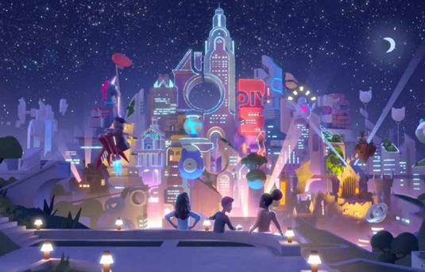
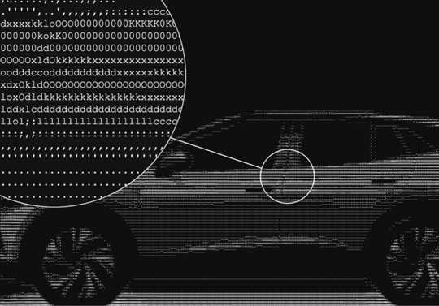
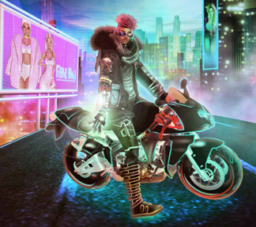
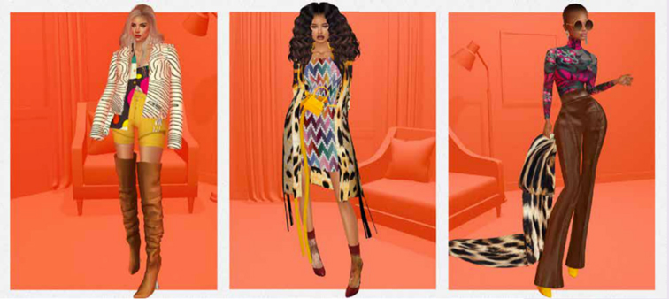
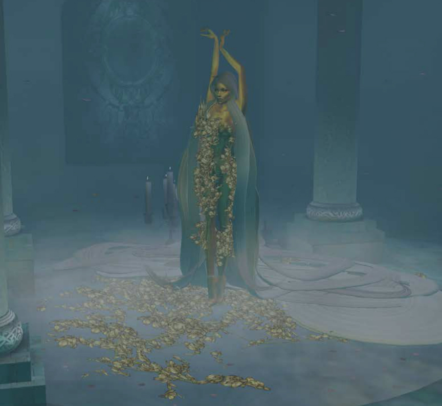
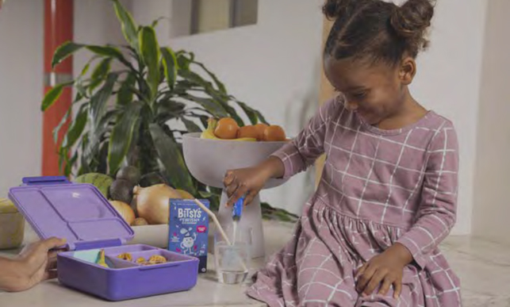
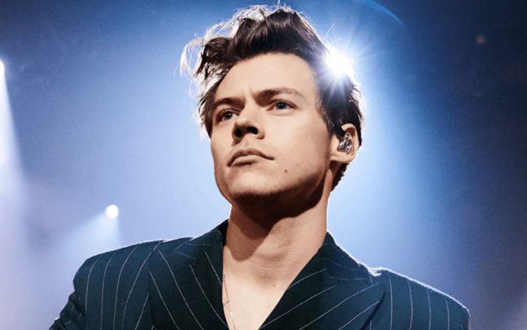

# 2022变局与趋势：元宇宙颠覆世界 品牌将创造力归还给用户

> 今年是疫情肆虐的第三个年头，世界卫生组织总干事谭德赛表达了大家齐心协力定能结束疫情的信心。各大品牌和广告主，也希望乘着乐观向上的浪潮，创造出乐观新颖的广告带给人们快乐。

各行各业更加关注人们的健康与幸福；生活方式与商务模式更加环保；品牌、政府和社区都在携手构建可再生的星球与未来；全球88%的消费者都坚信企业和品牌有责任关爱地球和人类的发展。

数字时代已来，元宇宙从科幻概念演变为现实。人们可以在虚拟世界里聚会、创造、买卖、社交、生活和学习。元宇宙正在颠覆世界，增强现实也成为了广告主选择的媒介。

**核心观点提要：**

1. 元宇宙时代以来，品牌和企业会深入数字化转型；个人生活、工作、出行等也随之数字化。

2. 商业模式从B2B，DTC转变到DTA。

3. 电子科技趋于更环保，可持续方向发展。

4. 后疫情时代，人们更加注重健康保养，关注儿童心理健康。

5. 平台和品牌将创造力归还给用户。
6. 美的定义更加包容、多元；奢侈品逐渐走向朴素。

**一、文化——构建元宇宙世界**

各大品牌投身元宇宙，建设元宇宙的竞赛已然打响。

2021年下半年，元宇宙霸占了各种头条，出现在荧幕之上。品牌和企业争相为下一轮的数字迭代做准备。大型科技品牌将目光投向元宇宙。Facebook在2021年10月改名为Meta，Mark Zuckerberg宣布Meta在未来将会成为一个元宇宙公司。微软的CEO Satya Nadella在去年8月就称微软正在构建“企业元宇宙”。

2021年，游戏公司开始在自己的平台上开辟元宇宙。4月，Epic Games 完成了10亿美元的融资，支持元宇宙里的长期目标。Pokémon Go的游戏开发商Niantic在11月筹集3亿美元构建其描述的真实的元宇宙。8月，Nvidia推出了Omniverse，为工程师开启了元宇宙世界。

现在其他公司都在花重金雇佣游戏开发商。最近Farmville开发商Zynga在2022年1月被以127亿美元的价格收购，早在2021年7月，腾讯花了17亿美元收购英国的游戏开发商Sumo Group。

即使是法律和财富管理等与元宇宙创建没有直接关联的行业品牌也开始预估2021年的价值增长。

3月，元宇宙集团宣布推出元宇宙房地产信托基金的计划，这是元宇宙里第一例虚拟的房地产信托资产。5月，Reed Smith律师事务所发布了一份关于元宇宙的法律指南，涵盖了从知识产权到隐私再到竞争等一系列法律问题，该事务所称这是“世界上有史以来最大的工业革命”。6月，Roundhill Investments（一家注册投资顾问）和Matthew Ball推出了Roundhill Ball元宇宙投资基金，该基金持有英伟达、腾讯和Roblox等公司的股份。

“20世纪60年代曾有过一场太空竞赛，现在在2021年又有了一场元宇宙竞赛。” 创建、定义、拥有元宇宙的竞赛已然开始。

**二、技术&创新——碳中和浏览**

品牌正在重新设计他们的在线体验，减少对环境的伤害。

根据Cleanfox公司2021年2月电子邮件污染报告，“如果把互联网比喻成一个国家，它将是世界上第六大污染国。”该报告还显示，促销邮件每年导致英国200万吨的二氧化碳排放。

鉴于此，各大品牌都在整顿自己的网站，降低在线活动的碳足迹。

阿姆斯特丹的设计工作室Formafantasma于2021年2月重新设计了其网站，以提高能源效率，使用了小图像、基本字体和一个由标准Unicode符号创建的标识。简单的视觉效果减少了加载站点所需的能源，也减少了碳排放。

大众汽车于2021年2月重建了其加拿大网站，以提供更可持续的浏览体验。碳中和网络的重新设计减少了该品牌的数字碳足迹，省去了颜色，用低数据文本字符创建的马赛克代替照片。该项目显著降低了人们浏览网页时产生的二氧化碳量。

根据碳排放数字计算器website carbon的评估，网站平均每次浏览产生的二氧化碳量仅为0.022克，而普通网站平均每次浏览产生的二氧化碳量为1.76克。

去年，随着人们越来越使用数字产品，养成了所谓的“数字习惯”，这加速推动了人们对数据可持续性的认识。从那以后，各大品牌已经开始重新考虑它们的数字触点，更加符合消费者的价值观。现在元宇宙的到来，虚拟领域的可持续实践将比以往任何时候都更加重要。

**三、旅游&食宿娱乐——旅游出行**

数字世界让人们在舒适的家里也能拥有沉浸的旅行体验。

目前而言，真正的瞬间移动只是科幻小说中的幻想，但旅行的感官体验可以让游客不用去到真实景点就能领略到景点之美。

日本航空集团ANA Holdings和JP Games于2021年5月推出了“天鲸”数字平台。该平台拥有多个数字世界，消费者可以与朋友、家人在其中旅行和购物，同时，这个平台还支持交互式的文化旅游体验。

该平台设有天空公园、天空村和天空购物中心，并与澳大利亚、奥地利、加拿大、夏威夷、菲律宾和新加坡等国的公司合作，连接来自世界各地的用户。

微软飞行模拟器，已经兼容Xbox Series X和S，现在提供了一个TCA波音版控制器的终极虚拟飞行体验。玩家可以通过一对一的波音787控制轭的模拟器来控制虚拟飞机的音高，此外，还有额外的Xbox按钮和一个音频插孔可以无缝地调整到新主机上。这个模拟器从2021年11月开始预售，消费者计划在12月就收到了不锈钢控制器。

更加沉浸的科技技术确实会让旅行变得更划算、更方便、更有想象力。

**四、品牌&营销——共创平台**

下一代数字平台将把创造力交到用户手中。

创新越来越多地受到技术的影响和推动，为下一个数字平台和创意影响力的时代奠定了基础。创意技术专家和数字设计师Helena Dong认为数字工具已经激活了一个全新的创造性世界，在这个世界里，创造可以超越物理限制。

数据调查显示，72%的Z世代和千禧一代在美国、英国和中国今天相信创造力依赖于技术，92%的人认为技术开辟了一个全新创造的世界。 

《卫报》游戏编辑Keith Stuart：“对于alpha一代和Z世代，定制和创造是他们游戏体验中很复杂的部分。对他们来说，定制和游戏元素其实都关于自我表达和探索。”

Snapchat认为，创造力是推动未来数字互动的驱动力。Snap公司集团产品营销经理Carolina Arguelles Navas：“作为用户，你不是在创造人们消费的内容，你是在创造人们随后使用的内容。这真的很强大。你发布的内容让每个人都有自己的个性化体验。”

这种势头是由她所说的数字创造力的雪球效应所激发的。“AR（增强现实）最大机遇在于它是是一种催化剂。现在人们可以用AR体验来创造内容；然后他们会与自己的朋友社群分享，而朋友群也会解锁并分享。相当于就是创造了一种催化剂，然后为自己扩大创造规模。”

IMVU社交应用及其母公司Together Labs的首席执行官Daren Tsui说：“ IMVU是一个以创造力为主的“下一代社交网络”。平台上有超过20万名创作者。在过去的几年里，我们的目录中积累了5000万件物品，几乎都来源于用户驱动。

“我们创造0.001%，其他一切都是由创造者完成的。” IMVU将创造力称为下一个数字时代的“新地位象征”，从此地位象征不再由影响力和收入决定。当用户进入平台时，赚钱对他们来说并不是最重要的事情，他们的创作得到认可更为重要。

上网习惯正在演变。正如数字时尚公司The Fabricant所言，“在数字世界中，人们不是被动的消费者，而是创意的代理人，他们会良好地自我表达，精心策划并展示他们的虚拟身份。”

**五、食品&饮料——免疫口服液**

注重健康的人一边想要解渴，一边想要增强免疫力。

2021年10月，总部位于洛杉矶的儿童零食品牌Bitsy 's推出了Swish，这是一款增强儿童免疫力的饮料组合。这种饮料含有电解质、维生素C和锌，这可以添加到孩子们的水杯中，让他们快速获得免疫

荷兰富尔食品公司利用微藻螺旋藻的能量，于2021年秋季在英国推出了富尔富含维生素饮料。这种饮料独特的蓝色来自于螺旋藻中发现的天然抗氧化剂藻蓝蛋白，它以增强免疫功能而闻名。除了健康益处外，该品牌还声称，这种饮料具有“气候活性”，这是因为这种微藻能够吸收自身重量的1.5到2倍的碳，并进行光合作用，释放氧气。

美国食品和饮料品牌Ocean Spray也在把健康第一放在第一位。2020年11月，该公司推出了B1U功能饮料品牌，这款品牌包括一种名为“我需要免疫力”柠檬甘菊水。除了饮料，该品牌还在2021年3月推出了Ocean Spray Fruit Medley，这是一个新的干果混合物系列，具有很多好处。免疫混合物包含葡聚糖，它已被证明可以提高免疫力。

对疾病预防的持续关注推动了增强免疫力的食品市场的增长，根据Stratagem Market Insights数据，2021~2028，免疫辅助饮料将成为创新的新焦点。根据Innova’s的《2020年消费者调查》，全球60%的消费者希望食品和饮料能帮助增强他们的免疫力，各品牌有充分的理由创造支持保健产品。

**六、美妆——“正常” 美妆的消亡**

品牌正在从根本上改变美妆行业，每次聚焦一个词汇。

2021年，Unilever宣布将把“正常” （ normal）这个词从其美妆及个人护理品牌的包装及广告中移除，以让品牌变得更加包容与兼收并蓄。此举既证明了Unilever的全球影响力，同时也反映了消费者价值观的不断升级。

Unilever美妆和个人护理总裁Sunny Jain称“全球每天有近10亿用户在使用Unilever的美妆及个人护理产品，而观看品牌广告的用户更是不计其数，我们的品牌有能力对人们的生活做出真正的改变。Unilever一直努力阻止不健康的标准与模式进入该行业，同时积极致力于形成更为广泛、更为包容的美妆定义。

除了移除 “正常” 这个词汇以外，公司还将对其广告中的模特图片过度编辑美化这一行为叫停。

2021年11月，以去性别化审美而著称的英国男歌手Harry Styles推出了新的美妆品牌Pleasing，包括四款指甲油及男女皆宜纯素天然面部护理产品，面部护理产品包括珠光提亮精华素和眼部凝胶。

该品牌广告中既有男性，也有女性出现。Styles称其为“社区中身份独特的大多数人”，同时Styles也在努力消除二元存在的现状。

2021年4月，Neutrogena推出了“For People With Skin” 活动。该品牌始创于1930年，目前主要关注皮肤护理中的不平等现象以及与社会经济地位、种族、民族相关的各种不平等问题。

Neutrogena品牌总经理Kerry Sullivan接受WWD采访时称“我们希望产品能够适用于所有皮肤及所有人群。

全新包容的潮流正在重新定义美妆行业，给个性化的用户更多的空间，同时接受关于美的更多表达与诠释。传统一刀切的美妆标准与概念已经被时代摒弃，不会再回来了。

**七、零食商业——零售行业重塑**

零售业长期面临的挑战正在迫使业内人士重新思考其核心价值供给，并不断创新服务领域，实现多样化发展。

近几年来，相对于其他行业，零售业的经营发展更加波折。2020年对于高街零售来说最为萧索，店铺纷纷关闭，销售额直线下降。直至现在，零售商还被供应链断裂与人员短缺等种种问题所困扰。

这些危机均迫使零售业进行调整。在充满动荡的年代里，发展的关键就在于主动适应。一些有远见的零售商正在积极进行改变，纷纷寻求各种创意方法，以实现跨界的多样化发展。

2021年7月，零售品牌John Lewis & Partners及Waitrose & Partners的英国母公司John Lewis Partnership公布了最新的发展计划--进军房屋租赁领域。该品牌始创于1864年，而2020年是其出现全年亏损的第一年。2021年1月，多样化经营的需求已经迫在眉睫。

其土地文件数据显示，公司多余的土地面积可以至少建7000个房屋。而未来这些房产将建在现有的土地储备范围内，房屋用途涵盖多个范围，从工作室到四居室不等。

这也意味着在不远的将来，人们可以毗邻Waitrose超市而居，或者靠近配送中心。John Lewis Partnership计划到2030年，非零售业务能够达到其利润的40%，这些业务主要包括金融服务、租赁及户外生存。

作为其环保行动的一部分，瑞典家具零售商Ikea 也开始出售可再生能源产品。有别于传统的平板家具业务，IKEA 希望推行全球最大的可再生能源行动，让全球都能使用价格合理的电力能源。

在新零售时代，消费者不再将品牌视为服务单一核心的机构。人们希望自己信任的品牌可以提供更深的服务体验，从而对于品牌方而言，创造新的收入流的机会正在大批涌现。而多样化经营可能是传统线下零售商翻盘的关键。

**八、奢侈品——奢侈品的朴素风**

面对中国的共同富裕政策，奢侈品牌正在积极对标。

2021年中国国庆节期间，上海变成了社交媒体的打卡中心。数以万计的消费者涌进乌中市集购买水果、蔬菜和鸡蛋，而所有的菜品都用印有Prada的包装纸包装，并配有购物纸袋。

这是Prada2021秋/冬 “Feels Like Prada.” 活动的一部分，也是颇为成功的营销活动。全球社交媒体上出现了大量的打卡自拍，Prada的纸袋被抢购一空。正如上海社会科学院助理研究员朱天华（音译）接受Sixth Tone采访时说的那样：这是一种日常生活中的消费主义。 

无论消费者如何看待，在全球依然遭受新冠、气候变化及经济停滞的影响之际，该活动确实引发了大众对奢侈品朴素风的广泛共鸣。

未来的工作将突破地域的界限，富有远见的公司正在加紧推出适合现代游牧人生活方式的各种服务，而游牧人的群体也必将日益壮大，并成为不可忽视的经济中坚。

2022年已经到来，看似每个平常的日子里，改变正在发生。我们有理由相信，经过两年疫情的洗礼与磨练，每个人都会对身边的生活和环境做出深刻的反思，对人生优先项重新进行排序，从而在未来的抉择中更加理性，也更加积极。

而从企业层面，无论是断壁求生，还是转危为机，疫情给品牌带来的远非经营层面的可见行为，更多的是经营理念的深刻转变。2022年的趋势也许不够热烈，但足够理性与温暖，而随着每一天的过去，我们期待明天会更好。