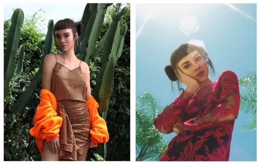

# 元宇宙”火了，品牌如何在虚拟世界抓住Z时代的心？

也许很多人都有过类似的感受：每天走过相同的路线，做着重复的工作，甚至说着相同的“台词”——生活就像“复制粘贴”一般无聊。

电影《失控玩家》中，男主角“盖”的生活就是如此，但他并不觉得无聊，因为他只是游戏中的一个NPC（non-player character，非玩家角色）：他在游戏中每天的“工作”，就是起床、去银行上班，然后被游戏中的玩家虐杀。

直到有一天，他遇到了爱哼流行歌曲、爱吃泡泡糖味冰激凌的女主（的游戏角色），才发现自己的生活有着巨大的问题。他开始努力活出不一样的人生，不按常理出牌的行为让他变成虚拟世界中的一位“网红”，最终帮助女主揭穿了窃取她原创游戏的大反派。

在《失控玩家》中，“盖”其实只是一段基于人工智能引擎的代码，但他自主进化出了丰富的情感，甚至让女主都迷上了他。当游戏中的NPC都能变得越来越像真人，甚至得到人类的爱，虚拟世界离我们还会远吗？

**当元宇宙、赛博朋克已经成为Z时代挂在嘴边的流行词，品牌下一步需要耕耘的空间，或许已经不止眼前这个眼见为实的世界了。**

> **Z世代对赛博空间不设边界**
>
> **品牌不妨披上虚拟形象的“外衣”**

在Instagram上，一位长着可爱雀斑的19岁混血女孩Lil Miquela，已经吸引了超过300万粉丝。她定居在洛杉矶，是一位拥有西班牙裔、巴西裔和美国血统的音乐人和模特。Lil Miquela喜欢在社交网络上分享自己的生活和穿搭，但她其实是一位虚拟人物。她是假的，但她的影响力却是真的，她发行过自己的单曲，还受邀参加过米兰时装周，出席过Dior、Louis Vuitton等奢侈品牌大秀 。

**当许多品牌还纠结着把该把预算投向站台、电梯广告还是短视频APP，另一些品牌已经开始偷偷地搭建起自己的虚拟世界了。**数据平台vtbs.moe 做过一个测算，约2019-2020年期间，Z世代聚集的B站，针对虚拟偶像的订阅打赏同比增长了350%，虚拟偶像的商业价值正在迅速释放。

《Z世代营销》一书的作者杰夫·弗若姆提到**：“Z世代的青年可以同时操作五个设备：电视、手机、笔记本电脑、台式电脑、写字板或是手拿的游戏装置。对Z世代来说，科技的存在是隐形的。”**

作为互联网的原住民，从Z时代懂事开始，“线上世界”和现实世界就同时来到了他们面前。他们熟稔地穿梭于线上与线下，对于现实和虚拟的边界感非常模糊，并且天然地对虚拟世界保持兴趣甚至充满向往。那些看来很“假”的游戏角色、虚拟人物，在Z世代看来，却是一个个性格迥异、充满魅力的人格化存在，它们甚至比现实世界中的人更有趣。**在物质日益充沛且同质化的现实世界，差异性的“人格化”要素将成为品牌最宝贵的资产。**

什么是“人格化”？简单来说，就是赋予物质的东西以人的情感和价值。虚拟人物的真身只是一串代码，但当她变成一个会笑会扮酷会跟你分享生活点滴的19岁小姑娘，你就会感到非常亲切。

**Z世代是富有人文情怀的一代人，他们不愿意被当作付钱的机器，而是更愿意与品牌建立精神共鸣，他们不容易被套路式的广告打动，但却对品牌的真情付出和原创内容更有耐心。**对于品牌而言，虚拟形象的发挥空间更为广阔，但核心还是要抓住“人格化”这一关键因素，才能与Z世代建立有温度和有信任的强链接。虚拟形象诞生后，也需要长期的内容产出和角色运营，想在Z世代保持影响力，品牌的虚拟形象或许还有很长的“养成”之路要走。

> **Z世代渴望沉浸式体验**
>
> **“元宇宙”中到处都是流量入口**

一场万人演唱会，大概就是线下活动的所能容纳人数的极限了，而Travis Scott 在游戏《堡垒之夜》中举办的虚拟演唱会，却获得了1230万粉丝在线参与。

这次虚拟演唱会也成为一场线上营销的盛宴，演唱会结束后，Travis Scot流媒体端的流量增长了26%，《Stagazing》直接增长了50%，相关周边衍生品也售卖火爆。未来，这种打破物理世界局限的虚拟线上活动只会越来越多。过去，品牌主为了获得某场大型赛事、演出的冠名权，往往需要投入重金，它们试图通过占据主要线下渠道，来获得用户注意力，又或者通过赞助活动现场的饮品，来获得与在用户面前混个眼熟的机会。但受制于现实世界的有限性，一场活动的容量总是有限的。

**而在数以亿计用户聚集的虚拟世界中，“品牌露出”获得流量将是无法估量的。**在Z世代的虚拟装扮、娱乐场景、社交场景中，品牌们都能找到“露出”的机会。就像《失控玩家》里盖穿的夹克衫、喜欢的球鞋，橙色咖啡杯上的logo，都可以成为品牌植入的理想之地。更受Z时代青睐的是，他们可以在虚拟空间中与自己喜欢的明星、歌手进行互动。

**Z世代早已习惯了与现实世界并行的“元宇宙”，他们渴望更沉浸式的、不受限制的3D交互世界。**他们过去在线上交友、购物、玩游戏，大脑沉浸于线上的感受，身体的一切觉知仍停留在现实世界中，而“元宇宙”能实现的，则是让他们真正漫游在虚拟世界中，用自己全新的虚拟身份去生活、工作、消费、交友。

美国知名智库研究院CEO恰克马丁，曾在著作《决战第三屏：移动互联网世代的商业与行销新规则》中，提出了一个概念——“第三屏幕”，用来意指除了“第一屏幕”电视、“第二屏幕”个人电脑之外的新媒介，就是我们熟悉的智能手机。它把手机引起的生活方式、互动体验、消费行为等的突破性变化，称之为“一场革命”，Z世代恰恰就生长在这场革命的成就中。

从小生活在“第三屏幕”环境中的Z世代，习惯了一种“拿到眼前式的”娱乐方式，这种方式相比电视时代靠着沙发看的“后靠式”，以及盯着电脑屏幕的“前倾式”，更贴近用户个体，它提供的服务更个性化，是时刻在线。而“元宇宙”将进一步实现，一种时刻在线且完全沉浸式的新体验，“第三屏幕”在VR/AR等技术的助力下，或许将变成“第四空间”，一个可知可感可触可嗅的虚拟空间。

**比起容量有限的现实世界，虚拟世界可以说是一块崭新、广阔、待开拓的沃土。虚拟世界中人群聚集的任何地方，如户外商区、公园、酒吧、博物馆等，都是正在“建设中、待填充的”无限空间。**虚拟场景中的户外广告墙？品牌在一场虚拟博物馆里举办展览？酒吧饮品瓶身上的设计？街道上的车身装饰……试想，畅游虚拟世界的Z世代，在上述每一个沉浸式的场景中，都可以跟品牌相遇，而这类用户的数量级，通常以亿计，毕竟理论上，全球各地的用户都可以在“元宇宙”中实时在线交互。

> **Z世代不愿成为牵线木偶**
>
> **品牌要帮他们实现“自我推销”**

一双爆款虚拟球鞋的背后，不过是一串代码和3D设计，但当Z世代听说马斯克、知名歌手Travis Scott穿过它，就会很想拥有同款。

Z世代从小就习惯了在社交网络上分享自己的生活，也习惯将自己暴露在公共视野中，他们希望自己在虚拟世界中呈现出最好的一面。对此，他们是用心甚至焦虑的。对品牌而言，这是挑战也是机会。

**未来，不是一个品牌向用户推销自己产品的时代了。未来将是一个品牌需要与用户建立合作关系，帮助用户实现“自我推销”的时代。**那些可以帮助Z世代展现自己、推销自己的品牌，将有更多机会赢得他们的喜爱和信任。

**“Z时代都希望成为自己的超级英雄，而不是某个品牌的牵线木偶。”（《Z世代营销》）而虚拟世界，恰好可以为Z世代展现自己提供一片更光鲜、更广阔的舞台。**

创立于2017年的Genies是一家虚拟形象科技公司，在Genies APP上用户可以根据自己的喜好定制自己的虚拟形象。去年，Gucci就与Genies合作设计了上百套服饰造型，以供用户挑选。

当很多人觉得花钱买虚拟服装是浪费钱的时候，Z世代已经被时尚品牌推出的虚拟商品“种草”了。今年5月，意大利奢侈品牌Gucci与游戏平台Roblox推出了一款虚拟潮鞋，用户可以花费11.99美元购买这款鞋，他们的虚拟形象还可以在游戏平台Roblox中试穿，然后截图或者录视频，发到社交网络上。Gucci 首席营销官罗伯特·特里菲斯表示：“ 虚拟时尚世界正在创造自己的经济价值。”

虽然很多年轻人买不起或者认为没必要为自己购置一身Gucci的行头，但他们已经有了新的选择——在虚拟世界中将自己打造为“人间Gucci”，这同样可以彰显他们的时尚品牌与喜好，向自己虚拟世界的好友进行“自我推销”。

未来，只要品牌能为Z世代的“自我推销”助力一把，无论是在现实世界还是虚拟世界，都更有可能得到Z世代的买单，而在虚拟世界，这种买单或许会来得更容易。

**小结**

随着Z世代年龄的成长，他们已经成为虚拟经济的主要消费群体。这一群想要成为自己世界中的超级英雄的年轻人，正在向世界展示着自己惊人的想象力和购买力。

他们愿意与人格化的品牌建立共振，他们热衷沉浸式的数字体验，喜欢遨游在五彩斑斓的赛博世界中，并愿意为自己喜欢的虚拟产品买单。他们渴望展示自己，擅长利用虚拟世界完成自己个性的延伸。对于品牌而言，想在“元宇宙”中实现开疆辟壤，Z时代必定是开启虚拟营销的一把关键钥匙。

