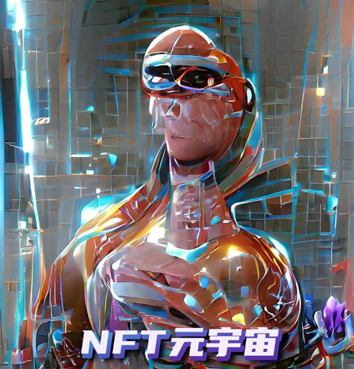
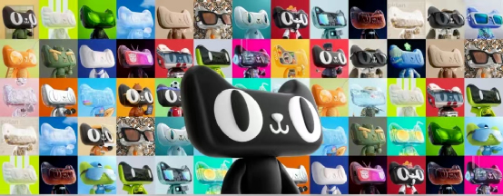
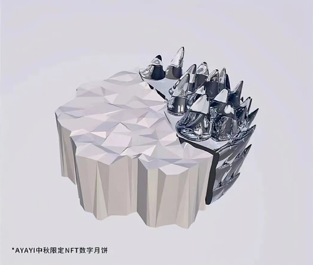
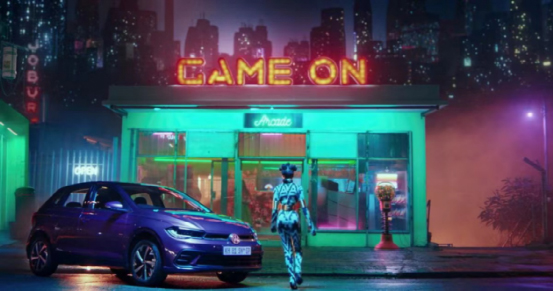

# 2022麒麟国际广告奖NFT元宇宙创意营销赛道正式启动！

> 2021年最火的词是什么？元宇宙一定榜上有名。这个诞生于30年前的词汇，一夕之间，火爆2021。虚拟、现实、想象、科技等一连串标签令人眼花缭乱。

**NFT元宇宙营销赛道正式拉开**

由上海市创意产业协会作为指导单位，2022麒麟国际广告奖NFT元宇宙营销赛道正式启动。赛事敏锐捕捉市场趋势，精准定位创意可能，**首次将NFT元宇宙营销纳入奖项组别**，以崭新的视角看待元宇宙发展，探索元宇宙创意，充分拥抱行业趋势，让更多优秀的元宇宙营销案例得以在此交流共享。

数字资产、虚拟场景、交互体验……为了让奖项参与者更具针对性地进行案例申报，在元宇宙营销案例上，组委会做出了细致地划分与安排。

参赛组别包括公司类奖项和案例类奖项，公司类奖项有**最佳元宇宙营销公司**，案例类奖项有**年度十大元宇宙营销案例**以及**NFT数字藏品类**、**虚拟活动**类、**虚拟人物类**金银铜奖。

**元宇宙赋能创意**

正是因为这样令人着迷的塑造可能，一向拥有天马行空想法的营销人们早已迫不及待“大显身手”。就在去年，一系列以元宇宙为基础的创意营销接连涌入大众视线，为广告创意带来了新的兴奋点。

2021年的天猫超级品牌日就为用户奉上了一份独特的礼物。用户通过淘宝搜索“你好元宇宙”，就会进入到一个中秋NFT数字月饼的活动界面，中签用户可获得一枚NFT定制月饼。

NFT（Non-Fungible-Token)可理解为存储在区块链上的唯一数字证书，保证了物品的独创性并赋予其专有权利。这也是天猫超级品牌日首位数字主理人AYAYI定制的第一款数字化NFT产品，天猫超级品牌日称其为“来自元宇宙（Metaverse）的礼物”。新颖的数字体验与虚拟数字偶像引发大批用户追捧支持。

除此之外，前不久，德国汽车制造巨头大众旗下南非子公司Volkswagen SA为新款Polo推出交互式NFT广告活动。活动打造了南非第一个以NFT寻宝游戏为主题的元宇宙系列品牌广告——“Game On（游戏开始）“，借助科技的力量，推广产品本身的安全性与智能化，沉浸式体验引发群体热潮。

不难发现，越来越多的创意思路开始融入元宇宙的概念，虚拟现实的科技体验以别样的方式刺激用户认知，新的时代序幕正在拉开。

**元宇宙究竟有多火？**

当很多人还在困惑它的概念时，资本却早已率先一步布局探索。据企查查数据显示，截至2021年底，中国境内共申请“元宇宙”商标达11376件，涉及公司达1692家。其中2021年申请了11374件，涉及公司1691家。

除此之外，就连官方也下场表明态度，2022年开年，武汉、合肥、上海市徐汇区均将元宇宙写入今年政府工作报告。元宇宙技术发展，绝非小打小闹。

**何为元宇宙？**

究竟什么是元宇宙？Facebook 给出的定义是：元宇宙是一组虚拟空间，你可以在这里与其他不在同一物理空间中的人一起创建和探索。不过这一定义显然不能完全解释元宇宙。但可以看出，这将是一个拥抱平等、创新、多元的全新世界，在这里，将塑造出与现实关联却又更为梦幻与富有想象的景象。