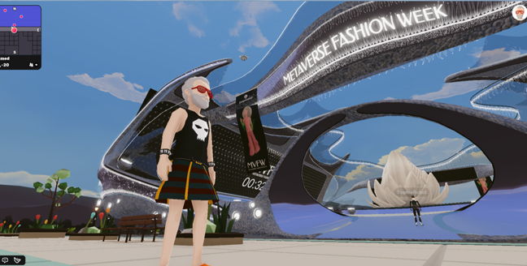

# 深度解读扎克伯格如何设想元宇宙时尚创意？

> Meta相较于其他竞争对手至少解决了一个问题，那就是数字时装在当下的使用场景。

一个月前，Meta首席执行官、Facebook创始人扎克伯格罕见现身米兰，与一众意大利时尚界高管会面，引发市场密切关注。 

扎克伯格发布了一张他与眼镜巨头EssilorLuxottica集团首席执行官Leonardo Del Vecchio的合影，鉴于扎克伯格的Meta正在AR/VR领域长期投入，并且Meta与EssilorLuxottica已于2020年开展智能眼镜项目，双方的会面并不令人意外。 

不过，从另外一张合照看出，扎克伯格此番意大利之行并不简单，更像是一场科技与时尚的非正式小型峰会。他拜会了一众意大利时尚界企业家，包括Prada接班人Lorenzo Bertelli、Brunello Cucinelli、Tod’s集团的Diego Della Valle、Moncler的Remo Ruffini、OTB集团的Renzo Rosso、Salvatore Ferragamo的新CEO Marco Gobetti，以及Yoox Net-A-Porter集团的Geoffroy Lefebvre。 

扎克伯格跨界时尚的意图呼之欲出。 

紧接着在上周五，扎克伯格在与Instagram时尚业务副总裁、知名时尚意见领袖Eva Chen的直播中宣布，**Meta公司本周将推出名为Meta Avatars Store的数字时装商店**，旗下Facebook、Instagram和Messenger上线，首批上线市场包括美国、加拿大、泰国和墨西哥。 

> **扎克伯格和Eva Chen的Avatar虚拟化身穿着Balenciaga、Prada和Thom Browne的虚拟时装亲自上身带货**

**已经确认合作的三个时装品牌分别是Balenciaga、Prada和Thom Browne**，这些品牌的数字时装价格将在**2.99美元到8.99美元**之间，是其实体产品原价的百分之一，甚至千分之一。Balenciaga、Prada和Thom Browne的成衣产品均以价格昂贵著称。 

Meta公司称未来将继续引入新品牌。扎克伯格也表示，公司计划将该商店打造成一个开放的市场，让开发者可以创造和销售服装。 

数字时装的愿景在时尚行业已不是新鲜事。尽管扎克伯格也说了一些有关数字时装商店推动创意实现的观点，但是不同于任何奢侈品巨头对数字时装的理想化勾勒，扎克伯格做数字时装商店的出发点无论如何都更偏向于**科技实用主义**。 

“简单来说，这是为你的Meta虚拟化身建立的服装店。虽然我们已经有一堆不同的头像免费服装，但我们依然想创建这个市场。”  

也就是说，数字时装商店可以无关乎模糊的元宇宙和过于遥远的数字时装愿景，而指向了**一个直接的目的和场景，那就是用数字时装来装饰Meta公司社交媒体全平台的“头像”，或者用Meta的话术说是“虚拟化身”**。 

值得关注的是，扎克伯格和Eva Chen的Avatar虚拟化身穿着了Balenciaga、Prada和Thom Browne的虚拟时装，两大科技和时尚领域意见领袖亲自“上身带货”。 

Meta公司表示，人们如何表达自己，很大一部分是通过他们的穿着和时尚，用户可以购买数字服装来为虚拟化身造型。数字商品是在元宇宙中表达自己的一种重要方式，也是创意经济的一大动力。为虚拟化身创建高端时装商店将使用户更好地表达自己，并与他人联系。 

**因此，此次数字时装商店的推出，本质上服务于Meta对其虚拟化身系统Avatars的辅助。** 

近两年来，Meta公司一直在对虚拟化身系统进行改进，包括去年发布采用全新Meta Avatar开发工具替换了Oculus Avatar，在表现力和可定制性方面实现了较大升级。在不断的完善中，虚拟化身正在拥有更多的表情、面孔、肤色等，而如今时装定制化的加入可以说是水到渠成。 

> **Meta公司一直在对虚拟化身系统进行改进**

同时，在今年年初Meta将虚拟化身系统带到Instagram后，未来该系统将普适于Meta旗下全平台，包括Facebook、Messenger和Instagram，以及VR。用户将可以在所有Meta平台上使用同一个头像，并可穿戴统一的数字服装。 

最终Meta的虚拟化身系统指向了扎克伯格的野心所在，即VR。Meta最近发布了Quest系统软件v41版本，新增支持Horizon Home用户以虚拟化身形象邀请朋友进入个人空间共同体验360度视频和游戏。 

**可以说，让用户在虚拟世界从2D向3D升维，并不断提升用户之间的互动性，在已经增长乏力且法律限制愈发严格的移动互联网之外拓展新的元宇宙空间，继续发挥其服务商角色，是Facebook更名为Meta后的核心任务。** 

Meta Avatars Store可以说是元宇宙版的亚马逊或淘宝，或者更具体的元宇宙版Farfetch。它依靠技术基础设施吸引品牌入驻，以服务换取佣金。一旦认真入局，Meta Avatars Store凭借强大的平台能力可以不费力地给相似商业模式的电商平台带来危机感，而无论是Farfetch还是StockX等平台都在瞄准数字藏品或虚拟商品的下一步机会。 

Meta Avatars Store的商业机会无疑是可观的，它相较于其他竞争对手至少解决了一个问题，那就是**数字时装在当下的使用场景**。Meta Avatars Store的使用场景是每个人此刻都在使用的社交媒体账号。 

据Piper Sandler对美国7100名青少年进行的调查，越来越多的青少年熟悉并购买NFT的同时，并不认可元宇宙当前的炒作形势。不到一半的青少年看好元宇宙的兴起，但有48%的青少年对Nike、Adidas以及Gucci等品牌试图通过元宇宙与年轻人建立联系的手段感到“不确定”或“不感兴趣”。

 Meta Avatars Store机会在于，它不是小众范围内才具有辨识度的NFT数字藏品，当下的NFT更多通过贩卖从1到1万倍的投资潜力来吸引用户，它出于投资目的而非实用目的。

Meta Avatars Store也不要求用户对游戏世界或尚不成熟的元宇宙拥有任何基础认知，因为虚拟化身时装的使用场景不在英雄联盟，也不在元宇宙平台Decentraland，而在每个人都频繁使用的社交媒体平台。 

> **虚拟时尚近年来加速发展，LV与英雄联盟游戏推出虚拟服饰，Decentraland举办元宇宙时装周**

扎克伯克的实用主义体现在，他一边勾画着元宇宙的愿景，一边通过Meta Avatars Store让广阔大众而非少数精英从此刻开始逐渐建立起与虚拟化身的情感投射，后者对用户心理无时无刻的暗示才是为Meta打通元宇宙未来道路的关键，而时装在其中无疑强化了用户对虚拟化身的情感投射。 

**不过问题在于，Meta对时尚的野心可能并不如人们想象中那么足，这可能会打破很多人对Meta元宇宙时尚的畅想。** 

作为一家社交网络起家的公司，Meta在本质上关注用户的社交和互动，而此次涉足数字时装也出于对用户身份表达与互动的需求。换言之，Meta对作为一个完整产业的时尚长期以来并没有表现出特别的兴趣。 

尽管其收购的Instagram已经发展成为时尚产业最核心的互联网应用，是时尚产业全价值链的关键战略平台，然而从集团角度，Meta对时尚业务并无明显的资源倾斜，在这一点上Meta与高调展露时尚野心的亚马逊表现出鲜明的差异。

此外，扎克伯格本人多年来作为硅谷科技精英的代表，也与时尚一词没有产生过密切联系，他的个人风格鲜少引发讨论，而互联网创业者并非与时尚总是绝缘，例如苹果创始人乔布斯对时尚界带来的影响可谓深远。 

在扎克伯格一个月前于米兰组织的小范围非正式峰会上还有一个插曲，由于合照中出现的意大利奢侈品集团高管清一色为男性，此次聚会被批评缺乏女性代表。这也从侧面反映出扎克伯格在切入时尚产业的过程中延续了其他产业那种制式化的、商业谈判式的沟通方式，而时尚却恰恰是一个文化生态，女性构成了该文化生态的重要组成部分。 

扎克伯格此番出手虚拟时装的目的无非是为了完善虚拟化身，这个目的过于直白，以至于本应富有想象空间的虚拟时装被简化为用户在社交媒体上的“头像”。

虽然被视为Anna Wintour接班人的Eva Chen在时尚界积累了一呼百应的影响力，但Meta时尚不能摆脱科技公司做时尚平台的局限性，因此时尚业务在集团业务中的权重受限，使其无法在Instagram以外的领域大展拳脚。 

**其次，来自奢侈品巨头的利益冲突也令本就决心不足的Meta在元宇宙时尚领域面临阻力。** 

在元宇宙，人们追逐的是去中心化，是DAO（Decentralized Autonomous Organization）这种全新的人类组织协同方式。因此，继续与平台合作，受到平台钳制，显然不是一个最佳选择。

当前，时装品牌与Meta合作更多是一种牺牲部分利益，率先涉水数字时装的捷径，但是对于LVMH和开云集团的整体布局而言，这些奢侈品巨头在真正愿意发力元宇宙时，毫无疑问将更加愿意自建平台。 

LVMH董事长Bernard Arnault对于元宇宙持保留态度，他直言对出售10欧元虚拟球鞋不感兴趣，并强调直到现在，人们还在现实世界中，LVMH卖的是真实的产品。 

但他的儿子们却展露出对元宇宙等新事物的巨大热情。Bernard Arnault的次子、27岁的泰格豪雅CEO Frédéric Arnault上周在Instagram发布了一张照片，照片中他所佩戴的手表上印有他个人收藏的Bored Ape Yacht Club系列NFT的图片，以此宣布泰格豪雅将允许用户在某些型号的智能手表表盘上展示NFT。这一功能的升级得益于泰格豪雅此次与Bored Ape Yacht Club、CryptoPunks、Clone-X和World of Women等蓝筹NFT项目的合作。 

> **Frédéric Arnault和Arnault三儿子Alexandre Arnault均已将社交媒体头像改为各自的NFT藏品**

目前，Frédéric Arnault和Arnault三儿子Alexandre Arnault均已将社交媒体头像改为各自的NFT藏品。目前担任Tiffany执行总裁的Alexandre Arnault则把他个人持有的CryptoPunk NFT实物化，做成了一个镀金的镶有宝石的Tiffany头像吊坠。 

不得不说，目前NFT和数字商品最大的应用场景仍然是社交媒体头像。有评论称，在一个人的数字身份正变得和物理身份一样重要的世界里，它连接了这些不同版本的自己。这与Meta的想法不谋而合，也显然带来了Meta与奢侈品巨头的利益冲突。 

随着奢侈品行业与科技之间的关系愈发密切，Gucci和Balenciaga的母公司开云集团正以相较于LVMH更明确的姿态发力元宇宙。 

开云集团股东不久前以压倒性的投票通过了谷歌欧洲、中东和非洲市场营销副总裁Yonca Dervisoglu担任公司董事会独立董事的提名，正式加入集团董事会。开云集团董事长兼首席执行官François-Henri Pinault表示，他和他的团队成员计划前往加利福尼亚与硅谷高管会面，以进一步探索元宇宙的潜力。 

此外，开云集团近日又对加密货币基金Haun Ventures进行了15亿美元的投资，旗下品牌Gucci已在美国5家门店开放使用加密货币支付，Balenciaga也宣布将通过专门的支付服务BitPay，在电商平台接受加密货币。此次投资进一步表明了奢侈品行业对元宇宙和加密货币的认可。 

开云集团旗下Gucci通过Vault等新项目涉足元宇宙，Balenciaga则宣布将创建一个专门研究和探索虚拟世界营销和商机的元宇宙部门。 

虽然Balenciaga是Facebook母公司正式改名为“Meta”后首个隔空互动的奢侈品牌，但是Balenciaga在此前已经尝试在游戏中展示虚拟时装秀，推出虚拟服饰等举措，有意发展自己在元宇宙中的独立空间。 

在新一代接班人Lorenzo Bertelli的推动下，Prada也跟上了元宇宙潮流。Prada于6月2日向全球发售与艺术家Cassius Hirst合作设计的全新Timecapsule系列，并附赠由Prada独立开发的NFT产品，限时24小时发售。与此同时，Prada还向公众开放了在Discord上创建的元宇宙社区Prada Crypted，旨在为用户提供时尚、艺术、科技等交流的平台。 

与Balenciaga一样，Prada虽然与Meta达成合作，但是其本意显然仍在自建平台。**令人玩味的是，此次扎克伯格绕开了时尚产业的心脏巴黎，而与意大利奢侈品行业进行接洽，或许也是受到了来自法国奢侈品巨头的阻力，而疫情后的意大利奢侈品行业比以往更加团结。** 

在一个去中心化的理想世界里，平台制霸的故事不再卖座。 

