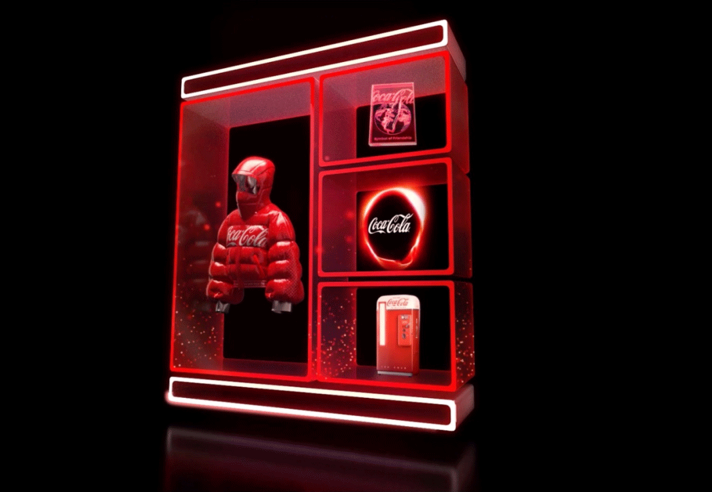
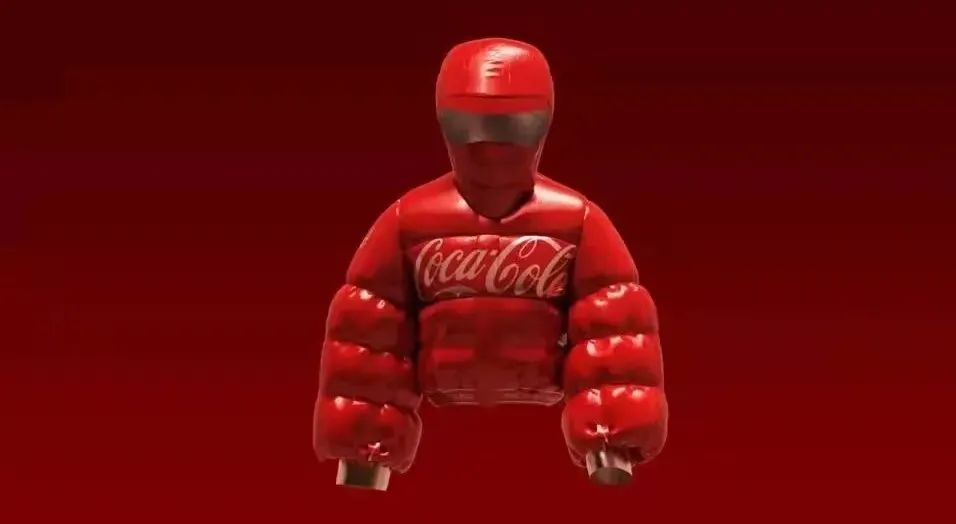
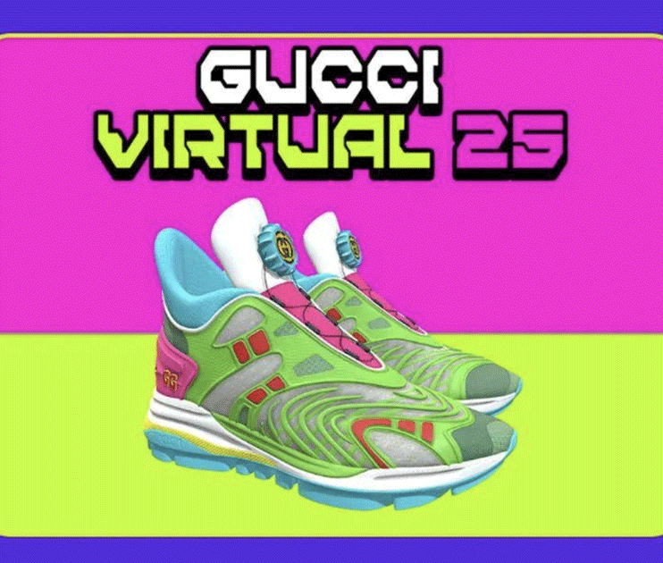
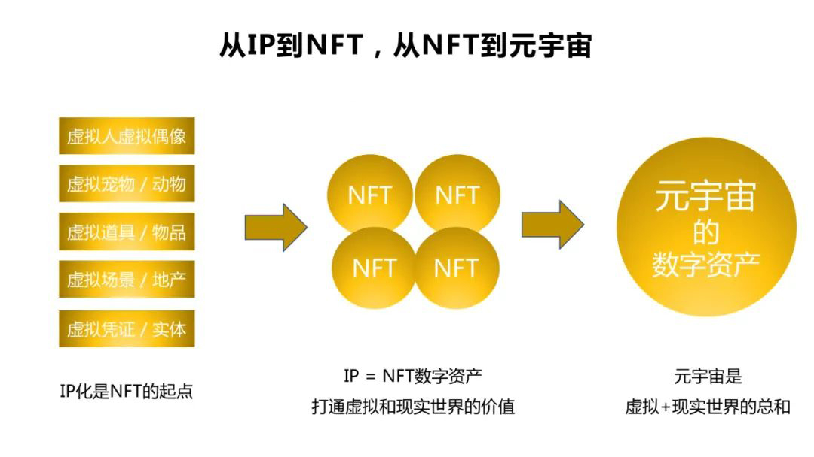

# NFT营销，品牌元宇宙的开启

**一个品牌如果想探索元宇宙，最现实、容易、有效的方式，就是从NFT数字藏品的新营销开始。**

> **数字藏品是不可替代的代币（NFT），使用区块链技术进行唯一标识，每个数字藏品都具有独一无二的链上序列号，和特定的作品、艺术品和商品建立唯一的映射关系，可以作为唯一的权利证明。数字藏品与虚拟货品等同质化代币有本质的不同，不具备任何货币属性。**

**NFT让元宇宙中的各种数字物品的价值归属、产权确认、虚拟身份的认证都成为可能**，所以，**NFT将是未来元宇宙经济活动的基本枢纽，还有人将NFT比喻为开启元宇宙世界的门票。**

数字藏品新营销，从诞生至现在只有区区几个月的时间，已经出现了很多有趣的事件，下面介绍几个最代表性的品牌案例——

## Coca-Cola Friendship Box

4个月前，可口可乐和数字可穿戴设备设计平台Tafi，联合推出了NFT数字藏品，这组名叫Coca-Cola Friendship Box的作品包含四个稀有的单版动态NFT，和一个隐藏惊喜。

**图：可口可乐友谊箱合集**

**具体包括：**

**1. 金属红泡泡夹克**，其灵感来自可口可乐的旧送货制服，可在Decentraland里穿戴。后者是一个开放式虚拟世界，里面几乎所有东西都是NFT，包括土地、服饰等等。

**2. 友谊卡：**仿照1940年代的可口可乐游戏卡设计。

**3､声音可视化器：**用标志性的音频捕捉分享可口可乐的体验：开瓶的砰砰声、饮料倒在冰块上的声音、气泡发出的嘶嘶声和入口那最初的清爽感觉。

**4､复古冰箱**，仿照1956年老式自动售货机重新设计后上线元宇宙。

合作方Tafi 表示，他们做的是“**比时尚单品更有意义的事情**”，后续Tafi 还会为可口可乐的其他品牌及平台开发其他数字可穿戴设备。

## Gucci Virtual 25

5月，Gucci发布了他们的首款数字虚拟运动鞋：Gucci Virtual 25。

这双鞋不能转售，只能在线上世界穿，它可能是Gucci有史以来最便宜的一双鞋，“只要”78元，买了之后，你就可以在虚拟世界“穿”上它拍照或录制小视频，然后分享出去。

## Cyber Eau de Parfum 

德国美容和生活方式工作室Look Labs在数月前，推出了**全球首款数字香水Cyber Eau de Parfum**，同时以实物和数字NFT的方式发布，其NFT艺术品用近红外光谱法提取香水气味，并将气味以光谱数据的形式在NFT艺术作品中表现出来。

此外，在去年12月，Gucci 与图片社交平台 Snapchat 共同推出依托增强现实技术**（AR）**的在线香水虚拟体验小游戏，针对美国市场推广品牌 Bloom **(花悦)** 系列香水全新作品 Profumo di Fiori。

而在今年2月，瑞士香精香料巨头奇华顿**（Givaudan）**宣布收购法国公司 Myrissi，后者的专利 AI技术，能将香气转换成与消费者相关的色谱和图像，从而预测终端消费者的情感反应。

## 天猫双11首届元宇宙艺术展

刚刚结束的2021双十一很冷静，但诸多大品牌推出的一系列数字藏品却非常值得关注。

比如，天猫举办了双11首届元宇宙艺术展，共推出8款数字藏品，包括:

极客们钟爱的外星人在元宇宙世界中像是元老，可以控制液态金属构建出外星人最具特色的徽章。

五粮液的数字藏品由金色和银色的粒子组成，如流动的星河熠熠生辉。

科颜氏的骨头先生乘着液态金属织成的飞毯，而moody则化身成了星空花在元宇宙的冰原中绽放。

自然堂护肤界的代表，将现实世界中纯净的大自然搬到了这个数字宇宙中。而宝洁化身成了液态金属组成的极具棱角设计感的背包。

除了博柏利**（Burberry）**，还有五个奢侈品品牌：浪琴**（Longines）**、阿玛尼**（Emporio Armani）**、Coach、Balmain、LaPerla都在今年天猫双十一首次集体发布数字藏品。其中浪琴设计的是一款马术X骑士形象，与实物双十一限量版、秋冬款、节日限定款同步发布。

------

通过这些案例，如果品牌想做数字藏品的新营销，能得到什么样的路径启示呢？

### **1､想做数字藏品，从品牌IP化开始**

**因为每一件数字藏品，其实都是一个个形象、道具或场景，这些都是IP的基本要素。**而且，**越是有文化属性的品牌，越容易做出相得益彰的NFT数字藏品，反之，则很容易无处下手，或者显得牵强。**

就以一开始展现的可口可乐Friendship Box为例，里面的每一件NFT，无不与可口可乐的历史、文化息息相关：金属红泡泡夹克的灵感来自可口可乐的旧送货制服；友谊卡仿照的是1940年代的可口可乐游戏卡；声音可视化器是可口可乐的声音体验；而复古冰箱则仿照1956年老式自动售货机重新设计。

**这背后都是一个个IP化的文化印记符号，体现着文化历史的传承，所以才具有收藏品的价值。**

**仅有过往的印记是不够的，还要在线上发展出新形式内容，这不是空洞的强调概念化的品牌理念，而是创造能够引发精神、情感、审美等共鸣的沟通故事、符号、仪式。**所以，**数字藏品营销，比过去都更需要IP化。**

### **2､重点是转化，实物体验转化为虚拟体验**

比如数字香水、GUCCI的香水游戏、双11元宇宙艺术展，都是将原本需要触摸使用的实物体验，转化为虚拟物体验。**品牌在虚拟世界的数字藏品，一定有来源于现实使用体验的部分。**

**这些转化并不是像传统品牌营销那样，转化为广告语式的抽象语言，而是转化为生动的形象和内容，让人可感知、可拥有、可体验。**

在数字藏品营销中，打造虚拟世界的可感知体验是首要任务。所以数字藏品一定要有玩法，方便人们参与体验。

这正是数字藏品设计的诀窍：**将实体物的体验转化为虚拟内容的体验，当线下实物体验被解构重塑，发展出更多“超现实”、“超脑洞”的体验创意时，品牌营销的创意空间和边界将无限扩展。**

这背后是虚拟生活的成长力量，正如在“元宇宙”这个概念大火之前，互联网崛起背景下生长起来的Z世代，就已经习惯于虚拟生活，以虚拟身份，和各种虚拟化身，进行交友、购物、游戏，全面沉浸于虚拟生活中。

所以，这些数字藏品都不是孤立存在的，它们背后都有场景和内容存在，**它们以虚拟+现实的融合逻辑下，重构人们对于未来世界的理解，从而一步步进入更沉浸式、不受限制、更立体的线上线下交互世界，这就是元宇宙的成长。**

### **3､用时间和权益，重构品牌生态**

NFT数字藏品营销，和过往其他数字营销的最大差别是什么？

我认为不是技术也不是表面的创意，本质上是两点不同，**一是时间，二是权益。**

先说时间，可能没有人注意到一个简单的事实，过往的营销活动，即使是看起来很创新的数字营销，**其实在时间轴上都是短暂的，会消散的**。消费者参加一个营销活动，看到一个广告只在某一时间段和品牌发生关系，随后就没有了，留下的可能有一些记忆，也仅此而已。

**而NFT数字藏品这种东西，不会随着营销活动的结束而消失，因为消费者对其的拥有，当然，消费者也可以将其转让、赠送出去，但在时间轴的意义上，仍然可以是永恒的，甚至不会因为生命的消失而消失。**

因此，时间会被无限拉长，这将改变我们对营销的某种定义，**品牌与人们发生长久联系的期望也会成为事实，不再是一句空谈。**

再说权益，由于让人们真正拥有了数字藏品的权益，从此，消费者就不再只是消费者，而是权益的拥有者，并因此获得更多的价值，当人们有权决定数字藏品后续的处置时，消费者的身份必然发生改变。

品牌与消费者的关系世界也会被重构，很自然而然的，每一个品牌能通过不断发行NFT数字藏品，消费者能通过不断获得它们，而组成一个不断扩大的品牌生态世界，权益共享也不再只是空话。

从现在已经出现的元宇宙雏形：虚拟世界游戏就已经看出来了，在这些虚拟世界里，玩家不像过往一样只是在玩乐和消费，由于里面的每一件物品都可以是NFT，每一个行为都可能产生出NFT，并可以让玩家拿着这些NFT去其他平台上转让、转卖和赠予，这使得玩家不再只是消费者，而成为了生产者。

**这些虚拟世界发生的事，正是未来品牌通过不断发行NFT，而与消费者发生的事的预演，让品牌与其用户，建立深层、深远且永恒的连接。**

### **4､一切品牌营销，未来皆可NFT**

数字藏品的未来想象空间是巨大的，所能创造的生态也是无界的。现在发生的事，都只是探索的开始，一切品牌营销，未来皆可NFT。

**对于品牌和平台来说，越早地抓住数字藏品的机遇，抓住早期红利，就越能在未来式的超空间战场中占得先机。**

下面是我们做的一张图，展现向元宇宙发展品牌资产的过程：

[

**IP化是NFT的起点，在数字虚拟世界里，IP可以完全转化为NFT数字资产，打通虚拟和现实世界的价值，最终，元宇宙是虚拟+现实世界的总和，品牌在其中积累数字资产，形成自己的子宇宙。**

**回到现在和当下，数字藏品/NFT既可以做营销，又可以做品牌文化建设。**

**一方面，通过数字藏品加深与消费者、员工的联系；另一方面，又将品牌价值转化为数字资产，初建品牌的元宇宙。**