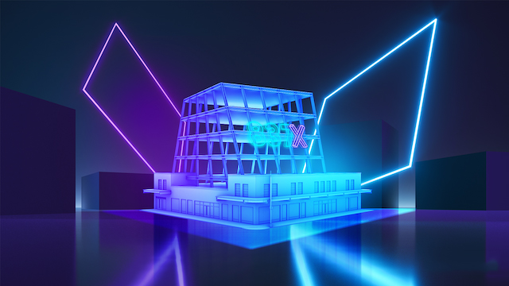

## 随着品牌创造数字体验，元宇宙生态系统获得吸引力,

> 基于区块链的元宇宙环境允许品牌为用户提供更多好处，比如增加互动性和虚拟物品所有权，但它会流行起来吗？

随着消费者对发生在网上的虚拟、互动和三维体验表现出越来越浓厚的兴趣，价值数十亿美元的公司正在掀起元宇宙风暴。

虽然“元宇宙”仍是一个新概念，但研究公司Strategy Analytics发现，到2026年，全球元宇宙市场预计将达到近420亿美元。这很可能是事实，因为包括耐克和沃尔玛在内的一些企业已经开始探索元宇宙环境中的消费者体验。

## 在元宇宙中推出的品牌的NFT效用

要了解品牌如何以及为什么要利用元宇宙，关键是要指出NFT在这些生态系统中发挥的作用。虽然2021年出现了大量的NFT，但预计元宇宙的兴起将突出NFT背后效用的重要性。

Ethernity Chain(一个经过认证和许可的NFT平台)的创始合伙人Adrian Baschuk告诉Cointelegraph，每个品牌、公司和知名人士最终都会有元宇宙和NFT集成：

> ”这是NFT-元宇宙交互层的“Myspace时代”。正如每个公司和个人都采用了某种形式的社交媒体一样，NFT和元宇宙也将如此。”

鉴于此，Baschuk分享说，Ethernity最近将其IP带到了基于区块链的元宇宙生态系统The Sandbox。具体地说，Ethernity在The Sandbox中获得了一块理想的土地，用于举办画廊和完全授权的NFT商店。Baschuk解释说，这将允许The Sandbox用户购买Ethernity NFT可穿戴设备和收藏品。

据Baschuk称，这些可穿戴的NFT包括运动员球衣，将被用来给The Sandbox中的角色穿戴并提供特殊的能力。他说：“达拉斯牛仔队(Dallas Cowboys)的Zeke和Dak将拉开这个序幕，因为球员的可穿戴球衣和垫肩将提高用户角色的技能和力量。”

虽然这个具体的例子可能会吸引The Sandbox游戏社区，但它背后的概念对进入元宇宙的品牌来说是普遍的。例如，Baschuk解释说，虚拟生态系统中的NFT允许公司通过区块链网络实现资产货币化，提高消费者和粉丝的互动性。

从这个角度来看，消费电子巨头三星(Samsung)最近宣布，它将在另一个领先的元宇宙生态系统Decentraland中建立一个其纽约实体店的虚拟复制品。该商店被称为“三星837X商店”，将在Decentraland中以有限的时间开放。

Decentraland中的三星837XX商店