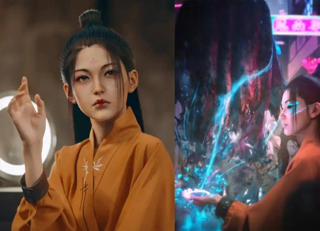

# 汽车品牌元宇宙着急“收割”年轻人

“未来汽车就是现代人移动生活的元宇宙，我干了三十年汽车，现在感觉真的有点意思了。”在刚过去不久的重庆车展上，长安汽车总裁王俊如是说。元宇宙的星辰大海，让一位来自传统车企的老汽车人心潮澎湃。

囊括了5G、AI、区块链、虚拟货币、虚拟形象等近几年最热门概念的元宇宙，也引得多家汽车厂商入局。上汽集团、一汽集团、理想汽车等车企已经率先申请了元宇宙相关商标。

年轻人对虚拟世界的沉迷，更是给元宇宙汽车添了一把火。在汽车之家研究院最近发布的《中国汽车潮流观察-兴趣向》报告中提到，超四成00后追捧虚拟化。

当汽车行业沉浸在元宇宙的热烈氛围时，百度造车的集度率先出牌。一个月前，集度带着“汽车机器人”概念车首度亮相。让人没想到的是，一家科技企业拿出的“元宇宙发布会”，竟然是被弹幕吐槽“连小朋友都不爱看”的动画效果。这难免给“元宇宙+汽车”泼了一盆凉水

从数字化展厅、虚拟形象到虚拟试乘试驾，车企并未停止对元宇宙的探索。而元宇宙在汽车圈的每次出现，也几乎都是冲着年轻人而来。

加拿大传播学者哈罗德·伊尼斯指出：“一种新媒介的出现，或将导致一种新文明的产生”。只不过，元宇宙——这个30多年前就被提出的概念，在如今万物互联的时代，又焕发新生。收割年轻人的利器，也从原来的二次元、跨界、联名、虚拟化等摇身一变，统称为一个时髦的词“元宇宙”。

#### 元宇宙≠虚拟化

关于元宇宙的定义莫衷一是，有解释称，元宇宙是利用科技手段进行链接与创造的，与现实世界映射与交互的虚拟世界，具备新型社会体系的数字生活空间。目前公认元宇宙具备五大特征：虚拟社交身份、沉浸感、经济系统、可持续性、极致的开发性。

数字与虚拟，成为元宇宙最直观的特点，虚拟现实技术成为元宇宙的核心。而年轻人对虚拟世界的着迷，正推进着娱乐与社交形态的演变。

在元宇宙中，所有的社交行为都是围绕用户的虚拟身份展开。在现实世界中，虚拟偶像与虚拟社交迅速抓住了90后、00后为代表的“网络原住民”的心。从日本第一代虚拟歌姬初音未来，到国内初代虚拟偶像歌手洛天依，再到时尚偶像IMMA，以及现在爆火的潮流KOL AYAYI，会捉妖的虚拟美妆达人柳夜熙……这些虚拟偶像火出圈的背后，也孕育着千亿级的消费潜力。

只要是年轻人喜欢，车企就不会错过营销上的尝试。6月8日，汽车圈有三场发布会，分别是东风标致，奇瑞和集度。不同品牌属性的三家车企，不约而同地亮出了自己的虚拟形象。东风标致推出“小狮妹Léa”、奇瑞打造了“元宇宙少女阿喜”实现跨次元互动，百度数字人车主“希加加”也顺势登场，成为集度首款汽车机器人概念车的000号虚拟车主。

在过去不久的电商大促“618”，虚拟偶像柳夜熙降临小鹏汽车直播间，让小鹏P7暗夜骑士版在抖音上收获了千万的浏览量。在官方宣传海报中，小鹏称柳夜熙为元宇宙“新鹏友”。

元宇宙还未到来，但汽车厂家们已经找到了通往元宇宙的捷径抑或说成本最低的方式—虚拟形象。然而，年轻人会因为对虚拟偶像的追捧，转移到汽车上吗？其实，虚拟偶像翻车的，也不在少数。

2017年初，小米联合火爆全球的虚拟偶像初音未来推出红米4X定制版，这次颇具创意的联动让红米的关注度暴涨。然而，期望越高，落差越大。很多想入手红米4X定制版的初音未来忠粉发现，所谓的联名除了手机后壳印着初音未来的图案外，其他与普通版并无太大差别。

虚拟偶像收割年轻人，前提是有触动年轻人的点。就像如今车企推出的虚拟形象看似与元宇宙息息相关，却又找不出打动年轻人的点在哪里。与此同时，虚拟化也远不是元宇宙的全貌，甚至未触及到元宇宙的核心层面。这也让元宇宙在汽车行业营销上的热，与现实中的冷形成了鲜明对比。

就拿集度一出牌就翻车的五毛特效虚拟发布会来说。那些浸润在纹理细腻，贴图精美的游戏画面中的年轻人，会轻易被“小朋友都不爱看”的动画效果打动吗？汽车厂商与消费者之间对需求认知的错位，比虚拟世界与物理世界的鸿沟还要深。

#### 真实与虚拟的割裂

诚然，车企对元宇宙的探索，并没有止步于虚拟形象。一汽-大众在近日全新速腾&全新宝来的线上发布会上，推出了首家与腾讯联合打造的线上云展厅，同台亮相的还有一汽-大众虚拟形象品牌官Ida。Ida将作为智能客服，在云展厅中与用户对话互动、提供品牌及车型讲解。用户登陆云展厅后，可个性化设置自己的虚拟角色。

今年3月，一汽奔腾在百度希壤元宇宙平台发布新车——奔腾B70S，并且上线了奔腾品牌的数字展馆。在这里，用户可以通过1：1还原的虚拟场景，了解新车信息，还可以虚拟试乘。

表面上看，这种虚拟的沉浸式的体验，离元宇宙又近了一步，可实际上，它还相差甚远。

中国计算机学会的高级工程师段永朝在一档对话节目中如此形容元宇宙的核心特性：高互动性、极致开发性。在这个空间里，虚拟与现实的边界变得模糊。“就好比是从打怪游戏到沙盒游戏，人不是被绑定在一个特定场景中，而是边建造边生存。”

反观车企在元宇宙的尝试，虚拟形象、虚拟场景、虚拟试驾皆是为了创造一个强交互、高沉浸，用户可以自我创造的环境。但是少了打通虚拟世界与现实世界的关键一环—介质。

马斯克曾在接受采访时，说过一句非常有趣的话：如果要置身于元宇宙首先要解决晕车问题。他认为，现在被人追捧的元宇宙的这个概念实际上都是那些玩游戏的小孩们搞出来的。“有谁会天天愿意佩戴一个头显、把一个电视屏幕放到你自己的鼻子上，然后就进入那个所谓的元宇宙。”

马斯克口中的头显，就是打通虚拟世界与物理世界的关键介质—虚拟现实头戴式显示设备，比如VR眼镜。脱离了这类介质，车企搭建的所谓虚拟场景就失去了真正的互动性和沉浸感，本质上与看动画无异。

在前不久的蔚来新品发布会上，李斌展示了蔚来ES7所搭载的应用AR/VR技术的全景数字座舱PanoCinema。当用户戴着专属AR眼镜，可投射出视距6米、等效201英寸的超大屏幕。用官方的话来说，将为用户带来全感官沉浸体验。

诚然，元宇宙对于人机交互、云计算能力的需求，与智能座舱的发展方向相吻合，在不少业内人士看来，智能汽车会成为连入元宇宙的重要接口。

可问题来了，汽车的使用场景与AR游戏有着很大的不同，对安全性和驾驶员的专注度有很高的要求。当人们需要在车内通过头显设备这类介质进入元宇宙，这岂不是与汽车本身用来驾乘的物理特性，存在天然的冲突？

#### 产业元宇宙，离年轻人有多远

当然，在新事物面前，人的想象力总是有限的。难说在技术突破的某一天，元宇宙在汽车上的壁垒将不复存在。而在各类赛车游戏里，人们已经畅想出了“元宇宙+汽车”的终极形态。比如在游戏《极限竞速：地平线 5》，汽车的风挡玻璃也被换为屏幕，可显示车速、油耗等实时数据。

而松下正把这种游戏场面带入现实。在2021年初的CES展会上，松下展出了下一代HUD平视显示器。普通的HUD功能只是简单地显示速度和其他一些信息。松下的想法是把挡风玻璃变成一个视频游戏用户界面。于是大胆地将前挡风玻璃更换为支持使用AR和AI并具备4K清晰度的屏幕。

从公布的视频可以看到，松下的AR HUD解决方案可以涵盖了更多的道路信息，比如近场中的显示速度和燃料等车辆信息，在远场中的通过3D叠加，显示了导航和其他关系驾驶安全的信息和数据，并随着前进方向映射前方道路的信息。

但遗憾的是，松下并没有透露，这套HUD解决方案的具体上车时间。酷炫的赛博汽车就如同高级自动驾驶一样，什么时候会来 ，是个玄学。

“科幻小说中的元宇宙已经近了”，这是英伟达创始人黄仁勋为自家开放式平台NVIDIA Omniverse赚吆喝的时候作出的判断。NVIDIA Omniverse专为虚拟协作和实时逼真模拟打造，被称为元宇宙的生产力工具。工程师们可以使用Omniverse，模拟仓库、工厂、物理和生物系统、机器人、自动驾驶汽车，甚至是虚拟形象的数字孪生。

与此同时，英伟达已经在汽车行业迈出了工业元宇宙的第一步。6月23日，华晨宝马生产基地大规模升级项目——里达工厂正式开业。据官方介绍，这座基于英伟达Omniverse打造的元宇宙工厂，从一开始就完全在虚拟环境进行规划和模拟的工厂，从厂区规划一直到设备调试都建立了数字孪生模型并进行模拟。

工业4.0研究院院长、数字孪生体联盟理事长胡权曾指出，汽车产业链、供应链的全过程都可以成为元宇宙技术的应用场景，而不仅仅是汽车产品本身。可正如马斯克所说，如果元宇宙40年、50年以后才会到来，它对当下又有什么意义？如果汽车工业先于汽车产品进入元宇宙，车企也需要思考，元宇宙式的期货，拿什么打动年轻人。

资本总是追逐风口，营销永远需要噱头。元宇宙强调互动性与创造性的特质，让探索用户运营的汽车厂商找到了切入点，以及与年轻一代同频共振的共同话题。

当这届年轻人，在虚拟世界里置地盖楼，甚至有人豪掷100万,只为买一张卡通头像。汽车企业，也想“收割”年轻人。