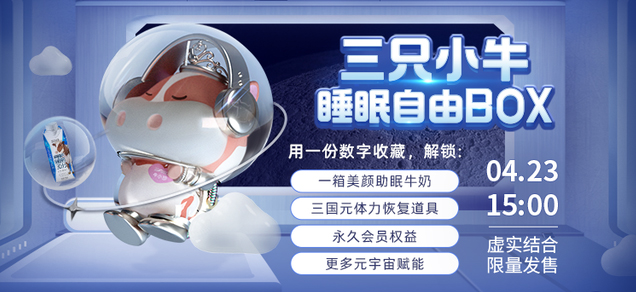
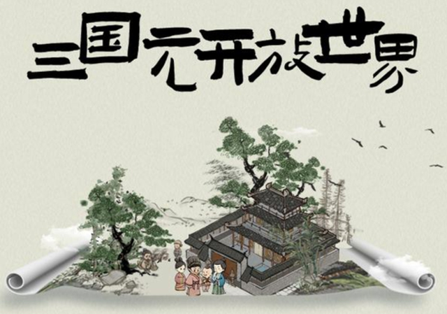

# 拆完蒙牛的元宇宙营销，我看懂了未来品牌营销的新玩法

过去一年里，全球互联网科技圈什么词最火？

当然是**元宇宙**。

科技、资本、企业甚至是政府争相涌入，巨头纷纷入场，将元宇宙带到了一个前所未有的关注点。

有人说2021年是全球元宇宙元年，还有人说互联网的尽头就是元宇宙。也有人说聊元宇宙的人，十有八九自己也不懂，不是割韭菜的就是被割韭菜的。

我一直在关注这个领域，对于元宇宙我的看法一直是——**未来的世界一定是虚实共生的。**

现在大家已经能看到这种趋势，所以提出“元宇宙”的概念倒没有错。

**问题是“元宇宙”从哪里才能和实体经济结合，和普通人的消费习惯结合落地呢？**

我原来一直认为突破口肯定是先从游戏行业开始，毕竟早在2003年IBM公司就推出过虚拟人生游戏“第二人生”，现在回头看，IBM太超前了。

但最近发生的一件事，让我意识到元宇宙可能找到和现实商业结合的突破口了。

01

前不久，一家名为**ODin META**的元宇宙平台上推出了蒙牛的数字藏品，名为「三只小牛·睡眠自由BOX」 ，总共2000个名额，一个数字藏品要90元，几分钟就全部秒空！给大家看看蒙牛推出的数字藏品的模样，就下面这个图。

说实话，一开始看到这个新闻**我也觉得是噱头**，因为我过去也不知道 ODin META 这个平台，我还以为这蒙牛推2000张数字藏品，跟一波NFT（数字资产的加密货币令牌）的热潮，就是试试水，玩一把借势营销。

我们千万不要低估这些传统企业。毕竟蒙牛是做快消品的，必须抓住新人，所以蒙牛这样的企业，一直在做破圈层、破次元的整合营销传播，就是希望能拥抱年轻人，影响年轻人。

提前布局元宇宙，可以说是快消品大厂一定会考虑的选择。**如果年轻人都去玩哪家的元宇宙，那么快消品大厂也一定会去这家元宇宙投放广告，快速卡位新人群的品牌心智。**

所以今年1月蒙牛就通过推出首个二次元员工，虚拟少女奶思，是不是很潮？

**扣响元宇宙的大门不是年轻人，而是那些需要年轻人支撑自己事业的品牌企业。**

打造元宇宙虚拟人形象，结合NFT做第一款数字藏品，不过是蒙牛进军元宇宙的道路上的两次成功尝试。

02

2000份数字藏品，90元，几分钟秒空，蒙牛这个成绩是不错！

问题是大家为什么要去抢**ODin META**推出的一张蒙牛小卡片？

这个事情让我很好奇，我仔细研究了蒙牛的活动策划，发现还真的不一样。

这次活动和过去推出各种数字藏品最大的区别就是——**数字藏品打造卖点，线下实物才是真香。**

来，让我们先看看4月23日下午15:00点发售的产品组合。

用户每购买1份「睡眠自由BOX」，即可兑换「三只小牛睡前30分」牛奶饮品1箱（每箱10包）。

这个牛奶我查了一下，正常零售价是98，等于优惠了8元，用户得到了实惠，不亏。

优惠8块钱，也不算大福利，那用户为啥这么疯抢呢？肯定还有福利。

果然，活动引入了**盲盒抽奖惊喜模式**。

在本期发售的2000份「睡眠自由BOX」中，有2份放了特殊样式，获得特殊样式的用户，等于中了大奖，可获得睡前30分年卡一张，送24箱睡前30分产品，等于有千分之一中奖率赚到近2400块的产品，当然要试试手气啊。

大家看，这些是线下商业里面实实在在的产品和实惠，那么在**ODin META**，拥有一份「睡眠自由BOX」有什么好处呢？

原来当你在**ODin三国元开放世界**中玩耍时，可用这个「睡眠自由BOX」快速恢复你采集材料消耗的体力，一份「睡眠自由BOX」只能补充1次。

原来是游戏里补血的道具，如果你本人就是游戏迷，买箱牛奶打游戏时补充能量，合理，顺便省点牛奶钱，还赚一份游戏补血道具，果然是线上线下都补血，这个设计，我就问问游戏迷喜欢不喜欢？

如果你买得多，比如集齐10份「睡眠自由BOX」的朋友，还可以得到更厉害的道具，合成「A2牛3D动效数字收藏」1枚。

**哎呀，这个玩法就是把线下买“小浣熊方便面”集卡换道具的玩法复制到元宇宙了。**

那拥有这个道具，你会得到什么福利呢？

拥有这个「A2牛3D动效数字收藏」的用户，自动升级为**「三只小牛·万能牛奶BOX」元宇宙专属会员**，有买东西打折、生日送礼品、新品优先尝鲜等会员永久专属福利。

**等于是办理了一份蒙牛的三只小牛会员卡，以后可以享受各种会员福利。**

这是把会员卡发行和数字藏品销售捆绑在一起了，怪不得有人抢，是因为大家一算账，在元宇宙买“三只小牛”牛奶更划算啊。**以后游戏玩家可以左手打元宇宙游戏，右手在游戏里抢生活用品的福利购，妈妈再也不骂我不务正业了。**

蒙牛的这次跨界元宇宙营销，让我看懂了一点，过去元宇宙数字藏品缺少实体商品的属性，在很多人看来就是概念大于实际，就是炒作。

把一个数字藏品不停炒作出天价，玩的是击鼓传花的游戏。根本没有对应的实物去证明它的价值，自然普通人理解和接受不了，很多大品牌和企业也只是把它当作一种流量噱头。

而蒙牛的这张“卡片”不单是一份数字藏品，它可以在元宇宙世界中当道具使用，还可以直接兑换一箱牛奶，并成为蒙牛品牌会员，这就让数字藏品同时具备收藏、商品、权益等多重属性，也让用户的购买行为增加了游戏里惊喜感和互动感。

也就是说，一份数字藏品满足了用户的三种实际需求：**好喝的牛奶+品牌会员长期权益+元宇宙游戏道具**。

**蒙牛用这套虚实结合的新玩法，打破了此前市面上众多NFT的局限，让每一份数字藏品都能绑定实体产品，再通过整合营销的形式拉动销量，从而实现多赢，非常适合新产品推广，不仅快速提升了新产品的知名度，也间接放大了品牌的价值。**

玩元宇宙游戏用户会越来越多，大都还是男性用户，过去很难赚到他们消费的钱，但今天通过让实物和平台中的数字收藏结合起来，就打开了营销的新可能。

不知道大家看懂了这个玩法吗？是不是很高明？

我已经在想，是不是以后我卖书，就应该把“电子书+实体书+游戏道具”结合起来卖？

结果小伙伴说，打游戏累了会喝牛奶，谁会看书？

哎。

03

好奇心驱使下，我顺便研究了一下这个叫ODin META的平台，没想到有惊喜。

我发现他们不仅是个数字藏品发行方，还开发了一款元宇宙游戏——三国元开放世界。

这一次和蒙牛合作的**ODin三国元开放世界**，提供了一个三国为背景的模拟世界，在这里你可以构建身份、形象、空间、道具，同时还可以重塑自己的社交关系，你不仅是三国元开放世界的“玩家”，也是创造者。

这听上去很像一个游戏，**但是它和游戏最大的区别是你在这里的交易不受平台约束，你可以在游戏里做合法的生意，并且衍生的数字资产都是有价值的。**

怎么说呢，你可以理解为这是一个剧本版的天猫店。

**我把天猫店开到了三国时代，在三国的环境下，我模拟一个三国身份和你做生意，这个想法是不是有点意思？**

比方说商家可以在这个平台开通品牌店铺，发行自己的品牌元宇宙商品，通过将线下实体与元宇宙应用场景相结合的方式，让用户在元宇宙中花钱，在现实世界去消费。

当然反过来也成立，在现实世界买道具，在元宇宙里消费，以后虚实世界可以自由切换。

以后有设计才华的朋友，可以和品牌联合，在元宇宙中发行你的数字藏品，直接向用户提供专属的品牌线下礼品或者兑换券，把数字经济和实体经济彻底打通。

如果让我给蒙牛提个小建议，我觉得他们干脆可以把店开进这个三国元开放世界里来，来做元宇宙里的第一个牛奶品牌。

据最新资料显示，**ODin三国元开放世界**的注册用户已经突破70万人，每天都有持续的新增用户，访问人次已达到1亿以上，不断在邀约品牌方入驻开通三国元商铺，打造品牌的元宇宙生态。

我认为：

**第一代线上商铺是阿里巴巴，做B2B生意；**

**第二代线上商铺是淘宝，做C2C生意；**

**第三代线上商铺是天猫，做B2C生意；**

**第四代线上商铺是元宇宙，把三种生意在虚拟世界里再玩一遍。*

如果**ODin三国元开放世界**真的可以成为一个购买元宇宙中数字藏品旗舰店，那就可以整合大量的一线品牌，复制蒙牛·三只小牛的策划模式，不但能快速把一群人吸引到自己的平台，还能持续获得品牌的广告营销预算，是一个可行的切入口。

如果你是品牌，你会考虑试水这种元宇宙营销吗?

04

当然，蒙牛好像更想要一步到位、干票大的。

尝到元宇宙整合营销甜头的他们，马上联合ODin META推出专属于蒙牛自己的元宇宙——蒙牛Land。

下一步蒙牛完全可以把自己的商店、产品、甚至是经销商都迁入进元宇宙，开放给普通人，设置新鲜多元的玩法，在平行空间打造自己的元宇宙商业帝国。**

再想远一点，只要人足够多，这个平台完全可以被打造成为**品牌宣传阵地或者元宇宙带货平台。**

以后品牌方要和广大创作者合作，在自己的元宇宙里，或者在平台级的元宇宙里面共建消费和娱乐场景，吸引大量的年轻人来玩，来体验，从而激活潜在的消费欲望。

现在传统企业线下和线上的流量成本越来越高，尤其是一些竞争到了白热化的行业，找到新的流量突破口对生存非常重要。

蒙牛这次元宇宙布局尝试，让我提前看到了元宇宙对品牌赋能的价值。当底层技术一旦打通，聚集在元宇宙平台的用户规模突破1000万人，那么井喷式增长就会到来。

每一个影响深远的重大变革都需要一个过程，元宇宙不会突如其来，一切规则尚在形成中。蒙牛给了更多传统企业布局元宇宙的新思路，这个要大大给一个肯定。

蒙牛这个案例意味着今天元宇宙已经发展到了一个新的阶段：它**不再只是VR场景、数字人等一个个新奇的概念，而是有了和真实的商业应用场景结合的可能，以后一定会带来全新的商业模式。**

目前元宇宙中几乎所有的产业形态都是初始空缺阶段，谁能率先看到机遇，提前布局，就意味着有更大可能性成为行业领导者。

蒙牛的元宇宙品牌营销模式试水成功，意味着其他品牌企业也可以复制这种模式，未来无论是把它作为品牌的流量阵地还是品牌营销阵地，都有着新的想象空间。