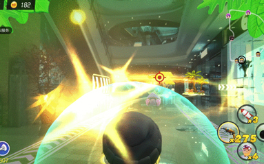

## 引爆元宇宙落地新风口，这个品牌逆风书写线下增长神话

近期疫情的反复，让线下经济再度遭受各式各样的摧残。

各大品牌线下战线持续收缩，以弃卒保车之势应对寒冬时刻，甚至关店走人已然成为了屡见不鲜的常态，品牌如何应对这一至暗时刻，实现逆风翻盘成为了当下亟需思考的关键问题。

而就是在这样严峻线下大背景下，线上经济却迎来一个前所未有的蓬勃发展时期，各大品牌纷纷涌入数字化赛道，企图以线上营销缓解各自的线下困境，而新颖超前的元宇宙自然也就成为了各大品牌争相追捧的线上热门领域。

正当各大品牌都在为进军元宇宙打得头破血流的时候，却敏锐地捕捉到了元宇宙概念与真实世界碰撞的交接点，并以此为核心将这一虚幻领域进一步拉入现实，凭借一辆虚拟与现实交融碰撞的AR娱乐车强势盘活线下赛道，也为元宇宙打通了一个极具落地性的营销新风口。

**01闯入元宇宙最底层**

**让概念股落地破圈**

虽然元宇宙在全球持续走火，但各大品牌也十分清醒目前为止元宇宙不过是人们对于下一代虚拟与现实无限交融互联网模式的想象而已。

回看市面上不少元宇宙玩法，虚拟人、数字藏品等等无一不是存在于数字世界的产物，概念很新颖，但在大众的感知世界中却存在感极低。

一方面是元宇宙本身就处在商业初探阶段，绝大多数品牌的借势玩法大多停留在概念层面，因此市面上并未对其产生统一定义；另一方面则是因为元宇宙与现实世界的连接度还不够，概念出圈之外整体还仅仅延展到部分小众圈层，无法真正有效触达更多用户的日常生活。

而就在不久前的六一儿童节期间，基于元宇宙的社交娱乐化属性强势破局，巧妙地将AR技术与线下商城场景深度捆绑，联动宁波9大商城首发AR娱乐车，真正将属于元宇宙世界的瑰丽幻想带进了现实生活。

自6月1日开始，仅仅7天创造了超万人购买体验的绝佳成绩，甚至在抖音、微博、小红书等社交平台上赢得了无数年轻人的疯狂种草安利，在线下经济堪称惨淡的大背景下赢得了一波满堂彩。

据悉，AR娱乐车为共享电单车品牌小遛旗下的全新子品牌，在领域内已经深耕5年，其产品覆盖全国100+城市，拥有超过5000万的用户规模，但随着疫情的反复，线下营收惨淡。

而为实现扭亏为盈，洞察到元宇宙热度飙升的小遛于今年重磅推出了AR娱乐车，通过将元宇宙概念与线下实体娱乐领域相结合，让元宇宙热度注入线下市场，达成线上回流线下的有效反哺。

与传统娱乐车的2D体验不同，在这场丛林金币争夺战中，整个商城将化身原始丛林，玩家们则需要通过穿梭各种丛林场景抢夺有限的金币，击败前来掠夺金币的神秘生活，与同行玩家斗智斗勇，最终穿越丛林赢得最后的胜利。

车辆本身同样黑科技属性点满，车身搭载着AR主机结合云端的3D点云定位系统，在商场这一巨大空间场景中同样具有厘米级别的三维空间识别定位能力。

再加上与AR技术的有效融合，在游戏过程中场景交互也十分真实，玩家被攻击后车身将同步感应震动，能够为玩家们带来更具沉浸式代入感的AR体验。

以元宇宙为圆心，充分浸润于新赛道的红利之中，并结合现实困境与行业难题提出了一套独属于自身的破解链路，即有效地汲取到了元宇宙市场的强大活力因子，为品牌元宇宙营销发展提供了一个可供借鉴的优秀思路；也有效地将虚拟世界的蓬勃生机带到了线下维度，达成了疫情之下的品牌逆生长。

**02构筑品牌蓝海版图**

**精准捕捉用户心智**

一个惊艳绝伦的敏锐创意洞察是品牌打造差异化风格、打开更广阔市场的关键媒介，但在创意蓝图之后，如何将品牌优势最大化、长效化，是品牌营销达成品效合一闭环的重中之重。

在脑暴不断的多元信息时代，天马行空的创意从来不缺，各大网红品牌的一夜爆红便是最好的证明，但它们“易火不易活”的品牌发展历程也从侧面证明，单凭一点始终难以撬起庞大的市场，唯有打造一连串环环相扣的立体营销矩阵，不断拉长品牌长尾效应，才是永葆生命力的正确道路。

在敏锐捕捉到元宇宙与线下经济碰撞交融的商机过后，也从三大方面入手逐步构建起了属于自己的蓝海版图。

**首先，优秀的经营策略。**

作为一个线下新兴品牌，大力度的促销活动是品牌在短期获取巨量曝光的关键战略。

可以看到的是，选取的开业时间就是十分耐人寻味，六一儿童节期间线下出行人流量增大，原本非假日里的冷清商城开始充分接纳出行人群，而借节日热度，在六一开业时更是推出了百万网红大V担任店长的吸粉策略，瞬间吸引了无数人关注。

此外，7天破万人购买的记录也与品牌新开业期间的价格优惠策略息息相关，不同于不少沾上元宇宙三个字就身价飙升的营销模式不同，在正式开业前的预售期间，将AR娱乐车从原价60元降到了19.9元即可体验的超低价，6月2日到6月5日更可免费领取60元体验券，通过超强价格优惠以量取胜，成功打出品牌名气。

此外，消费者初次游玩还能获得青年设计师原创IP精美周边贴纸，购卡还赠送玩偶、帆布包等限量周边，更有机会现场解锁“金币王争霸赛”的隐藏挑战，高效达成了第一波原始用户的积累。

**其次，精准的用户定位。**

AR元宇宙娱乐车的用户组成部分其实可以分作两个部分，一是由“元宇宙”概念吸引而来的年轻人群，二是“娱乐车”为代表的儿童群体，因此品牌打出的目标用户是3岁到30岁的泛Z世代用户。

而为有效吸引了这一跨越年龄段的泛用户群体，在AR娱乐车这一产品本身也大费功夫，4台摄像+8颗雷达自动避震防撞，搭载自动避让系统+智能校准路线能够全方位呵护小朋友们的安全。

特制航空控制摇杆，让你能够左手控制方向右手控制射击，加上赛博朋克风格十足的车身造型与炫酷的LED灯光，更是俘获年轻人心智的绝佳武器。

小朋友们能够在这里体验到前所未有的沉浸式游戏体验，在充满娱乐氛围的亲子玩耍语境下强化消费者对于品牌的认同感；而年轻人也能一览元宇宙落地现实世界的奇妙创意，感受先锋科技加持下的虚拟现实魅力，多元化的用户群像加持，也为品牌注入更多个性化活力因子，助力破圈更广阔的用户市场。

**最后，持续更新的元宇宙体系。**

值得一提的是，AR娱乐车也并非小遛营销布局的全部，恰恰相反，它仅仅是品牌冲向元宇宙的第一步。

据悉，除了已经上线的丛林金币“掠夺战”外，的第二款自研游戏“星际探索”也即将面世，而随着元宇宙热度的再度扩散，品牌也在布局思考将这一线下AR娱乐车模式逐步扩散到全国市场。

此外，在不久的将来小遛还推出属于自己的AR眼镜以及NFT数字藏品，真正从线上线下全维度乏力，构筑起属于自己的元宇宙生态链，持续抢占蓝海市场红利。

**03元宇宙破次元壁**

**品牌营销下一站**

其实在AR娱乐车之前，品牌们在元宇宙热度的持续发酵下就已经展开了对于领域破壁的相关探索，诸如将虚拟数字人实体化到现实世界、将爆款IP热剧以数字化技术呈现到元宇宙世界等等。

而融合线下经济与AR科技的综合性探索，则是进一步将原本略显虚幻的元宇宙真正落地到了现实，并通过商业化形式完美复刻了出来，这对品牌界而言无疑是异常值得肯定的关键性破局营销。

随着更多品牌的逐步摸索，原本困窘于概念领域的元宇宙终将真正与现实世界接轨，而破除虚拟与现实之间的次元壁，也必然成为品牌元宇宙营销的下一站，之后，谁能成为下一个接棒的选手，值得期待。