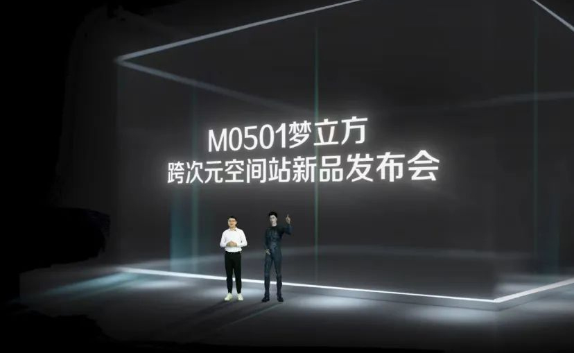

# 元宇宙浪潮再度来袭，品牌开启营销新时代

> 从1992年出版的小说《雪崩》首次提到Metaverse这个词，到社交巨头Facebook正式改名Meta，元宇宙的概念越来越频繁地出现在人们的日常生活里，品牌也逐渐开始把目光放在元宇宙上，利用这一自带流量与热度的新鲜事物吸引年轻群体的注意，更新自身传播方式、交互方式，寻求长效且可持续的增长，开启营销的新时代。下面就让我们一起去看看各大品牌是如何玩转元宇宙的吧！

本周，可口可乐推出首款以元宇宙概念为灵感的可口可乐「律动方块」，旨在以虚拟世界的创意体验对话更多年轻消费者；TME腾讯音乐娱乐旗下首个虚拟音乐嘉年华TMELAND 携手潮流品牌adidasOriginals共同开启「OZ未来音乐会」；摩登天空视觉创意厂MVM 创作的摩登天空首个数字藏品系列「1.M.O.星际动力别动队-星际漫游者，正式上线并开启预约；顾家家居近日开启「一方好梦」，首场跨次元空间站新品发布会；露得清携手新品牌代言人任敏，发布了品牌首支元宇宙广告。

**01 可口可乐推出限定产品「律动方块」**

5月26日，可口可乐全球创意平台「乐创无界」在中国市场推出了继「星河漫步」之后的第二款限定产品--以元宇宙概念为灵感的可口可乐「律动方块」，旨在以**虚拟世界**的创意体验对话更多年轻消费者。作为可口可乐首款以元宇宙为灵感的限定产品，「律动方块」从虚拟世界的无限创造力中汲取灵感，通过跨越数字世界和现实世界的创新方式，带领消费者探索「元宇宙」的神奇味道。据悉，这款元宇宙概念的产品，外观原型最早诞生于可口可乐和电竞组织PWR在游戏《堡垒之夜》中共同创建的像素岛。

不仅如此，可口可乐还同步推出了**AR游戏**。消费者通过「律动方块」罐身扫码，即可开启元宇宙AR游戏体验。同时，中国市场还同潮玩**虚拟人** YUM ZIYA任子雅进行合作，讲述首款元宇宙概念可口可乐的故事。

**「乐创无界」**是可口可乐在全球范围内全新推出的创意平台，通过限定产品的发布、沉浸式的互动体验以及符合年轻一代的文化创意，赋予标志性的可口可乐以全新的表达方式和意义。此次「律动方块」产品从口味到包装都以太空为主题，借助元宇宙这一概念，运用产品限定、AR游戏、虚拟人等营销手段，将**品牌文化**融合其中，深刻洞察了当今年轻消费群体的消费心理与消费需求，以更具想象力的产品表达和更新潮的营销方式与之建立联系，为消费者打造出更加丰富的沉浸式体验，以文化创意和科技理念开启百年品牌的新赛道。

**02 TMELAND 携手adidas开启「OZ未来音乐会」**

近日，TME 腾讯音乐娱乐旗下首个**虚拟音乐嘉年华** TMELAND 携手潮流品牌adidas Originals共同开启「OZ未来音乐会」。此次TMELAND元宇宙都市的流程规划中包含了「逛」、「看」、「听」三重体验，用户只需要通过提前生成的 roz流动体|Avatar形象进入TMELAND，就可以逛OZ球鞋展示区、看十位流动体走秀、听说唱歌手欧阳靖和朴宰范(JayPark)带来的经典曲目，尽情享受虚拟与现实之间流动性的**数字体验**。

TMELAND既是TME 腾讯音乐娱乐旗下首个虚拟音乐嘉年华，也是国内首个虚拟音乐嘉年华。早在2021年底，TMELAND就邀请了五月天、全球百大DJ等知名音乐人在TMELAND打造了首个虚拟音乐节，今年5月4日，TMELAND又与央视合作打造国内技术能实现的最大虚拟会场，让千万青年化身虚拟**「数字人」**，身穿特定的五四装扮，与节目现场实时联动，开创了国内虚拟节目沉浸式互动体验先河。

此次 TMELAND与adidas Originals联合打造的本土首个WEB3.0音乐会，在真正意义上打破了现实与虚拟世界的界限，实现了虚拟与现实之间的交互，既为用户带来了一场兼具时尚感与科技感的视听盛宴，也为其他品牌的元宇宙玩法提供了更多的联想与参考。品牌以**虚拟空间**为纽带，依托新技术、新场景打造创新内容与交互式的用户体验，从而能够更好地与年轻消费群体打成一片。这场线上音乐会也证明了元宇宙及虚拟技术与更多产业相结合能够进一步释放**超级数字场景**的更多优势，给品牌带来巨大的营销价值。

**03 摩登天空正式上线首个数字藏品系列**

5月24日，由摩登天空视觉创意厂牌MVM 创作的摩登天空首个**数字藏品**系列「1.M.O.星际动力别动队-星际漫游者」在摩登天空官方平台「正在现场」app数字藏品频道正式上线并开启预约。1.M.O.是由摩登天空视觉创意厂牌MVM于2018年创立的虚拟IP，本次「I.M.O.星际动力别动队-星际漫游者」数字藏品将以**盲盒形式**发行，该系列共包含7款，限量 2999 份，购买后的所有藏品均能够在「正在现场」app内使用AR功能，供藏家把玩欣赏。

早在今年1月，摩登天空就于2022年度发布会上宣布全面布局**虚拟世界**，并宣布2022草莓音乐节将推出**AR体验**，并计划打造虚拟草莓音乐节，同时也会把数字藏品作为未来业务的一个重要方向，未来将开发更多自有IP及艺术作品，以数字藏品的形式为虚拟世界提供更为艺术、更为丰富的体验。数字藏品的底层技术来自区块链，具有不可分割、不可替代、独一无二的特性。数字藏品为品牌营销与传播带来了许多新的玩法，以其限量珍贵的属性结合饥饿营销，加上独特的收藏价值和文化意义，能够最大程度地吸引年轻消费群体进行购买，同时也为品牌注入新的活力与生命力。

**04 顾家家居「一方好梦」跨次元空间站新品发布会**

为满足大众深睡需求，顾家家居近日开启「一方好梦」，首场跨次元空间站新品发布会，以**虚拟交互**的形式深入M0501梦立方的新品内核，邀请大众领略匠心品质与未来科技，旨在引领**深睡革命**。此次发布会通过立体空间站的形式设计和虚拟人物形象的演绎，将深睡床垫采用的科技与工艺融入其中，展现出品牌独创「未来睡感」的实力，帮助大众解决长期熬夜与浅睡的「睡眠负债」，释放身心活力。活动期间，消费者还可享受一年无忧包换试睡福利。

睡眠问题一直是当代年轻人的最困扰也最关心的问题之一，顾家家居此次跨次元空间站新品发布会通过首个家居虚拟人小顾同学的**沉浸式体验**，为消费者展现新品的独特黑科技。随着元宇宙的兴起、一批批虚拟人的涌现，越来越多的品牌选择运用虚拟人物作为代言人，既能够帮助品牌实现**年轻化战略**，又能有效吸引年轻消费群体，还能减轻代言人人设崩塌的风险，较之真人来说有过之无不及，是品牌代言人性价比最高的选择。

**05 露得清发布品牌首支元宇宙广告**

作为A醇抗老鼻祖品牌，露得清近日携手新品牌代言人任敏，发布了品牌首支**元宇宙广告**，为追求美的女孩带来一个肌肤反重力的宇宙。广告塑造了一个架空的后现代城市，品牌也是希望借**超现实主义**的环境，去放大日常中女孩都会遇到的各种肌肤困扰，而这一切都会因露得清的出现而发生变化。影片中露得清的广告牌成了连接现实与梦想的窗口，在任敏踏进广告牌后，一个A醇构建的反重力宇宙随即出现在大众面前，在产品与人物的相互作用下，具象的卖点被更清晰地表达出来。

此次广告片是露得清首次探索元宇宙的世界，品牌以前沿科技的概念通过视频展现了产品的相关卖点，在吸引更多年轻抗老群体了解产品、关注品牌的同时，也巩固了品牌一贯的专业形象，增强了产品的可信度。元宇宙的广告片早已被多个品牌运用传播，科技大片的观感、新奇有趣的概念......帮助品牌达到推广产品、塑造品牌价值的双重功效。

元宇宙在本质上来说是相对于现实世界而建立起来的一个虚拟数字空间，尽管前景如何仍未可知，但其独特的传播方式和交互手段等特性已被诸多品牌看中，运用发展成为数字藏品、虚拟演出、元宇宙广告片等各类营销与传播手段，期望使用户获得沉浸式的互动体验、激发品牌的溢价能力、提升品牌的变现能力，最终以文化创意和科技手段塑造品牌价值。