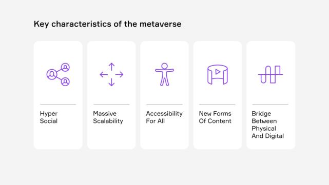
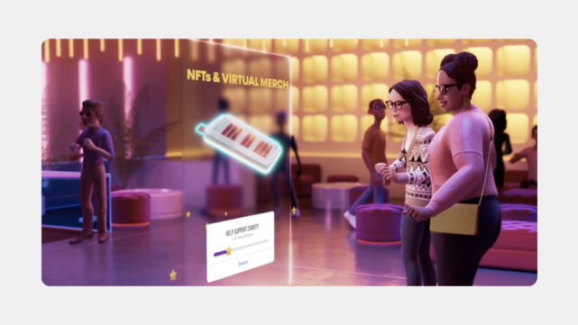
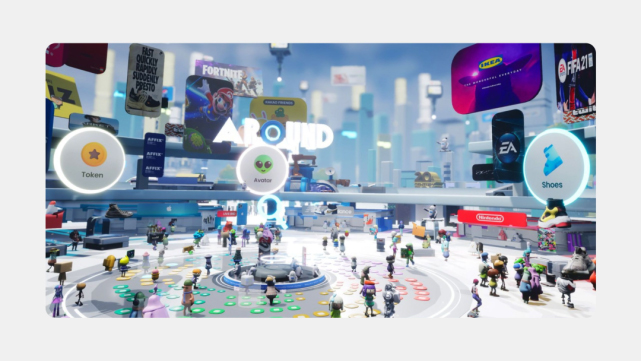
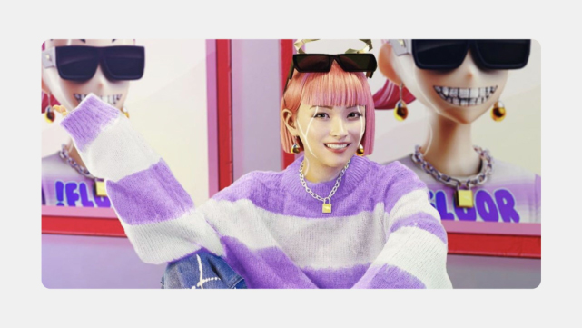
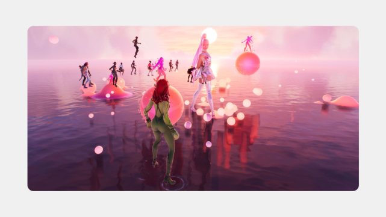
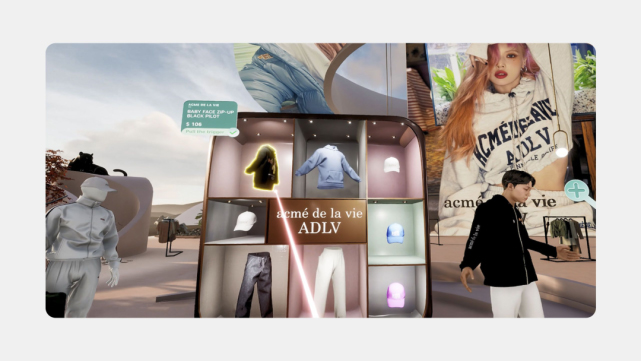
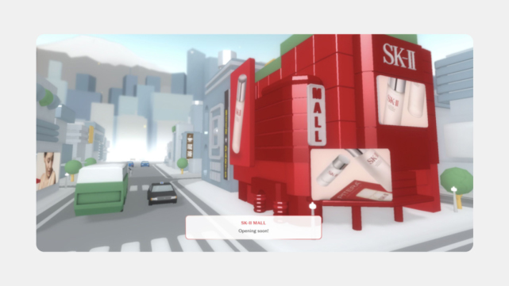
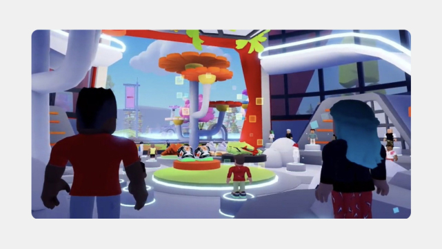

# 元宇宙中的广告创意

> 随着我们迎来技术创新的新时代，品牌和消费者在 Web 3.0 世界以及由此产生的元宇宙中的互动变得非常明显，这一点变得越来越明显。通过将实体与数字相结合，我们将看到混合体验的兴起，其中沉浸式、个性化和连接性将成为一些关键卖点。

随着新的行为和消费模式慢慢形成，品牌将不得不重新发明自己，以与元宇宙中的受众保持一致。需要注意的重要一点是，今天的营销在虚拟世界中不会很好地转化；从广告到购买渠道以及消费者利益的本质，营销人员和广告商都将面临一系列新的挑战。

Metaverse 被称为一个万亿美元的市场机会。一些财力雄厚的品牌，如 Gucci、Louis Vuitton 和 Ralph Lauren，已经开始在虚拟世界中发挥影响力——并通过首次涉足虚拟世界赚大钱。即使对于那些还不愿意承诺的人来说，品牌实验也已成为一种趋势。

虽然我们只是处于这种技术进步的尖端，但现实世界中已经存在可以从虚拟世界中受益的领域。也许毫不奇怪，广告和营销可能会成为元宇宙中一个更大的行业，因为正在开辟新的（并且非常有利可图的）途径。

在这篇文章中，我们将讨论虚拟世界中的广告，从未来的广告渠道到拥抱这种技术发展的利弊。

什么是元宇宙

Metaverse 是一个虚拟空间，它将现实世界和虚拟现实实时融合为一体，使用虚拟和增强现实等新兴技术来创建高度身临其境的 3D 环境。有人将其称为当前互联网的继任者，作为交互式数字体验的下一个重要步骤。

凭借大量的可能性，元宇宙正迅速成为社交、创意追求、商业、游戏、娱乐等有影响力的平台。

目前，我们与元宇宙最接近的体验是 Roblox、Axie Infinity 和 Fortnite 等游戏平台，以及包括 Decentraland 和 Sandbox 在内的开源虚拟世界。这些平台提供共享的 3D 世界，用户可以在其中参与游戏以外的多种体验。

例如，在Sensorium Galaxy中，用户将能够参加音乐会并结识他们最喜欢的艺术家，并在这个虚拟世界中的许多世界中穿梭，与新朋友联系，探索自我表达和探索的新形式，创作舞蹈并与虚拟人工智能驱动的生物建立了惊人的关系。用户还将获得对他们的化身和 Sensorium Galaxy 体验的深度定制。

随着虚拟世界成为新的营销和广告前沿，广告商将希望利用一个关键的元宇宙概念：

**超社交：**由于虚拟世界的共享性质，结识新朋友和结交新朋友的机会将变得更大。

**可扩展性：**数以亿计的人（及其化身）将能够同时在元宇宙中共存。

**可访问性：**所有用户，无论其年龄、背景、宗教或位置如何，都可以加入元宇宙。

**新形式的内容：**用户产生的沉浸式交互内容，在现实世界中无法成形，最终可以在元界出现。

**物理和数字之间的桥梁：**模糊两个世界之间的界限使人们能够以更引人注目的方式与体验、产品和服务进行交互。

广告商应该知道的关键 Metaverse 术语

正如我们在上一篇文章“元节含义：定义、起源和机会”中解释的那样，元节这个词是希腊语前缀“元”（超越的意思）和“宇宙”一词的组合。这个概念最早是由尼尔斯蒂芬森在他 1992 年的小说《雪崩》中提出的。

然而，只有在去年，元宇宙才真正爆发，在诸如 Facebook 于 2021 年底更名为 Meta 等大型科技新闻的背景下进入主流。

从那时起，元界已经从一个技术流行语变成了各行各业公司的主要投资领域。

随着数字商品（以不可替代代币的形式）的价值不断增长，品牌将不再局限于实体空间或实体产品。这个想法是，您无需去实体店购买您最喜欢的产品，您只需在虚拟世界中购买它们，然后将它们送到家中即可。听起来像 Deliveroo，我们知道，但在 Metaverse 中，您在购物的同时可以做的事情远不止于此，例如参加 Metaverse 音乐会或与朋友聚会。

体验将越来越多地融入一个空间，为用户创造更多机会。或者这至少是像麦当劳这样的公司的计划，它将在其标准的送货上门选项中增加一系列服务。

在我们了解详细信息之前，有必要先了解一下广告商和广告代理机构应该注意的关键元宇宙理念：

**虚拟现实（VR）**

虚拟现实是在模拟环境中的一种身临其境的互动体验。您可以借助头戴式设备等界面进入 360 度环境。通过这种方式，VR 提供了视觉、感官和听觉反馈，让用户可以完全沉浸在虚拟世界和环境中，比如虚拟世界。

虚拟现实技术已经存在了很长一段时间，但它只是在最近几年才开始成熟并变得更容易使用。最近的进步使 VR 及其界面（如 VR 耳机）的使用更加实用、广泛和可访问。

**增强现实 (AR)**

增强现实是现实世界的技术增强版本，通过在现实世界的物理空间中叠加计算机生成的图像来实现。添加视觉和声音刺激以增强沉浸感。

**混合现实 (MR)**

混合现实是一个广泛的技术类别，指的是人类和计算机处理输入重叠的“混合”体验。如此处所述，混合现实技术将人工内容叠加到现实世界上，并使人工内容与现实世界的风景进行交互。VR 和 AR 属于混合现实领域，介于物理世界和数字世界之间。

**扩展现实 (XR)**

扩展现实包括虚拟现实 (VR)、增强现实 (AR) 和混合现实 (MR)，以及能够通过融合现实世界元素和虚拟世界来扩展现实的任何形式的沉浸式技术。XR 包括对认知和感官有影响的人机交互，例如 VR 耳机、AR 眼镜甚至植入物。

**阿凡达**

化身是虚拟世界或元节中用户的计算机生成表示。从本质上讲，这是您的虚拟角色。

**区块链**

区块链技术提供了一种以数字方式存储几乎不可能更改或破解的信息的方式。区块链还为比特币和以太坊等加密货币提供动力，同时也是不可替代代币 (NFT) 背后的技术。

**加密货币**

虚拟货币或加密货币是元界中的主要支付手段。这种类型的货币保存在数字钱包中，并通过高度复杂的密码学进行保护。加密货币通过去中心化系统时，没有中央监管或监督，这有助于发行和跟踪加密货币代币。

**不可替代代币（NFT）**

NFT 是存储在区块链上的独特数字资产。它代表现实世界的物品，如音乐、艺术、收藏品等等。NFT 将为您提供独一无二的资产的真正数字所有权。

在 Metaverse 中做广告的方法

那么，品牌如何在虚拟世界中做广告并从技术中获利呢？由于元宇宙远不是一个完整的平台，我们无法预测机会的全部范围，但有一些趋势正在出现。许多是现实世界中久经考验的策略的延伸，包括：

1. 元界内广告

好的，同意。这可能不是最令人兴奋的发展，但数字广告并没有真正走向任何地方。在一些类似元节的平台中，包括 Roblox、Fortnite 和 Decentraland，您可能会遇到某种形式的元节广告，最常见的是虚拟广告牌。这个模型在 Tiki-Taka Soccer 和 FIFA Mobile 等平台上的游戏内广告效果很好，并且可以在元世界中很好地转化。可口可乐、三星、巴黎世家和阿迪达斯等品牌当然注意到了这种潜力，正加倍加大在虚拟世界的影响力，并推出引人注目的公关和广告活动。但是，虽然广告牌或横幅可能看起来像是老式的 IRL，但它们仍然是元宇宙中未开发的渠道。

2. 虚拟影响者

影响者营销是当今广告和销售产品的最强大工具之一。虽然这在虚拟世界中可能不会改变，但品牌正在越来越多地探索与新型社交媒体明星——虚拟影响者的合作。这种策略有很多好处，从制作更具创意的活动到最具成本效益。虚拟模型也更容易管理，这对一些广告商来说可能是另一个很大的优势。Lil Miquela、Shudu和Imma等有影响力的人经常与 Calvin Klein、Balmain、Valentino 和 Dior 等人一起参加备受瞩目的活动。这并不是说人类影响者不会在虚拟世界中占有一席之地。正如营销咨询集团R3所说，用户仍然可以像现在一样关注数字影响者，而品牌将继续与各种影响者合作，在虚拟世界中“大放异彩”。

3. 元界事件

Fortnite和Roblox率先通过 Travis Scott、Lil Nas 和 Ariana Grande 等人举办的音乐会等娱乐活动吸引大量观众，每场都吸引了数百万粉丝。就像现实生活中的大型活动一样，比如超级碗、元宇宙音乐会、峰会、体育赛事等，都是令人难以置信的广告机会。从推出全面的广告到更微妙的产品展示位置，消费者将在虚拟世界中进行互动广告。

4. 元界商务

新兴的主要趋势之一是直接化身 (D2A) 经济的兴起，品牌销售旨在增强用户化身的数字产品。这些数字商品已经可以依靠巨大的市场潜力，这与我们近年来看到的游戏内消费趋势一致。到 2025 年，游戏内购的市值预计将超过 744 亿美元。

大部分炒作与使用不可替代的代币来支持虚拟经济有关。在元宇宙中，数字商品作为 NFT 进行交换，这使得它们完全独一无二，同时确保其所有权受到保护。这些资产的范围从内容到收藏品，到目前为止，它们已被证明是一个高度货币化的市场。

例如，耐克已成为 Roblox 的永久固定资产，并在此建立了Nikeland。这个虚拟陈列室里摆满了 Nike NFT 鞋、衣服和配饰的虚拟架子，用户可以在 Metaverse 中轻松购买和佩戴。可口可乐最近在 Decentraland 推出了自己的 NFT 可穿戴设备系列，现在它还添加了一种metaverse 饮料。包括 Gucci、Tommy Hilfiger、三星、Wendy's 和麦当劳在内的许多其他品牌也在提供跨虚拟世界的 NFT。

为什么 Metaverse 对广告有利可图

尽管预计它会膨胀成一个价值数万亿美元的产业），但目前元宇宙仍然是一个负担得起的广告目的地。开展活动或租用 Metaverse 广告牌的价格并不是特别高，这使其成为瞄准进入 Metaverse 的新受众的潜在有利可图的机会。

元宇宙中的广告不仅是一种新颖的工具，而且与传统的营销和广告策略相比，它的影响范围也会更广。

品牌尤其希望瞄准千禧一代和 Z 世代受众，因为他们已经基本熟悉数字体验和虚拟世界，尤其是在游戏领域。目前全球有近 300 万活跃游戏玩家。仅在美国，68% 的美国成年人（1.633 亿）是游戏玩家，而 70% 的 18 岁及以下美国儿童（或 5110 万）也是游戏玩家。

此外，随着加密和 NFT 变得越来越主流，这些细分市场只会在虚拟世界中被大规模采用和增长。事实上，元界已经成为 NFT 的主要目的地，甚至著名的拍卖行苏富比也在 Decentraland 推出了一个虚拟画廊。

最后，摆脱现实世界的限制，虚拟世界中的广告可以达到新的高度 - 而不会破坏银行。以 Gucci 超级成功的 Gucci Garden 广告系列为例，这是该时装屋最奇幻的广告系列之一的虚拟再现。在这个托管在 Roblox 内部的虚拟空间中，用户（化身）可以穿过一个森林般的场景，完全向天空开放，同时还可以浏览 Gucci 的数字时装系列。

由于这种激活，这家著名的意大利时装公司设法以比现实生活中的对手更高的价格出售了一个虚拟包。

元界广告的主要优势

纵观历史，广告一直在迅速拥抱新趋势和技术飞跃。元宇宙现在再次开启了一个可以利用的新时代——以及一个广告商和营销人员可以通过它接触受众的新平台。因此，品牌需要开始考虑迈出拥抱虚拟世界的第一步，在虚拟世界中广告的一些主要优势是：

无限投票率

元宇宙对可以进入其中并同时体验的人数没有限制。这意味着广告商可以接触到无限的受众，这是目前技术所不允许的，因为很少有活动可以同时在一个地方聚集数百万人。

无限的基础设施可能性

在想象和概念化元宇宙时，天空是极限。如果没有现实世界的限制，例如重力、空间不足甚至预算，那么在虚拟世界中构建的东西就没有任何障碍。无论您梦想什么，在元宇宙中都可以实现。

大量货币化

通过区块链和智能合约，元界承诺赋予其用户对数字资产的真正所有权。这对创作者来说是一个诱人的前景。艺术家可以轻松地铸造他们的艺术作品或内容并将其作为 NFT 出售，这意味着它们是一种独一无二的数字资产。一些名人、影响者和内容创作者也在使用这项技术以更有意义的方式与粉丝和追随者建立联系，包括发布直接面向买家的独家内容。

个性化

近年来，营销和广告已经从“一对多”转变为更加个性化的“一对一”方式，广告越来越适合其目标受众。这一策略对于吸引年轻一代的注意力尤为重要，他们不想在大量观众中感觉自己像另一个不露面的人。利用 VR、AR 和 AI 的潜力与虚拟世界中的客户建立更深层次的关系是想要变得相关并参与虚拟世界的品牌必须遵循的策略。

为什么品牌要在元界做广告

先发优势

俗话说，早起的鸟儿有虫吃。就目前而言，元宇宙是一种新奇事物，人们对此知之甚少。但这为那些准备好了解它并迎接挑战的人提供了机会。不需要像开设虚拟商店并在虚拟世界中永久存在这样的大承诺。品牌可以选择尝试较小的广告，例如在游戏或虚拟音乐会中购买横幅，或者使用 AR 来增加参与度。

创新的跨渠道组合

跟上趋势的一部分是更新策略，不仅要适应不断变化的消费者行为，还要适应对观众最重要的渠道。随着越来越多的人进入虚拟世界，有必要看看这一举动背后的原因并研究行为和兴趣的演变。就像第一批使用 Facebook 或 Instagram 的用户和品牌一样，元界也将成为消费者的相关渠道。从长远来看，即使很小，在那里也能有所作为。另一方面，对于广告商来说，元宇宙是完美的创意资产，他们可以在元宇宙中并行运行现实世界的活动。

无尽的创意可能性

元节是一块空白的画布，可以充分释放创造力。排除物理定律后，广告商可以利用创新工具来构思广告系列。目前，我们看到对广告越来越不感兴趣和漠不关心。许多消费者，可能包括您在内，都在主动避免广告并为无广告体验付费。然而，这不一定在元宇宙中成为现实，因为会有更多的方式来吸引用户。这意味着不仅要吸引他们的眼睛和耳朵，还要吸引他们所有的感官。虚拟世界中的多感官模拟将在很大程度上成为可能，这在很大程度上要归功于触觉技术的使用，使用户能够以当今不可能的方式真正感受到存在感并与他们的虚拟环境接触。

元界广告的挑战

虽然元宇宙是一个非常诱人的营销和广告平台，但在加入之前有一些注意事项需要注意。

安全

现在比以往任何时候都更重要的是，数据隐私是消费者最关心的问题和需求。如果没有明确的网络安全协议，就很难吸引采用者并说服他们与虚拟世界中的品牌互动。归根结底，品牌可能要确保他们的数字存在和足迹保持安全。

规定

科技巨头因未能充分审核和监管其平台上的内容而面临越来越多的审查。这个问题在元宇宙中同样重要，它的本质依赖于去中心化。有了这样的模式，自我监管将是关键。但即便如此，随着用户监管其他用户，就像 Decentraland 等平台一样，这个问题仍然难以捉摸。一个解决方案可能是使用智能合约来标记不适当的内容或处理错误信息。

缺乏收养

消费者对进入虚拟世界所需的界面（尤其是 VR 耳机）的采用正在加快步伐，但目前仍然很低。更广泛的 VR 技术采用率也是如此，用户体验经常被认为是主流采用的最大障碍之一。除了相对缓慢的硬件采用之外，还有一个与虚拟现实内容相关的障碍，到目前为止，虚拟现实内容的接受度也很低。Forrester 的数据发现，分别只有 34% 和 28% 的美国和英国在线成年人对元宇宙将提供的内容感到兴奋，而这两个国家只有不到 25% 的人展示了有利于Metaverse 早期采用。

测量指标

在 Metaverse 中测量和跟踪在 Metaverse 中具有挑战性，因为没有明确的指标。最大的挑战之一是评估投资回报率，这是任何广告商和营销商的关键指标。在不确切知道他们从他们的钱中得到了什么的情况下，很难向广告客户证明预算的合理性。正如 Cathy Hackl 所解释的那样，品牌在评估潜在的 OKR [目标和关键结果] 和潜在的投资回报率时可能会遇到困难，因为即使是对数字的预测也在不断发展。只有在元宇宙中，营销指标才有可能超越喜欢、订阅者和分享。

元界广告入门技巧

那么，广告3.0会是什么样子呢？很难说。我们还没有进入一个成熟的元宇宙。但是品牌已经开始尝试一些工具和策略，这些工具和策略肯定会在元宇宙中进行广告宣传：

增强现实营销

与依赖 VR 耳机和更复杂数据的虚拟现实不同，增强现实是一种更易于使用的工具，因为消费者只需要智能手机即可访问基于 AR 的体验。例如， Zara和Chanel等品牌已经尝试使用 AR 技术来丰富他们的购物产品，而 Instagram 和 Snapchat 等社交网络则有大量的 AR 滤镜可供选择。增强现实是营销人员与他们以前可能无法接触到的客户互动的一种方式，为个性化开辟了新的机会，从长远来看会带来更成功的营销活动。

虚拟现实广告

虚拟现实是获得广告商充分关注的最新技术。它有可能比任何其他形式的传统广告更具沉浸感和互动性。虚拟现实广告可用于多种用途，包括产品演示、360 度视频和虚拟游览。最近，Meta宣布将把 3D 广告整合到 Facebook 和 Instagram 广告中，称这一步骤将帮助消费者更好地了解他们在网上使用的产品。

视频营销

视频营销已经是当今营销实践的基石之一。在元节中，它将包含链接到与客户相关的特定主题的视频，并作为个性化演示的一部分出现。正如行业专家预测的那样，元界视频营销将利用眼睛和动作捕捉、面部表情识别和语音识别等技术，让广告商可以将其作为衡量标准来更好地衡量观众对产品或内容的反馈。呈现。

直播

作为用户可以轻松与朋友和家人等其他人一起闲逛的共享空间，直播是另一个可以实现连接的工具。直播带来了实时呈现和连接的元素，广告商可以继续利用这些元素来发挥自己的优势，就像他们已经在 Meta、Instagram 或 Twitch 等平台上所做的那样。

底线

元宇宙尚未完全出现，但它已经为品牌提供了更有创意地营销其产品和服务的机会。广告商不仅可以使用创新工具来重塑他们的方法，虚拟世界还为与更广泛的受众互动打开了大门，其规模如此之大，目前几乎无法复制。希望我们的指南能够帮助您更好地了解虚拟世界中的广告以及您现在可以开始采取的一些步骤来启动您的虚拟世界体验。