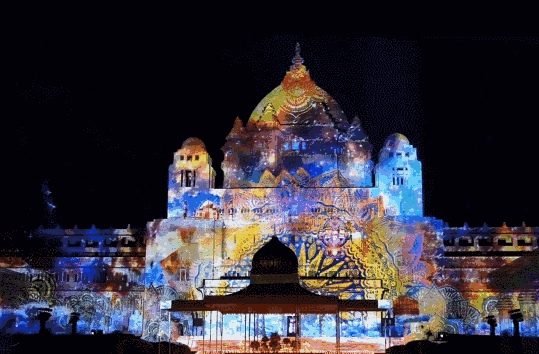

# 元宇宙赋能创意+七大表现形式，玩转沉浸式夜游

>  随着疫情逐渐好转，商业已经开始复苏，夜游经济因此兴起，结合夜游经济的政策鼓励进行景区转型，亦是必趋之势。夜游项目选择中沉浸式夜游顺理成章的成为各大景区的首选，那文旅景区转型重点为什么是沉浸式呢？

沉浸式体验是时代发展的产物。**一方面，互联网的快速发展促进了游客获取信息。**一个单一、平坦的景点再也不能满足游客日益增长的体验和个性化需求。**另一方面，增强现实/虚拟现实等高科技手段为营造多元化的体验氛围提供了技术支持。**

**沉浸式夜游优势**

**强烈的视觉感受**

就是说好看，好看到游客可以在几秒钟内拍出“大片”。如果某个景点拥有可以产生强烈视觉感受的地方，那么该景点可以从许多景区中脱颖而出，并且具有强烈的视觉冲击力要胜过数千行华丽的词藻描述。

**强烈的精神感受**

就是产生一种互动和参与的感觉。观看视频或图像可以使人们有强烈的参与感。

**引流推广能力**

景区既要“为人所知”又要“被人认可”。首先要让人们知道世上有如此有趣的地方，然后依靠令人惊叹的视觉创作和创新的体验来实现“认可”的目标。身临其境的沉浸式夜游将使人们有所收获，使人们愿意再次来到这里，产生消费依赖。

**“沉浸式夜游”是一种独特的艺术形式，可创建大型投影水上表演，主题光影表演，互动光影体验以及声音和灯光的融合，以创造夜游效果。**可以产生令人震惊的视觉冲击，并为游客带来巨大的吸引力。近年来，国内外各种景点和主题公园纷纷推出沉浸式文旅夜游设计体验项目，极大地丰富了游客的旅游体验，颠覆了传统旅游。**在日益智能化和科技化的未来，沉浸式旅游体验将成为旅游产品的重要组成部分。**

**元宇宙为沉浸式添加新动能**

近年来，“元宇宙”对于优化文旅产品供给，**虚实结合拓展沉浸式文旅场景应用**，引导和培育网络消费、体验消费、智能消费等新模式的作用，备受关注。而目前文旅行业面临的消费模式转型、**数字化建设与实体服务深度融合**、线上场景大量衍生等现状，使其具备了“元宇宙”落地应用的基础需求。

与传统文旅体验中，游客只有一个单一的标签体验，即“游览者”，以被动观看和接受为主的单向的、一维的游览体验不同，元宇宙的文旅体验，每个个体的身份是有别于现实世界而独立存在、可以自由设定的，文旅场景也不再是单一的观览过程，通过交互乃至多线性、多重叙事的体验，**每位游客可以享受到迥异的场景、故事情节、角色身份，助其产生强烈的自我代入感，获得更有品质的文旅体验。**

西安大唐不夜城《大唐·开元》，是全球首个**基于唐朝历史文化背景大唐不夜城的“镜像虚拟世界”的元宇宙项目**，通过数字化技术，让中国传统建筑能够在数字空间生动地复原和呈现，可以游览、购物，享受和现实世界一样的商家折扣，就如在现实生活中一样，让虚拟与现实的世界产生互动。

**沉浸式夜游的七大表现形式**

**3DMapping**

以景区文化特色为主题，将Mapping投影与景象相融合，将项目的主题创意、历史人文相融合，利用影像、互动体验、虚实结合艺术造景等手段，打造出具有沉浸感的视觉体验，继而促进景区夜游的发展。

**投影互动装置**

项目理念融合科技和艺术，通过光影、色彩、声音和互动影像来营造景区氛围，让游客不止于静静观看，邀请游客参与、体验、互动，触发观众的感知与想象、为游乐增加深度，带给游客加倍的感受。

**实景演出**

实景演出能够快速加深景区在游客心中的印象，为景区形象加分，助力景区脱颖而出，为游客打造独一无二的极致体验，突破单一的夜赏功能，全方位地展现景区魅力，演绎一场主题大秀。

**投影水秀**

打造日夜联动的视觉盛宴，水秀拥有多种形式，水幕表演、数码水帘、音乐喷泉、投影水秀特效等，白天全景音乐喷泉带给游客唯美体验，夜晚运用水幕、激光、音乐等多媒体艺术为游客呈现电光流影，带来沉浸式水秀灯光体验。

**IP故事
**在夜游中，通过科技手段，将文化艺术、光影设计、互动演绎等内容融入夜游项目活动，打造综合视听旅游产品，讲述文化旅游的新故事，通过对场地艺术、光影设计、互动演绎等内容整合到夜游项目活动中，打造综合性视听旅游产品，讲好文化旅游新故事。

将地方特色文化要素作为内在驱动，与项目主题创意、历史人文相融合，运用影像、互动体验、虚实结合等手段，快速提升景区热度，全方位地植入地方特色IP，打造夜游的同时展示景区的文化底蕴，文化才是最吸引人，从而促进景区夜游收益良好循环发展。将科技与艺术融为一体，用声、光、电等方式营造景区氛围。

IP故事以更易感动的故事形式，以延展IP故事的灯光表演，让更具先天的观众基础优势情况下吸引游客。多元互动、可辅助的游乐体验体验，增加具有导览、场景互动、沉浸体验等功能，为夜游增添更多新玩法。以更容易打动人心的故事形式，基于IP故事延展的灯光秀，更具有先天的观众基础，以及自带的粉丝热衷度。

**夜游情节设计
**游戏情节多样化、可设置神秘的辅助游览道具，比如说：魔法棒，吸引儿童、情侣等群体主动购买衍生品。魔法棒具备引导游览动线、场景效果互动、增加沉浸式体验感等功能，还可设置不同的外观、不同的触发效果，为夜间游览增添更多新玩法。

剧本杀从最初单一推理追凶的桌游1.0时代，迅速发展到以剧本游戏体验馆为活动中心的2.0时代，再到现在以沉浸式实景演艺为代表的3.0时代。相关数据显示，2020年全国共新增剧本杀相关企业3100多家，较2019年增长63%。剧本杀的迅速发展为沉浸式文旅带来了新的机会。上海、成都、长沙、北京等地都出现了剧本杀与民宿、景区等旅游场景结合的超长时间体验项目。剧本杀与沉浸式文旅的多样化结合和IP的打造，有望成为重要的文旅新业态。

沉浸式剧本杀与景区、民宿的结合，为沉浸式文化产业业态发展注入了新活力。对于民宿运营者来说，不仅要提供令人满意的住宿服务，还要做好NPC玩家引导服务、选购情节丰富的剧本、巧妙设计房间主题情景等工作。剧本杀主题的沉浸式体验场景在未来可能成为推动民宿业和传统景区升级换代的一种催化剂。

**AR技术+导览**
*通过手机对带有AR技术元素的图片扫一扫，就能形象有趣的现实该物品的各种特征。还可以下载手机AR应用，里面的虚拟导航形象能依据定位技术为你提供导航和展厅介绍服务，提升游览体验。