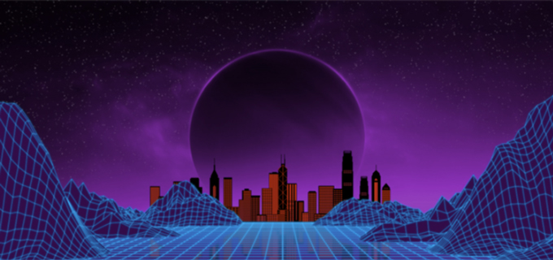

# 元宇宙适合在什么样的文化属性下发展呢？

**何谓“元宇宙”？**

“元宇宙”最早出现于尼尔·斯蒂芬森1992年出版的小说《雪崩》，指物理现实、增强现实和虚拟现实三种模式，在共享的网络空间中相互融合的一种状态。2018年电影《头号玩家》更生动地将“元宇宙”图景具象化。

电影中打造了一个“绿洲”场景，玩家可以通过VR设备在虚拟世界中自由的探索、娱乐和生活。

元宇宙的三个关键特征：必须跨越物理世界和虚拟世界；**包含一个完全成熟的经济体；可提供“前所未有的互操作性”——用户必须能够将他们的化身和拥有物从元宇宙中的一个地方带到另一个地方。**

构成元宇宙的要素包括：强大的科技水平支撑（5G、VR、AR）、区块链技术搭载的技术网络和以区块链为载体的**数字资产经济系统**。元宇宙需要包括**网络算力、人工智能、游戏技术、显像技术（AR、VR）、分布式储存以及区块链技术**（**通过智能合约和去中心化结算平台保障经济系统的稳定透明）共同支撑。**

**区块链为****元宇宙经济系统奠基**

“只有构建了公平的经济体系，才会让所有的参与方得到公平对待，获得回报。安全、规则是保障元宇宙运行的基础，包括**个体的隐私安全、机构的数据和网络安全等，因此区块链的不可篡改特性，天然成为元宇宙中的底层基础**。在大数据时代，区块链只是让我们在虚拟世界中的物品成为数字物品，但在元宇宙中，就不是单纯的数字物品了，数字物品可以变成数字资产。

**加密数字资产助力价值交换**

如果说区块链为元宇宙的经济系统运行奠定了基础，那么其中的原生加密数字资产则承载着这个世界中价值转移的功能。

工银国际首席经济学家程实对证券时报记者表示，**元宇宙将创造一个闭环经济系统，任何与数据相关的微弱贡献均可以通过区块链技术溯源，配合原生数字资产作为激励使整个数字世界的价值转移过程畅通无阻。**

**据彭博资讯分析，到2024年，元宇宙的市场规模将达到8000亿美元。**

- 元宇宙有三个关键方面：存在感、互操作性和标准化。
- 元宇宙在未来将会是一个巨大的公共网络空间，数字虚拟和物理现实将迎来史无前例的大融合。
- 在可预见的未来，更多用户会通过交互式和沉浸式虚拟平台进行交互，消费和体验元宇宙。
- 基于区块链的加密资产是连接数字资产与现实世界的桥梁，为元宇宙内数字资产的产生、确权、定价、流转、溯源等环节提供了底层支持。
- 行业正在建立一个共同的价值观和创造标准，打造一个具有凝聚力、可互通的“社会”。

**加速互联的因特网**

元宇宙是基于互联网而生，与现实世界相互打通，平行存在的虚拟世界。元宇宙不是一家独大的封闭宇宙，而是由无数个虚拟世界/数字内容组成的不断碰撞并且膨胀的数字宇宙，正如同真实的宇宙一般。

元宇宙要想成为下一代互联网，**那么必不可少的是各个平台的互操作性和可移植性**。这就好比需要**打通各个国家和地区的壁垒来实现全球化，元宇宙也需要形成形成一个统一的巨大经济体**。这样一个没有土地、没有国界的新虚拟国度或将诞生。