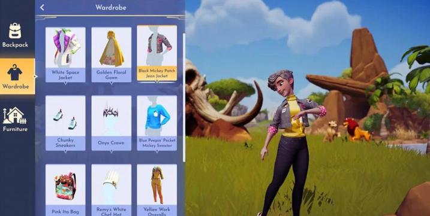
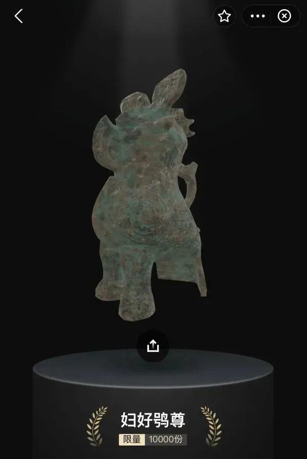

# 突破与创新，元宇宙正在重塑文旅产业发展景观？

当一件件珍贵的文物跃然于荧屏之上，当我们能够与其背后的历史典故及人物产生交集，当我们能够穿越历史长河回到文物诞生的年代，或许我们能够真实地感受到文物背后独特的文化魅力。

曾经这一切或许只存在于我们的想象之中，而如今，元宇宙技术的发展，将其变成了现实。

文旅产业中有不少企业正在积极拥抱元宇宙，迪士尼的抢先入局、张家界元宇宙中心成立、元宇宙项目《大唐 · 开元》启动 ...... 入局元宇宙的文旅企业不断增加，文旅产业正在快步走进元宇宙的世界。

文旅活动更多的是为了满足当下人们对于感官体验的享受和超越，元宇宙的时空整合、目的地扩展等特性能够重塑文旅产业，创造更多可能性。但文旅行业内却出现了不同的声音，有人认为元宇宙会对旅游业形成冲击，影响实景旅游产业的市场；有人认为文旅与元宇宙有极好的向性，元宇宙能够拓宽文旅行业的边界，带来更大的可能性；也有人认为虚拟沉浸式场景无法替代真实风景中的感官感受，很难得到用户的认可。

元宇宙对文旅产业的发展起到了怎样的正向作用？在二者的结合过程中又有那些必须要面对的困难？

**" 基因 " 与发展需求的高度契合**

体验是文旅活动和元宇宙共同的基因内质。元宇宙是对 " 人、场、物 " 的重构，通过身份映射能够赋予消费者身份的差异化，在赋予用户新身份的同时，创造符合当下场景的沉浸式空间。正如迪士尼 CEO 在与卡夫集团 CEO 的对谈中所言，他相信元宇宙是下一代的发展方向，并表示 " 粉丝们有望在元宇宙中与迪士尼公主共进午餐 "。

沉浸式场景的塑造是未来元宇宙技术的重要优势，用户从现实环境中抽离出来，融入到新的场景和主题的氛围中，这个过程能够为用户打造一个极具临场感和真实感的虚拟游览空间，用户能够以低成本和重体验的方式随心所欲地体验不同的场景甚至生活，实现用户生活状态与旅游状态间的无缝切换。

随着经济发展和居民消费结构的升级，市场对文旅产业提出了更高的要求，用户不再满足于视觉上的冲击与刺激，而是希望突破感官限制，拓展体验的边界。在元宇宙的世界中，消费者不再处于被动的接受地位，而是以发掘式、探索式的态度主动参与到文旅活动中，实现身体真实感受的叠加，从而达到身临其境的文旅体验。

如今，智慧旅游成为了文旅产业重要的发展方向之一，通过元宇宙技术的加持，用户与文旅行业双端在管理、体验层面都会迎来明显的提高。从管理端来看，元宇宙能够帮助文旅实现全方位监管与全流程服务，使服务、活动、产品、内容等变得更加透明、开放和可控，线上、线下服务监管效率能够大幅提升。从用户端来看，通过元宇宙技术在虚拟世界打造旅游宣传推广内容，能够让游客通过 AR、VR 等虚拟现实技术感受景区的环境与氛围，在实地旅行前抢先游览景区实景，避免发生 " 踩雷 " 的情况。

不可再生性是文旅资源的核心价值所在，这在成就文旅资源极高的知名度和影响力的同时，也意味着它们对人的吸引力同样是不可再生的，一旦过度开发或经过岁月的打磨，就会造成无法挽回的损失，这也是制约文旅产业发展的关键因素。

元宇宙技术能够实现旅游资源的信息化，通过数字化方式对各类文化遗产进行挖掘、保护、传承，不论是名胜古迹、珍贵文物，还是文创产品，在元宇宙的世界中都能被完整复刻出来，为文旅产业发展提供资源支持的同时，兼顾资源的保护和开发功能。

整体来说，元宇宙与文旅行业的发展轨迹在很大程度上是同向的，文旅需要虚拟空间的加持，同样也为元宇宙提供了一个独特的切入点，成为元宇宙应用的 " 排头兵 "。来自全国各地的用户足不出户就可以浏览大好河山，未来或许能在一定程度上颠覆用户与文旅行业的交互方式。

**数字藏品打开文创产品的未来之门**

从河南博物院的 3D 版数字文创 " 妇好鸮尊 " 到西安曲江大明宫国家遗址公园的 " 宇宙 · 千宫系列 " 数字藏品，再到云南旅游官方助手 " 游云南 " 上线 " 云穹 " 数字藏品品牌，并发布建水紫陶 " 兽耳方尊 "，数字藏品为文创产品的变现与营销带来了新的想象空间。

相比馆藏文物或字画真迹，数字藏品可以让购买者以更低的价格在线上购买、观赏和收藏，而不用担心藏品的储存保管、赝品仿冒等困扰实物收藏者的诸多问题，让普通人，特别是年轻人有机会体会到收藏的乐趣，并激发人们走进线下景区及博物馆的热情。

图为河南博物院发布 " 妇好鸮尊 " 数字藏品

文旅行业发布数字藏品有着独特的优势。几乎每个已发布的文旅数字藏品都有历史文化底蕴作为支撑，自身有着极具中国特色的 IP 属性。当下，年轻人文化认同感愈发强烈，这为文创产品的数字化提供了情感价值上的支撑，不仅为文创产品打开了新的市场，也让年轻人了解到文物及其背后的历史故事。

当下，文旅数字藏品主要呈现出了三大特征。

**首先是场景化。**文创产品是有生命周期的，而数字藏品独特的场景优势，能够在一定程度上延长文创产品的生命周期。在数字藏品的交易界面和展示界面，发行方能够将产品背后的故事与场景以数字化的方式展现给用户，用户能够在场景中与文物产生交互，亲身体验文物所经历的历史故事，增添产品的可玩性，从而拉长用户体验与感知产品的时间。

**其次是社交性。**数字藏品在一定程度上代表着一部分用户的文化认同，在数字藏品交易平台，用户拥有的数字藏品往往能够直观地展现在主页上，这其实是一种符号的传达。用户可以发现与自己有相同爱好的朋友，可以找到购买了同系列藏品的同好，彼此的交流与沟通对发行方而言是提升社交声量的重要资源。在文旅产业的角度来看，文旅数字藏品可以成为游客会员等身份的象征，通过圈层归属增加游客对景区的认同感，沉淀发行方自身的私域流量。

**最后是线上与线下的互动性。**普通的数字藏品一般只在线上进行营销与发售，而对于文旅行业而言，游客可以因为实地到访景区选择购买相关的数字藏品，实现从线下到线上的引流，也可以引导线上购买文旅数字藏品的消费者到达景区旅游，实现线上到线下的转化，从而实现文旅行业产业链的延伸。

文旅产业与其他产业不同，其背后的文化内核是不可修改与颠覆的，要符合长久以来的历史发展规律。这要求数字藏品的设计与发行方尊重历史文化，避免曲解文化及一味炒作的现象发生。

**" 路漫漫其修远兮 "**

虽然数字藏品的快速发展引发了文旅消费的新热潮，但元宇宙概念及相关技术的发展仍处在起步阶段，用户对于数字藏品价值也大多持观望态度，要想彻底改变文旅市场的发展格局还有很长的路要走。

目前国内的数字藏品基本都在各大平台进行发售，文旅产业的数字藏品大多采用与平台合作发行的方式。而当下数字藏品平台的发展呈现 " 井喷 " 的态势，竞争激烈，一旦平台在竞争中被淘汰，消费者手中的文旅数字藏品或将面临归零的问题，由此引发的一系列问题值得引起发行方的思考与重视。

我们有理由相信未来元宇宙及数字藏品能够成为文旅产业变革的依靠，但在浪潮席卷而来的过程中，技术、监管等因素就像前行路上的 " 救生衣 "，是文旅产业数字化进程中安全平稳发展的依靠。