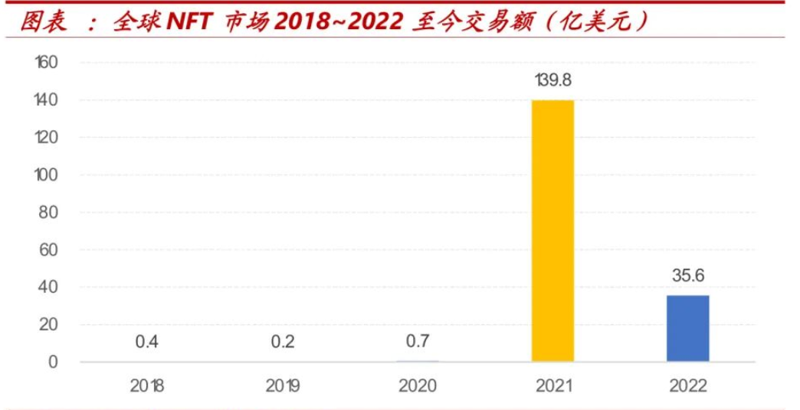

# 品牌数字化营销，NFT/数字藏品成为新战场？

2021年被称为**“万物皆可NFT”**的“NFT元年”，这场最先由海外币圈以图文、影音、游戏、艺术品等形式掀起的金融风暴使得人们似乎看到了“元宇宙”的未来。根据中泰证券研究所数据显示，在2021年全球NFT市场交易额迎来139.1亿美元的爆发式增长后，2022年1、2月热度丝毫不减，仍拥有巨大的增量空间。

**什么是NFT？**

**1.非同质化代币**

NFT的全称是Non Fungible Token，即非同质化代币，本质上仍然是一种**数字代币**，其具有不可分割、不可替代、不可互换、独一无二、可验证、可流通、可交易等特性。在现实物理世界中，资产通常可以划分为同质化资产和非同质化资产。区块链上的数字资产也分为同质化数字资产和非同质化数字资产，最常见的同质化数字资产包括比特币、以太币等“虚拟货币”，而非同质化数字资产包括游戏项目、数字艺术品等非同质化通证。

**2.** **与NFR的异同**

NFR可以理解为**“中国特色版NFT”**，其全称为Non Fungible Rights，即非同质化权益，是为解决以艺术品为代表的、多领域数字化交易的国内技术问题和法律问题而提出的数字交易新模式和新路径，国内各品牌和数字平台所发行的**数字藏品**，本质即NFR。

从定义上看，NFT和NFR具有难以分割的联系，NFR因NFT的火爆而诞生并走入公众视野，事实上在国内许多应用场景下并未对两者做出比较明确的区分。在相同点上，两者都具有**非同质化特性**，它们存储在链上的数据都是独一无二且不可分割的；此外两者都采用了**区块链技术**，保证了所有权的明确，交易数据的可溯源、公开透明、不可篡改。

国家新闻出版署科技与标准综合实验室区块链版权中心主任刘天骄指出了两概念的三点主要区别：首先，国外的NFT基于**公链**，其核心在于全开放，不受监督与管理，相反国内数字藏品基于**联盟链**，联盟链由政府搭建，受国家管理；其次，在发行藏品的内容上，NFT上链发布相比国内数字藏品省略了**内容审核**的流程；最后，两者根本区别在于，NFT强调**代币功能**，NFR强调权益功能，其本质是数字艺术品，传递的是真正数字文创作品的价值。

**应用探索: “NFT+”的无限可能**

伴随着“元宇宙”概念的爆红，**数字藏品/NFT**这股热潮很快辐射到品牌营销领域。站在新的技术风口，为了握紧“元宇宙的入场券”，一众国际品牌争先恐后入局NFT营销市场。近年来，我们也看越来越多的国内品牌借力NFT探索品牌营销的新路径——那么，各大品牌品牌结合NFT都在哪些领域进行了应用？ 

**1.NFT+饮品**

今年2月28日，江小白和天猫合作进行的数字藏品活动上线，打造了两款虚拟形象：蓝彪彪和红蹦蹦，发行**NFT数字藏品限定礼盒**，购买数字藏品附送40度和52度的两款特别版白酒，限量首发1000份，在开卖仅3分钟后就宣布售罄。这场NFT发行，江小白的销售转化率创下历史新高，超过日常的10%，单日销售额超日常16倍，支付用户数也暴涨超日常34倍，单日访客量超出日常3倍。

NFT/数字藏品的走红意外吸引了一批传统酒企的加入。作为酒行业龙头，茅台在5月20日公布了**“节气里的茅台”**系列数字藏品预告，准备发行藏品53款，与茅台经典度数53°相契合，分为二十四节气系列和传统节日系列两个类别，共计9605份，每份售价0元，供消费者抽签获得。其中，二十四节气系列藏品，每个节气包含2款，每款限量200份；传统节日系列的数字藏品，包含端午、中秋、重阳、春节和元宵节5个节日，每个节日限量1份。然而，因参与人数过多，且发现大量“虚拟账号”与外挂抽签行为，官方为保护正常用户权益，选择提前终止活动。

**2.** **NFT+美食**

4月19日，饿了么联合中国杭帮菜博物馆发布首款“美味中国”数字美食藏品“鳕鱼狮子头”，这是杭州市商务局与饿了么共建的全行业**首个“数字美食”创新项目**。用户只需在饿了么APP以菜品拍照打卡的参与方式，即可获得直接收藏“鳕鱼狮子头”数字藏品的资格。未来，消费者可在APP端以拍照识别、下单外卖、好友互助等形式打卡收集更多地域经典菜品的数字图鉴，获得免费抢兑限量款典藏菜品的机会。

除了美食图鉴的收藏功能之外，有品牌尝试将数字藏品同线下美食的**优惠权益**结合起来。由发行公司HangryPiggy和香港创意营销咨询公司 Elevate PR 共同创建的，香港首个以餐饮为主题同名NFT“HangryPiggy”于6月30日上线，公开发行1,997只 Hangry Piggies数字藏品。发行方计划与茶餐厅、街头小吃摊、小吃店联手，在展示香港饮食文化的同时，为NFT持有者提供优惠餐饮等**独家增值福利**。

**3.NFT+时尚**

近日，法国奢侈品品牌路易威登（Louis Vuitton）更新了 “Louis: The Game” 游戏，玩家在8月4日前通过游戏全新关卡后，将有机会参与抽奖并获得10枚特殊代币。代币将呈现路易威登吉祥物Vivienne的不同造型。同时，游戏支持用户将数字代币转至其他平台，或作为**社交网络头像**使用。

相较于发行数字藏品的常规玩法，运动潮牌李宁力求创新，选择联动出圈NFT项目“无聊猿”，邀请BAYC家族的无聊猿#4102号成为快闪店主理人，并将其作为印花，打造实体时尚单品；此外，前段时间在国内社交媒体小红书上大火的“虚拟时装”，通过**PS技术辅助NFT**实现了虚拟与现实的联动，让众多网络潮人过了一把未来时尚的瘾

**4.** **NFT+文旅**

近年来因疫情肆虐，文旅行业受到了是前所未有的冲击，反复无常的疫情也增加了文旅行业发展的不确定性。然而，元宇宙概念的出现却为文旅业打开了一个新局面。3月26日，来自全国50家博物馆、高校的60位馆长、学者联名发布**《关于博物馆积极参与建构元宇宙的倡议》**，呼吁博物馆顺应时代发展，发挥自身优势，积极参与建构元宇宙。据不完全统计，目前至少有30多家博物馆发行了文创数字藏品。

文创数字藏品在文化传承等方面具有独特优势，其在帮助文旅品牌进行线上获客的同时，更大程度上发挥自身的多元场景应用特点来实现宣传效果。文旅行业通过这种新潮的方式，吸引更多关注度，特别是**新生代游客**的目光，从而开拓数字化营销渠道，创新商业模式。

**价值探索：品牌的数字化未来**

**1. 为品牌注入新鲜感，塑造品牌年轻化形象**

开启NFT项目是品牌塑造年轻化形象的有效途径。根据3月份“区块链芝士”公布的中国NFT买家用户画像调研分析报告显示，NFT投资人群中占比最高依次为31-40岁人群（36.8%）、26-30岁人群（35.1%）、18-25岁人群（14%），其中18-30岁年轻人群体成为消费主力。

NFT投资者年龄分布

区块链芝士-2022年中国NFT投资者人群画像市场调研报告3月版

NFT为什么受到年轻人的追捧？一方面，成长在原生网络环境下的年轻一代，面对元宇宙、NFT、数字藏品等新理念具备更高的理解力、接受度和冒险精神。另一方面，NFT的新潮属性开辟了一条独特的垂直细分领域，正好切中目前Z世代以**“圈层文化”**为核心链接的社交模式，他们能敏锐捕捉到品牌所传递的信号，并善于通过与内在价值契合的消费行为来彰显个性、打造外在人设。

品牌与NFT/数字藏品的结合，在无形中将原本的品牌形象拆解重组，注入“潮酷”“科技”“趣味”“年轻化”等元素，以一种新鲜的方式走进普通消费者的认知。通过开辟私域社区，制造热门话题，激活NFT/数字藏品的社交属性，品牌创造了与目标受众间的珍贵回忆纪念和公共对话空间，在抢占年轻群体心智，增强其**品牌认知**和**归属感**方面具有不可忽视的作用。

**2. 品牌资产数字化，探索收益新渠道**

在“万物皆可NFT”的世代，品牌历史、品牌形象、品牌符号、品牌价值观等无形的品牌资产迎来了数字化的春天——依托web3所带来的**唯一识别和安全性交易技术**，NFT正在成为资产数字化的一种有效形式。囿于传统时代对品牌有形和无形价值的分割，无法实现单一价值化计量，但在数字时代，一切都可以被定义、被价值化、被同步，任何可以数字化的有形和无形的价值都可以被NFT化，从而使得搭建品牌的**数字资产架构**成为可能。

此外，NFT为品牌发展开辟了**新的收入渠道**，开启了数字藏品NFT反作用于实体销售的营销模式探索。巴黎世家通过推出NFT时装并在游戏中开设零售店增加了新品牌收益来源，同时，品牌也在现实世界中与《堡垒之夜》合作推出了限量版实体服装系列，将联名效应从虚拟世界导流回现实世界，形成消费闭环。

因为有NFT的出现，虚拟产品的价值也得到了更多群体的认同，加速了品牌对NFT项目的开发和价值兑现。值得关注的是，数字藏品在实际销售过程中并未涉及物流、仓储、门店租金等问题，极大节约了品牌的**销售成本**。目前，许多国际品牌并未保留NFT项目所得收入，而是选择将其捐赠社会慈善机构，有学者认为该现象是一种**“NFT产业化的试水行为”**，根据市场反馈，未来品牌资产、主营业务或将与NFT进行更深度的融合。

**3. 多元玩法与激励，实现产品体验增值**

NFT/数字藏品除了可以作为品牌形象、价值的**传播介质**，还能和品牌**实体产品**深度融合，解锁更多玩法模式。NFT/数字藏品具有唯一性、稀缺性、不可分割性的特点，这也赋予了它收藏和投资的价值。消费者在购买实体商品时获赠NFT/数字藏品，能够有效提高消费**体验感**和**满足感**。前文所提到的江小白就是“实体产品+NFT/数字藏品”的营销模式，通过购买产品赠送限量数字藏品，江小白成功激发了消费者的购买热情。

除了满足购买环节的及时获得感，NFT/数字藏品的现实融合还可以渗透到**售后体验环节**。有的品牌赋予了NFT/数字藏品更多的实际权益，将其打造为徽章、通行证、门票、礼包等形式，推动品牌和消费者的互动，链接更多元的**消费场景**。这种权益在文旅领域体现得较为明显，例如孔子文旅集团水泊梁山景区发行的数字门票“好汉令”，既可以被收藏，又享有终身游览景区的权益。

NFT/数字藏品的兴起是对实体产品的再赋能，它作为虚拟和现实的桥梁，赋予了实体产品**数字化生命形态**和**福利性附属权益**，有效延长了品牌产品的**生命长度和价值维度**，它一经发行就永远存在于数字世界，不会随着活动落幕或品牌式微而消逝。

在2021年“万物皆可NFT“的风口之后，2022年，各大品牌正式进入了将NFT/数字藏品融入品牌发展的探索红利阶段。数字化时代进程加快，加之全球疫情对于物理活动空间的限制，人们被迫从线下生活抽离，开始了一场 “线上大迁徙”。由此，数字资产的价值逐渐被更多人看见并认可。而NFT作为元宇宙的入场券，其唯一性、稀缺性、不可分割性特征使它成为品牌数字化道路上的有效载体，也让大众看到了有形的元宇宙蓝图。希望未来会有更多品牌加入到赛道中来，用**创意NFT/数字藏品营销**在消费者和数字世界之间搭建一座便捷而稳定的桥梁。