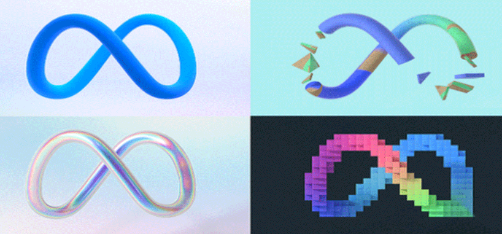
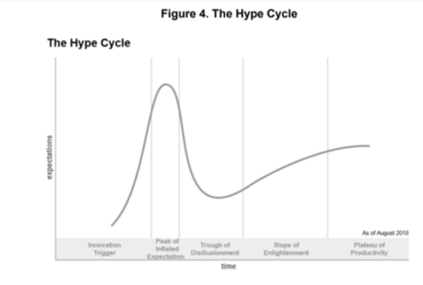
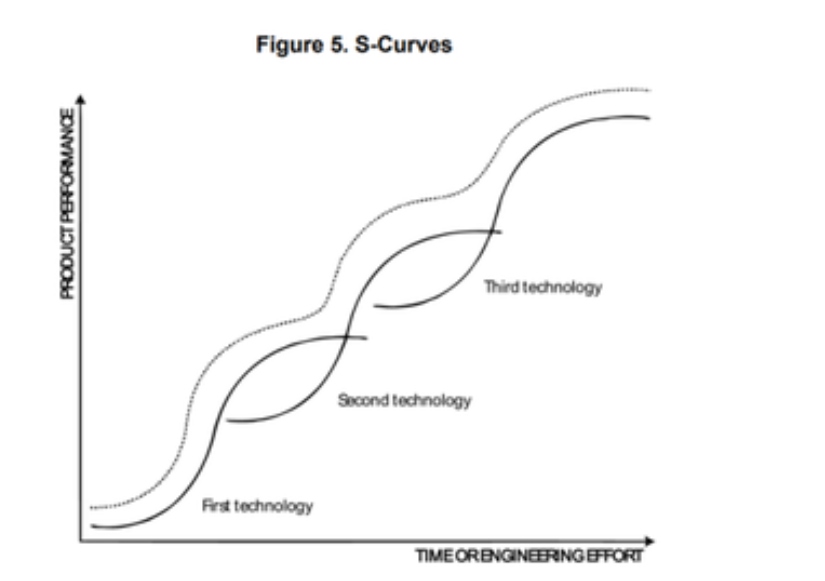

# Meta首份元宇宙白皮书9大看点！瞄准80万亿美元市场

　    近日，Meta委托国际经济咨询公司Analysis Group编写了一份元宇宙白皮书，该报告以移动设备的发展为依据，预测了元宇宙技术对全球经济的影响。

　　该报告主要分为四个部分：元宇宙的应用及挑战、移动设备技术与元宇宙的相似性、用经济模型研究移动设备对全球GDP的影响、研究元宇宙的潜在经济市场。

　　该报告称，如果元宇宙技术从2022年开始被采用，到2031年，元宇宙技术将为全球GDP贡献3.01万亿美元，其中三分之（1.04万亿美元）来自亚太地区。

　　报告提到，已经有行业分析师对元宇宙的潜在价值及市场规模进行预估，他们预测在未来几年内元宇宙市场将在8000亿美元-20000亿美元。而当元宇宙被广泛采用后，元宇宙市场将会在3万亿美元-30万亿美元之间，最乐观的估计可超过80万亿美元。

　　**一、无限量用户、开放世界、数字人格，元宇宙9大亮点**

　　虽然目前还没有一个关于元宇宙的统一定义，但该报告表示，元宇宙应该有以下特点：

　　1.元宇宙是一个数字空间的拓展网络，用户可以在元宇宙里有VR（虚拟现实）、AR（增强现实）、MR（混合现实）等各种3D沉浸体验，并且玩家可以进行实时互动。

　　2.元宇宙是一个大规模、可交互操作、并且实时渲染的3D虚拟网络世界，元宇宙可以供不限数量的用户同步、持久地体验。

　　3.用户可以在元宇宙里创建自己的虚拟形象账户，这些账户的历史数据不会被清空，而是会被连续地保存下来。并且，账户的身份信息、支付方式、通信方式等都可以跨平台共享。换句话说，各平台可以兼容。而不是像现在这样，每个平台（如Twitter或TikTok）需要注册不同的账号，并且这些账号还归属于公司。

　　4.交流方式更多样。在元宇宙中，用户可以用眼神、姿势、手势等方式交流，而不仅限于打字或者语音。

　　5.元宇宙可以支持几乎所有的活动场景，如社交、工作、学习、娱乐、购物、创作等。

　　6.元宇宙是一个开放的市场，企业和个人可以自由体验、参与活动、创造内容等。

　　7.用户在元宇宙中拥有数字人格和数字资产。用户可以在一个平台购买一件数码服装，在另一个平台依然“穿着”它，这件数码服装归属于用户，而不是平台。

　　8.元宇宙不是一种物品或者空间，而是不同的技术组件相互联系的方式。这些技术包括AR、VR、MR、区块链、NFT（加密货币令牌）等。

　　9.元宇宙将打破互联网对于设备和地理位置的依赖，通过自然无缝、身临其境的体验，为人们创造一种无须亲临现场也能参与的线上体验。

　　**二、西门子、宝马、世博会都在用，元宇宙经济潜力较大**

　　该报告还列举了元宇宙技术在世界各地的应用情况。在美国，元宇宙技术正在扩大体育运动的使用范围，iGYM（一个AR游戏）能够让残疾的年轻人与健全的同龄人一起参加体育游戏活动。在欧洲，工业公司采用了XR技术简化原型设计、培训员工、远程指导工作的流程。德国工业制造公司西门子、宝马（BMW）、标致（Peugeot）和奥迪（Audi）等采用了工业虚拟现实培训技术，这种技术可以在保证培训质量的同时大量节约成本。

　　在中东，迪拜让世界各地的游客通过AR眼镜进行2020世博会的观赏。南非著名艺术家诺曼·凯瑟琳（Norman Catherine）展示并出售了自己的NFT艺术藏品。非洲最大的移动网络运营商MTN于2022年2月在Ubuntuland购买了144块虚拟土地。在拉丁美洲，巴西公司MondodX创建了第一个在线零售购物的XR平台VYRCH。

　　这些应用案例都揭示了元宇宙有较大的经济潜力。

​       　**三、借鉴移动设备发展史，十年后元宇宙GDP或达3万亿美元**

　　元宇宙这类新兴技术还未大范围投入使用，缺乏切实准确的运行数据，所以元宇宙的经济影响难以评估。因此，Analysis Group用移动设备的发展类比元宇宙的发展，以此来评估元宇宙的经济影响。

　　这里的移动设备指的是能够上网的移动设备——如智能手机和平板电脑，以及支持使用移动设备的基础设施和相关生态系统。

​       Analysis Group称，元宇宙与移动设备有很多类似之处。移动设备整合了通话、相机和mp3播放器等功能，改变了互联网的连接和体验方式。移动设备克服了台式计算机的地理限制，让用户在任何地点都能使用互联网。此外，在这种移动设备的基础上，人们研发了各种应用程序，催生了直播等新兴行业的诞生，反过来改变了人们的娱乐、生活和工作的方式。

　　而元宇宙也将AR/VR、视频会议、多人游戏和数字货币等技术结合，并将其转变为全新的内容和体验。元宇宙进一步打破互联网对于设备和地理位置的依赖，通过自然无缝、身临其境的体验，为人们创造一种无须亲临现场也能参与的线上体验。

　　此外，移动设备是一种相对较新的技术产物，有充足的数据资料可供调查。

　                                                                                                      ▲未来十年元宇宙对全球GDP的贡献

　Analysis Group通过分析得出结论:假设市场从2022年开始使用元宇宙技术，那么到2030年，元宇宙产生的GDP将占全球GDP的2.8％；到2031年，元宇宙对全球GDP的总贡献将达到3.01万亿美元，其中三分之一（1.04万亿美元）来自亚太地区。

　　**四、经济学家：元宇宙是信息革命的转折点**

　　炒作周期（Hype Cycle）曲线是咨询公司Gartner于1995年首次采用的一种分析方法，Gartner公司根据其专业分析预测，推断各种新科技的成熟演变速度及要达到成熟所需的时间。炒作周期曲线主要分为五个阶段：科技诞生的促动期、过高期望的峰值期、泡沫化的底谷期、稳步爬升的光明期、稳定生产的高峰期。

​                                                                                                                              　▲炒作周期曲线

　Analysis Group在报告中提到，根据咨询公司Gartner对2000年-2016年的新兴技术的炒作分析，由于大众对技术最初的预期与最终的市场需求不适应，大多数炒作技术从未成功进入市场。这为元宇宙技术带来了启示，就跟炒作周期中分析的许多技术一样，或许元宇宙永远不会以我们目前所设想的方式实现。Analysis Group称报告分析的目的不是预测元宇宙技术是否会成功，而是想衡量元宇宙的潜在经济影响。

​                                                                                                                                   ▲S形曲线

　　每项新技术的发展趋势都遵循S形曲线，第一阶段是发展缓慢的初创期，第二阶段是快速发展的成长期，第三阶段是成熟完善的平稳期。而随着时间的推移，不同技术的S形曲线会相互叠加，不断提高产品的性能。

　　技术和经济学家卡洛塔·佩雷斯（Carlota Perez）称：“我们正处于信息和通信技术革命的转折点。”他认为，现在我们就好比处在20世纪30年代IT技术的转折点上，我们即将进入一个由人工智能、物联网、机器人、区块链、半导体等新兴技术引领的新时代。

　　**五、让传统行业迸发生机，元宇宙可催化经济**

　　元宇宙对经济的具体影响很难确定，因此Analysis Group从直接影响、间接影响和催化影响三个方面来分析元宇宙对不同行业的潜在影响。

　　直接影响：元宇宙将首先影响创建技术和基础设施的行业，如图形处理器、AR/VR头显、虚拟社交平台、区块链等行业。还会影响硬件、软件、支付系统和网络供应商等。

　　间接影响：在基础设施建成后，早期元宇宙可能会对一些行业造成间接影响，如游戏、社交、在线零售、教育、远程办公、医疗、制造业等行业。元宇宙可以为这些行业提供技术支持，创造新的就业机会，让这些行业受益。

　　催化影响：元宇宙还可以带来一些我们目前无法精准预测的远大影响。就像移动设备带来了手机、互联网、计算机、直播、外卖等新兴行业，元宇宙也可能创造一些新的行业并为整个社会带来深刻广泛的影响。元宇宙可以“催化”经济，提高生产力，加速经济增长。创造出比直接和间接两种方式大得多的影响。

​        虽然元宇宙有巨大的经济潜力，但达到预期经济的速度取决于基础设施建设、技术部署的进度、消费者和企业对元宇宙的使用率等。该报告提到，我们仍处于元宇宙建设的早期阶段，还缺乏许多实现元宇宙的必要条件。

　　技术专家和风险投资家Matthew Ball概述了实现元宇宙需要的三个核心要素:并发基础设施、标准协议、用户引入。

　　并发基础设施是支持数百万用户同步共享网络的技术。与目前互联网一对一连接的服务器不同，元宇宙需要多个服务器并行连接。

　　并且，元宇宙是一个大型生态，需要很多公司进行大规模协作。因此，元宇宙需要统一的标准和协议。

　　搭建好元宇宙平台后，如何吸引更多用户进入元宇宙平台是一个关键问题。元宇宙平台要为用户提供独特的价值和优势，才能得到用户的推广。如果用户觉得在元宇宙上购物比自己去商场购物还要麻烦，那么元宇宙技术可能就无法被广泛采用。

　　此外，元宇宙还要面临政策监督、数据隐私、内容安全等其它方面的挑战。

​        **结语：预测尚存局限，元宇宙技术需要继续发展**

　　Analysis Group公司的这份元宇宙白皮书，较为全面地阐述了元宇宙的定义、应用实例、经济影响等。通过这份报告，我们可以一览元宇宙技术的发展现状。

　　按照该报告的结论，如果元宇宙技术与移动设备发展的方式类似，那么10年后，元宇宙将会为全球贡献2.8%的GDP，到2031年，元宇宙为全球创造的GDP将达到3.01万亿美元。

　　但是，这个结论建立在元宇宙与移动设备发展方式类似的基础上，只是一种推测。Analysis Group也在报告中表示，由于目前没有足够的“元宇宙数据”可以测量，Analysis Group只是运用了现有的工具和数据，为元宇宙创造了一个类似物，以此来推测元宇宙对未来经济的影响。虽然不完美，但我们可以通过这个透明的框架来把握元宇宙的影响趋势。

　　此外，Analysis Group也在报告中提到，目前的元宇宙技术尚在初级阶段。如果我们想要让元宇宙成为现实，还要在基础建设、政策协议等各方面继续努力。