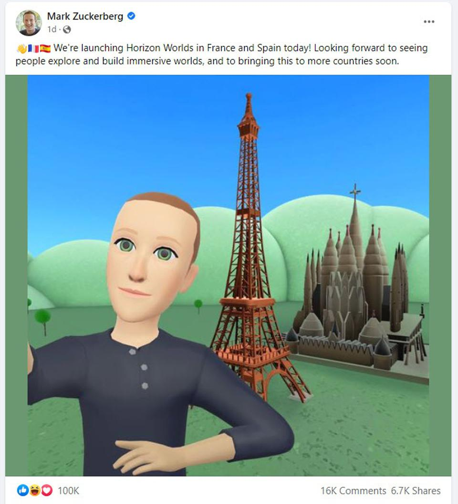

## 元宇宙炒房，凉了！Meta元宇宙游戏“翻车”

众多明星和大佬引流，各路资金纷纷投向元宇宙，这其中也包括元宇宙里面的房地产市场。只是，虚拟土地和房产真的只涨不跌？到底是什么在支撑元宇宙房地产市场？

有元宇宙玩家认为，支撑元宇宙房地产热潮最基础的逻辑在于大家要看好元宇宙的前景。不过，尽管市场炒作很热，但元宇宙还有很远的路要走。

**元宇宙“房价”暴跌**

提起元宇宙里面的地产布局，当中不乏许多名人的身影。据海外媒体报道，美国著名说唱明星Snoop Dogg在Sandbox的一块土地上打造他在南加州豪宅的数字复制品。去年11月，华语歌手林俊杰在推特上宣布，他买了Decentraland平台上的三块虚拟土地，正式涉足元宇宙。在Sandbox去年曾经有虚拟房地产开发公司Republic Realm曾花费430万美元购买了一块土地，一度创下了价格的新纪录。此外，香港房地产巨头郑志刚花费了约500万美元，在Sandbox上购入另外一块地，表示要打造“创新中心”，展示大湾区新创企业的商业成功。

不仅如此，时尚品牌也在元宇宙里进行了地产布局，Nike收购虚拟时尚初创公司RTFKT，并与Roblox合作推出Nikeland虚拟体验。Adidas在Sandbox Metaverse中购买大约144个虚拟土地。

据悉，元宇宙房地产价格在今年年初达到顶峰，但因虚拟货币的熊市和元宇宙慢于预期的发展速度，元宇宙房地产市场也开始退烧。根据数据分析公司WeMeta的数据，以太坊五大元宇宙项目的平均价格从1月近21000美元降至约2500美元。如果按土地销售量计算，Sandbox的地产项目平均价格从35500美元降至约2800美元，下跌幅度更大。WeMeta的数据还显示，林俊杰购买的三块虚拟地皮当前估值分别下跌81.5%、80.1%和80.4%。

有元宇宙玩家对记者表示，元宇宙虚拟房产的暴跌主要由于全球虚拟货币的暴跌，元宇宙的虚拟资产的价格跟虚拟货币市场是密切相关。其次，这些虚拟房产被爆炒，最后成了击鼓传花的游戏，当没有资金接最后一棒的时候，价格也就出现暴跌。美国亿万富翁投资人Mark Cuban就曾表示，在元宇宙投资房地产是最愚蠢的方法。“在现实世界中房地产是有价值的，因为土地是一种稀缺资源。然而，这种稀缺性并不一定适用于元宇宙。”

**Meta元宇宙游戏“翻车”**

证券时报记者与多位元宇宙的玩家沟通，这些玩家都觉得，支撑宇宙房地产热潮最基础的逻辑在于大家要看好元宇宙的前景。的确，元宇宙正加速发展，成为了互联网产业和资本市场的热点。提到元宇宙，不得不提到Meta和扎克伯格，他们最近又再次给市场带来“惊喜”。

Meta公司CEO扎克伯格近日宣布，Meta公司旗下的VR平台“Horizon Worlds”正式在法国和西班牙上线。并晒了自家打造的元宇宙游戏《Horizon Worlds》（地平线世界）的截图：虚拟形象的他在简陋的埃菲尔铁塔和圣家族大教堂建模前自拍。不料，这张图片遭网友嘲讽。

“这看起来像是一个非常诡异的恐怖木偶。”

“这个虚拟人毫无灵魂，令人担忧我们的元宇宙未来。”

据悉，Meta这款元宇宙游戏耗资高达100亿美元，目的是 " 将社交从二维转向三维 "，让玩家在虚拟数字空间体验互联网文化，但从目前结果来看显然是翻车了。有分析人士表示，从游戏效果来看，这款元宇宙游戏的画面比较粗糙，与一般的动漫其实没什么区别，难怪会引来“不满”。

不过，也有玩家认为，Horizon Worlds看起来不太精致还有其他原因，一是简单的图像对于一些不适应VR的用户更为友好，二是这样一来更能吸引一些不怎么用其他社交应用的用户。随后，扎克伯格又发文表示，“即将对Horizon和头像图形进行重大更新。”新的两张配图分别是一张他的虚拟形象大头图，以及一张明显更精细的场景图。

回过头来看，扎克伯格早已开始对元宇宙进行布局。早在2014年，Facebook就花20亿美元收购头显设备Oculus VR，其后也不断收购小规模的VR工作室至Oculus旗下。2021年Facebook干脆改名英文元宇宙（Metaverse）的前缀Meta。当时，扎克伯格许下愿望，在希望用五年左右的时间，将Meta打造成一家元宇宙公司。到了2022年初，扎克伯格再次许愿未来十年，元宇宙覆盖全球10亿人群。只是，从目前情况来看，尽管市场炒作很热，但“元宇宙”还有很远的路要走。