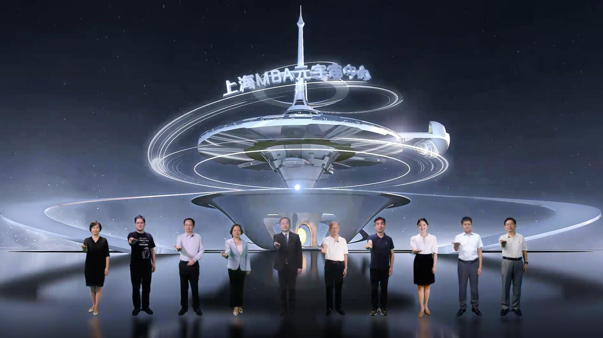

# 开拓教育元宇宙主要场景，上海MBA元宇宙中心启动建设

数字时代背景下，“元宇宙+教育”的可能性正在被不断探索。

“5G+教育元宇宙产业生态联盟”启动 本文图片均为华东师范大学提供

8月18日，由华东师范大学承办的教育元宇宙暨上海MBA元宇宙中心建设启动会于上午8点18分全网直播，旨在以“上海MBA元宇宙中心建设”为契机，推动组建“5G+教育元宇宙产业生态联盟”。通过打造“来源现实而高于现实”的教育元宇宙世界，进一步开拓教育元宇宙主要场景和创新通道。

数字人“道道老师”担任主持

启动会由数字人道道老师主持，“道道”既是“传道授业解惑”，也是元宇宙DAO的去中心化之意，他肩负并祝福教育元宇宙事业“携手执道、蓬勃前行”。

据上海MBA教指委主任邵志清介绍，“上海MBA元宇宙中心”产品服务于深化教育改革目标，推动上海MBA教育在虚拟教学实验室的使用中弥补常规教育的办学短板、营造更利于深度学习的沉浸式互动教学环境。真正打通学习场景、教学资源的时空限制，促进“线上线下”教育的融合以及未来教育优质资源的共享。

华东师大作为上海MBA专业学位研究生教育指导委员秘书处挂靠单位，承办此次会议，在教育元宇宙方面规划了三个赛道：高教、基教、职教。现在着力推进的是两个项目，高教聚焦在商科教育，即这次启动的上海MBA元宇宙中心建设；基教聚焦于科学教育，开发了面向中小学科学教育的元宇宙接入舱和空间站，是软硬件和数字资源深度集成的一体化智慧空间，将在今年世界人工智能大会（WAIC2022）上发布。

据了解，华东师大国家大学科技园目前已经基本建成“高校主导的创新创业服务平台”，在人工智能、XR技术应用、数字化教育技术装备、个性化学习等方面积累了很好的产业基础，构建了多种智能技术应用场景，对全新的元宇宙生态模式进行了广泛探索，为元宇宙生态发展集聚了丰富的产业能级。

启动会由上海工商管理专业学位研究生教育指导委员会主办，由华东师范大学、5G+教育元宇宙产业生态联盟筹备委员会联合承办。